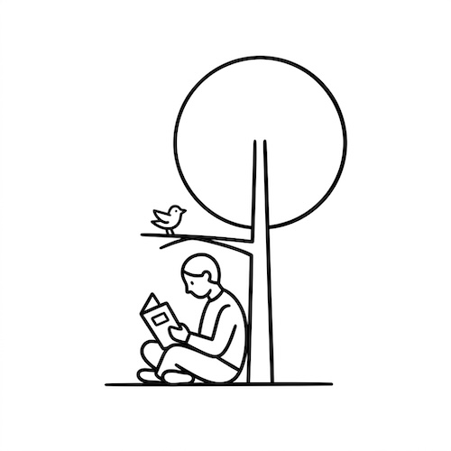

# Minimalist Notion Style

[← Back to Image Prompts](../README.md)

Ultra-clean, black-and-white line art with bold strokes and generous negative space — the visual language of the Notion app's illustration system and modern corporate illustration. Every subject is reduced to its most essential, recognizable form: a tree is a circle on a line, a person is a few confident curves. The beauty is in restraint — what you leave out matters more than what you include. No color, no shading, no fills — only lines and space.

**Best for:** App icons · Website illustrations · Blog headers · Presentation graphics · Brand assets · Sticker designs · Social media posts



> **Sample prompt used to generate the above image (Nano Banana 2):**
> ```text
> Minimalist black-and-white line art illustration of a person sitting cross-legged under a large tree, reading a book while a small bird perches on a low branch above them, 1:1 square format. Notion app illustration style. Bold confident strokes with uniform line weight. Highly abstracted — the tree is a simple circle on a line, the person reduced to essential shapes. No shading, no gradients, no fills. Only black lines against a pure white background with generous negative space.
> ```

---

## Prompt Variations

### 🔵 Nano Banana 2 _(Featured)_

> NB2 can be too detailed for this style — the key is explicit simplification. Always include "highly abstracted — reduce to essential shapes" and "no shading, no gradients, no fills." The restraint must be explicitly stated or the model adds too much.

**Variation 1 — Single Concept / Icon** _(App Icon, Brand Asset)_
```text
Minimalist black-and-white line art illustration of [SUBJECT — e.g., a lightbulb with a tiny plant growing inside it], 1:1 square format. Notion app illustration style. Bold confident strokes with uniform line weight. Highly abstracted — reduce the subject to its most essential recognizable shapes using the fewest possible lines. No shading, no gradients, no fills. Only black lines against a pure white background with generous negative space. The illustration should work at 32×32px as an icon.
```

**Variation 2 — Scene / Activity** _(Blog Header, Website Hero)_
```text
Minimalist black-and-white line art illustration of [SCENE — e.g., two people collaborating at a desk with sticky notes on a wall behind them], 16:9 landscape format. Notion app illustration style. Bold confident strokes with uniform line weight. Figures are highly abstracted — simple rounded shapes for heads, confident single-stroke limbs. Objects reduced to essential silhouettes. No shading, no gradients, no fills. Only black lines against a pure white background. Generous negative space — the illustration uses less than 40% of the frame.
```

**Variation 3 — Spot Illustration Set** _(Presentation, Documentation)_
```text
Set of 4 minimalist black-and-white line art spot illustrations arranged in a 2×2 grid, each depicting a different [THEME — e.g., workflow step: 1. Research (magnifying glass + book), 2. Plan (calendar + pencil), 3. Build (blocks stacking), 4. Launch (rocket)], 16:9 landscape format. Notion app illustration style. Each icon rendered with the same line weight and abstraction level. No shading, no fills. Pure white background. The four illustrations share a consistent style that works as a set.
```

**Variation 4 — With Single Accent Color** _(Brand Asset, Social Media)_
```text
Minimalist line art illustration of [SUBJECT — e.g., a hand holding up a trophy with confetti], 1:1 square format. Primarily black lines on white background in the Notion illustration style. Bold strokes with uniform weight. Highly abstracted. One single accent — [ACCENT — e.g., the trophy is filled with a solid flat yellow]. No gradients or shading. Generous negative space. The single color pop creates a focal point against the stark black-and-white.
```

**Variation 5 — Animated / Sticker Style** _(Sticker Set, Emoji-Style Asset)_
```text
Minimalist black-and-white line art illustration of [CHARACTER/OBJECT — e.g., a cat in a box], 1:1 square format. Notion illustration meets sticker-pack aesthetic — maximum simplification, rounded friendly forms. The character is reduced to 5-6 essential lines: circular head, dot eyes, simple ears, box outline. Bold uniform line weight. No shading, no fills. Pure white background. Small enough concept to work as a 128×128 sticker.
```

### ChatGPT

**Variation 1 — Single Concept**
```text
Create a minimalist black-and-white line art illustration of [SUBJECT] in the Notion app illustration style. Bold strokes, uniform weight. Highly abstracted — fewest possible lines. No shading, gradients, or fills. Pure white background. 1:1 square format.
```

**Variation 2 — Scene**
```text
Create a minimalist line art illustration of [SCENE]. Notion app style. Abstracted figures and objects. Bold uniform strokes. No shading or fills. Pure white background with generous negative space. 16:9 landscape format.
```

**Variation 3 — With Accent Color**
```text
Create a minimalist line art illustration of [SUBJECT]. Black lines on white, Notion style. Add one single flat [COLOR] accent on [ELEMENT]. No gradients or shading. 1:1 square format.
```

### Midjourney

**Variation 1 — Icon**
```text
Minimalist black-and-white line art, [SUBJECT], Notion illustration style, bold uniform strokes, highly abstracted essential shapes, no shading no fills, pure white background --ar 1:1
```

**Variation 2 — Scene**
```text
Minimalist line art illustration, [SCENE], Notion app style, abstracted figures, bold uniform strokes, no shading, generous negative space, pure white background --ar 16:9
```

**Variation 3 — Icon Set**
```text
Set of 4 minimalist line art icons in 2x2 grid, [THEMES], Notion style, consistent line weight, no shading no fills, white background --ar 1:1
```

### Stable Diffusion

**Variation 1 — Icon**
- **Prompt:** `Minimalist line art illustration, [SUBJECT], black and white, bold uniform strokes, abstracted simple shapes, clean white background, Notion app style, no shading no fills`
- **Negative Prompt:** `color, shading, gradients, 3d, realistic, complex detail, photographs`

**Variation 2 — Scene**
- **Prompt:** `Minimalist line art, [SCENE], black and white, Notion style, abstracted figures, bold strokes, generous negative space, no shading`
- **Negative Prompt:** `color, shading, gradients, 3d, realistic, detailed, complex`

---

## 🔄 Image-to-Image Transformations

Transform photos into minimalist line art:

**Nano Banana 2** _(Featured)_
```text
Using the attached photo as reference, create a minimalist black-and-white line art version in the Notion app illustration style. Reduce the subject to its most essential recognizable shapes — use the fewest possible lines. Bold confident strokes with uniform line weight. No shading, no gradients, no fills. Only black lines on pure white background. Generous negative space. The result should be so simplified that it works as a small icon.
```
> 💡 **Follow-up refinements:**
> - "Simplify further — remove [specific detail]"
> - "Add one single flat [COLOR] accent on [element]"
> - "Make it rounder / more geometric / more angular"
> - "Create a set of 4 related illustrations in the same style"

**ChatGPT**
```text
[Upload Photo] "Reduce this to a minimalist black-and-white line art illustration in Notion app style. Fewest possible lines. Bold uniform strokes. No shading or fills. Pure white background."
```

**Midjourney**
```text
[IMAGE_URL] Minimalist black-and-white line art, Notion style, highly abstracted, bold strokes, no shading, white background --iw 0.5 --ar 1:1
```

**Stable Diffusion**
- **Pipeline:** Img2Img · Denoising Strength: `0.80–0.90` (very heavy — almost full restyling to achieve minimal lines)
- **Prompt:** `Minimalist line art, black and white, bold uniform strokes, abstracted, Notion style, white background`
- **Negative Prompt:** `color, shading, gradients, realistic, complex, detailed`

---

## 💡 Tips & Best Practices

- **Less is more — literally**: This style succeeds through omission. Every line you add dilutes the impact. If a line doesn't add recognition, remove it.
- **"No shading, no gradients, no fills"**: Without this explicit exclusion, AI always adds tonal variation. You must forbid it.
- **Consistent line weight**: "Uniform line weight" prevents the AI from using thick-and-thin dynamic strokes. Every line should be the same thickness.
- **Test at small sizes**: Great Notion-style art works as a 32×32 favicon. If your subject isn't recognizable at that size, it's not simplified enough.
- **Common pitfalls**: "Simple illustration" is too vague — always reference "Notion app illustration style." Avoid "cartoon" (implies fills and color). Don't ask for "detailed" — it directly contradicts the style.
- **Pairs well with:** [Blueprint / Technical Drawing](blueprint-technical-drawing.md) (similar line-based aesthetic, different purpose), [Art Deco Illustration](art-deco-illustration.md) (geometric simplification from a different era)
