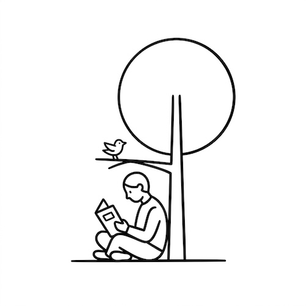

# Minimalist Notion Style

[← Back to Image Prompts](../README.md)

Ultra-clean, black-and-white line art with bold strokes and generous negative space — the visual language of the Notion app's illustration system and modern corporate illustration. Every subject is reduced to its most essential, recognizable form: a tree is a circle on a line, a person is a few confident curves. The beauty is in restraint — what you leave out matters more than what you include. No color, no shading, no fills — only lines and space.

**Best for:** App icons · Website illustrations · Blog headers · Presentation graphics · Brand assets · Sticker designs · Social media posts · Profile avatars



---

## Prompt

Replace the bracketed details with your subject and preferred format.

```text
Minimalist black-and-white line art illustration of [SUBJECT — e.g., a lightbulb with a tiny plant growing inside it], 1:1 square format. Notion app illustration style. Bold confident strokes with uniform line weight. Highly abstracted — reduce the subject to its most essential recognizable shapes using the fewest possible lines. No shading, no gradients, no fills. Only black lines against a pure white background with generous negative space. The illustration should work at 32×32px as an icon.
```

## With a Reference Image

Attach your image and use this prompt to preserve its defining features while applying the style.

```text
Using the attached photo as reference, create a minimalist black-and-white line art version in the Notion app illustration style. Reduce the subject to its most essential recognizable shapes — use the fewest possible lines. Bold confident strokes with uniform line weight. No shading, no gradients, no fills. Only black lines on pure white background. Generous negative space. The result should be so simplified that it works as a small icon.
```

---

## 💡 Tips & Best Practices

- **Less is more — literally**: This style succeeds through omission. Every line you add dilutes the impact. If a line doesn't add recognition, remove it.
- **"No shading, no gradients, no fills"**: Without this explicit exclusion, AI always adds tonal variation. You must forbid it.
- **Consistent line weight**: "Uniform line weight" prevents the AI from using thick-and-thin dynamic strokes. Every line should be the same thickness.
- **Test at small sizes**: Great Notion-style art works as a 32×32 favicon. If your subject isn't recognizable at that size, it's not simplified enough.
- **Common pitfalls**: "Simple illustration" is too vague — always reference "Notion app illustration style." Avoid "cartoon" (implies fills and color). Don't ask for "detailed" — it directly contradicts the style.
- **Pairs well with:** [Blueprint / Technical Drawing](blueprint-technical-drawing.md) (similar line-based aesthetic, different purpose), [Art Deco Illustration](art-deco-illustration.md) (geometric simplification from a different era)
