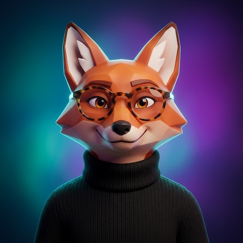

# Modern Avatars

[← Back to Image Prompts](../README.md)

Clean, stylized 3D profile pictures for social media, gaming platforms, and professional accounts.



> **Sample prompt used to generate the above image (Nano Banana 2):**
> ```text
> Modern 3D avatar render of a red fox wearing a black turtleneck sweater and round tortoiseshell glasses, 1:1 square profile picture format. Stylized geometric features with clean smooth surfaces and a subtle rim light separating the character from the background. Vibrant glowing teal-to-purple gradient background. High-end octane render quality with soft subsurface scattering. Friendly, confident expression.
> ```

**ChatGPT**
```text
Create a sleek, modern 3D avatar of [SUBJECT] suitable for a profile picture. The character should have stylized but recognizable features — clean geometric shapes, smooth surfaces, and a subtle rim light separating them from the background. Place the avatar against a vibrant, softly glowing [COLOR] gradient background. High-end 3D render quality with subsurface scattering on the skin.
```

**Midjourney**
```text
Modern 3D avatar of [SUBJECT] for a profile picture, stylized geometric features, clean smooth surfaces, subtle rim lighting, vibrant glowing [COLOR] gradient background, octane render quality --ar 1:1 --niji
```

**Stable Diffusion**
- **Prompt:** `Modern 3D avatar of [SUBJECT], stylized geometric features, smooth clean surfaces, rim lighting, glowing [COLOR] gradient background, octane render, subsurface scattering, profile picture composition`
- **Negative Prompt:** `realistic photograph, messy, dull colors, text, watermark`

**Nano Banana 2**
```text
Modern 3D avatar render of [SUBJECT] for a 1:1 square profile picture. Stylized geometric features with clean smooth surfaces and a subtle rim light separating the character from the background. Vibrant glowing [COLOR] gradient background. High-end octane render quality with subsurface scattering on skin surfaces.
```

> 🔄 **Image-to-Image Variations:**
> * **ChatGPT:** *[Upload Photo]* "Transform the person in this photo into a sleek, modern 3D avatar with stylized geometric features. Place them against a glowing [COLOR] gradient background."
> * **Midjourney:** `[IMAGE_URL] Modern 3D stylized avatar, clean geometric features, rim lighting, glowing [COLOR] background --iw 1.5 --ar 1:1 --niji`
