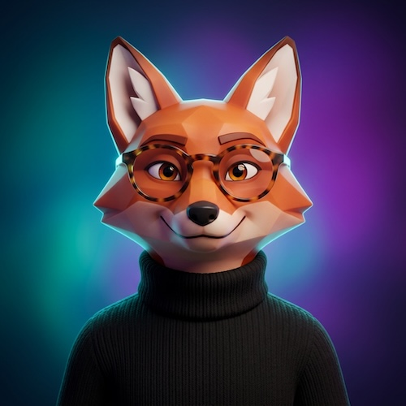

# Modern Avatars

[← Back to Image Prompts](../README.md)

Clean, stylized 3D profile pictures with smooth geometric surfaces, vibrant gradient backgrounds, and a polished digital aesthetic. These avatars strike the balance between recognizable identity and artistic stylization — less photorealistic than a headshot, more personal than a generic icon. Perfect for accounts where you want to stand out without using an actual photograph.

**Best for:** Social media profiles · Gaming accounts · Slack/Discord avatars · App user profiles · YouTube channel art · Personal branding



---

## Prompt

Replace the bracketed details with your subject and preferred format.

```text
Modern 3D avatar render of [SUBJECT — e.g., a young woman with curly auburn hair and freckles] in a 1:1 square profile picture format. Stylized geometric features with smooth clean surfaces — slightly exaggerated proportions for a friendly, approachable feel. Wearing [CLOTHING — e.g., a navy hoodie with small gold earrings]. Subtle rim light separating the character from a vibrant glowing [COLOR — e.g., coral-to-peach] gradient background. Soft subsurface scattering on skin. High-end octane render quality. Warm, confident expression with a slight smile.
```

## With a Reference Image

Attach your image and use this prompt to preserve its defining features while applying the style.

```text
Using the attached photo as reference, transform the person into a modern 3D stylized avatar. Preserve their key identifying features — face shape, hairstyle, glasses if present, and clothing — but render everything as smooth, clean geometric surfaces. Place them against a vibrant glowing [COLOR] gradient background. 1:1 square profile picture format. Add a subtle rim light separating the character from the background.
```

---

## 💡 Tips & Best Practices

- **1:1 is king**: Profile pictures are always square. Always specify `1:1 square` in your prompt.
- **Rim light is essential**: The phrase "rim light separating the character from the background" prevents the avatar from blending into the gradient.
- **Gradient backgrounds pop**: Two-color gradients (`coral-to-peach`, `teal-to-purple`, `electric blue-to-violet`) create a more dynamic, professional look than flat colors.
- **Consistency for teams**: When creating matching avatars for a team, specify "same art style, same rendering quality, same rim lighting angle" across all prompts. Use NB2's multi-turn: generate the first, then say "Create another avatar in exactly the same style for [next person]."
- **Common pitfalls**: Avoid mixing "realistic" and "stylized" — pick one direction. Saying "realistic 3D avatar" often produces an uncanny valley result.
- **Pairs well with:** [Cinematic Headshots](cinematic-headshots.md) (photorealistic version of the same subject), [Pixar / 3D Animation](pixar-3d-animation.md) (more expressive, animated style)
