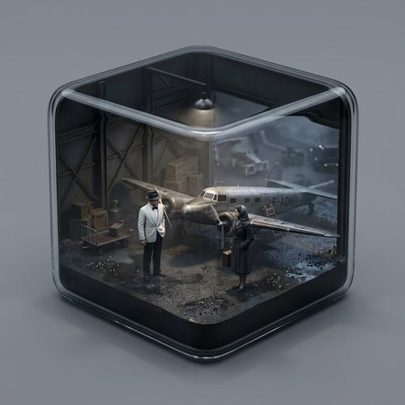

# Movie Diorama Cube

[← Back to Image Prompts](../README.md)

Hyper-realistic miniature dioramas of iconic movie or TV scenes encased in sleek, rounded cubic glass enclosures — part snow globe, part museum exhibit, part collectible art object. Two solid back walls form the environment while two transparent glass front walls provide a cutaway view. Inside, photorealistic miniature characters act out specific cinematic moments with meticulous set design, accurate costumes, and atmospheric lighting. Clean neutral backgrounds isolate the cube, and a slightly elevated isometric camera angle shows off the interior through the glass corner.

**Best for:** Social media posts · Desktop wallpapers · Fan art · Gift concepts · Movie tributes · Collectible mockups · Content creator assets



> **Sample prompt used to generate the above image (Nano Banana 2):**
> ```text
> A hyper-realistic isometric miniature diorama encased in a rounded cubic enclosure, 1:1 square format. Structure: The rounded cube features two solid back walls forming a dimly lit 1940s Casablanca airport hangar, and two transparent glass front walls with smooth, curved edges, creating a perfect cutaway view. The entire scene is strictly contained within this soft-edged cube. Inside the cube is the farewell scene from Casablanca — Rick and Ilsa standing on the misty tarmac near a propeller plane. Character: A photorealistic miniature person, representing Humphrey Bogart as Rick Blaine in his iconic white dinner jacket. Materials and Textures: All elements feature hyper-realistic textures — wet tarmac, fabric weave on the trench coat, metallic plane rivets. Lighting: Noir fog with volumetric mist and a single overhead light casting long shadows. Background: A clean, solid neutral grey background completely isolating the cube. Camera: A detailed macro photograph from a slightly elevated isometric three-quarter view, centering on the front glass rounded corner.
> ```

---

## Prompt Variations

### 🔵 Nano Banana 2 _(Featured)_

> NB2's search grounding is essential here — naming specific movies, actors, and characters produces accurate costumes, set designs, and iconic props. The structured prompt format (Structure → Scene → Character → Materials → Lighting → Background → Camera) keeps all elements organized.

**Variation 1 — Classic Film Scene** _(Fan Art, Social Media)_
```text
A hyper-realistic isometric miniature diorama encased in a rounded cubic enclosure, 1:1 square format. Structure: The rounded cube features two solid back walls forming [SETTING — e.g., a rain-soaked 1982 Los Angeles rooftop at night], and two transparent glass front walls with smooth, curved edges, creating a perfect cutaway view. The entire scene is strictly contained within this soft-edged cube. Inside the cube is [SCENE DESCRIPTION — e.g., the final rooftop confrontation from Blade Runner — Roy Batty sitting in the rain holding a white dove]. Character: A photorealistic miniature person, representing [ACTOR] as [CHARACTER]. Materials and Textures: All elements feature hyper-realistic textures — [DETAILS — e.g., wet concrete, rain droplets on skin, worn leather coat]. Lighting: [ATMOSPHERE — e.g., neon-blue and amber rain-soaked noir]. Background: A clean, solid neutral grey background completely isolating the cube. Camera: A detailed macro photograph from a slightly elevated isometric three-quarter view, centering on the front glass rounded corner.
```

**Variation 2 — Action / Adventure Scene** _(Desktop Wallpaper, Collectible Concept)_
```text
A hyper-realistic isometric miniature diorama encased in a rounded cubic enclosure, 16:9 landscape format. Structure: The rounded cube features two solid back walls forming [SETTING — e.g., an ancient Egyptian tomb chamber with hieroglyph-covered walls], and two transparent glass front walls. Inside is [SCENE — e.g., Indiana Jones reaching for a golden idol on a stone pedestal while a giant boulder looms behind]. Character: A photorealistic miniature [ACTOR] as [CHARACTER] in iconic costume. Materials: Hyper-realistic stone textures, dusty cobwebs, weathered leather. Lighting: [ATMOSPHERE — e.g., warm torchlight flickering against cold stone]. Neutral grey background isolating the cube. Macro photograph from elevated isometric view.
```

**Variation 3 — Horror / Thriller Scene** _(Social Media, Art Print)_
```text
A hyper-realistic isometric miniature diorama encased in a rounded cubic enclosure, 1:1 square format. Structure: Two solid back walls forming [SETTING — e.g., Room 237 from The Shining — a decayed ballroom with rotting wallpaper]. Two transparent glass front walls with smooth curved edges. Inside is [SCENE — e.g., Danny Torrance facing the twins at the end of the hallway]. Miniature characters with photorealistic costumes and expressions. Materials: Vintage carpet patterns, aged wallpaper textures, dim fluorescent lighting. Lighting: [ATMOSPHERE — e.g., sickly greenish fluorescent with deep shadows]. Clean neutral grey background. Isometric macro photograph.
```

**Variation 4 — Animated / Fantasy Film Scene** _(Profile Picture, Gift Concept)_
```text
A hyper-realistic isometric miniature diorama encased in a rounded cubic enclosure, 1:1 square format. Structure: Two solid back walls forming [SETTING — e.g., the enchanted ballroom from Beauty and the Beast]. Two transparent glass front walls. Inside is [SCENE — e.g., Belle and the Beast dancing under a chandelier]. Characters are rendered as photorealistic miniature figurines (not 2D animation) in accurate costumes — Belle's golden ballgown, the Beast's blue formal coat. Materials: Polished marble floor, crystal chandelier, draped curtains. Lighting: [ATMOSPHERE — e.g., warm golden candlelight with sparkling reflections]. Neutral grey background. Macro photograph from isometric view.
```

**Variation 5 — TV Show Scene** _(Social Media Series, Desktop Wallpaper)_
```text
A hyper-realistic isometric miniature diorama encased in a rounded cubic enclosure, 1:1 square format. Structure: Two solid back walls forming [SETTING — e.g., the Dunder Mifflin office from The Office]. Two transparent glass front walls. Inside is [SCENE — e.g., Michael Scott standing on his desk declaring "I declare bankruptcy"]. Photorealistic miniature character in accurate costume. Materials: Office carpet, fluorescent ceiling tiles, cluttered desks with tiny papers and coffee mugs. Lighting: [ATMOSPHERE — e.g., flat office fluorescent lighting]. Neutral grey background. Isometric macro photograph.
```

### ChatGPT

**Variation 1 — Classic Film Scene**
```text
Create a hyper-realistic isometric miniature diorama of [MOVIE SCENE] encased in a rounded cubic glass enclosure. Two solid back walls forming the set, two transparent glass front walls with curved edges. Photorealistic miniature characters in accurate costumes. Hyper-realistic textures and atmospheric lighting. Clean neutral grey background. Macro photograph from elevated isometric view. 1:1 square format.
```

**Variation 2 — Action Scene**
```text
Create a hyper-realistic isometric diorama of [ACTION SCENE] in a rounded glass cube. Solid back walls forming the environment, transparent front walls for cutaway view. Photorealistic miniature [ACTOR] as [CHARACTER]. Detailed textures and dramatic lighting. Neutral grey background. 3:2 landscape format.
```

**Variation 3 — TV Show Scene**
```text
Create a hyper-realistic isometric diorama of [TV SCENE] in a rounded glass cube. Accurate set recreation. Photorealistic miniature characters. Detailed props and textures. Neutral grey background. 1:1 square format.
```

### Midjourney

**Variation 1 — Classic Film**
```text
Hyper-realistic isometric miniature diorama, [MOVIE SCENE], rounded cubic glass enclosure, two solid back walls, two transparent glass front walls, photorealistic miniature characters, accurate costumes, atmospheric lighting, neutral grey background, macro photograph --ar 1:1
```

**Variation 2 — Action / Adventure**
```text
Hyper-realistic isometric diorama, [ACTION SCENE], rounded glass cube, photorealistic miniature [ACTOR] as [CHARACTER], detailed set textures, dramatic lighting, neutral grey background, macro photography --ar 16:9 --s 200
```

**Variation 3 — Horror / Thriller**
```text
Hyper-realistic isometric diorama, [HORROR SCENE], rounded glass cube, eerie atmospheric lighting, photorealistic miniature characters, detailed set textures, neutral grey background, macro photograph --ar 1:1 --s 150
```

### Stable Diffusion

**Variation 1 — Classic Film**
- **Prompt:** `Hyper-realistic isometric miniature diorama, [MOVIE SCENE], rounded cubic glass enclosure, solid back walls, transparent glass front, photorealistic miniature characters, accurate costumes, atmospheric lighting, neutral grey background, macro photograph, 8k`
- **Negative Prompt:** `flat, 2D, illustration, cartoon, full-size, blurry, low detail, messy`

**Variation 2 — Action Scene**
- **Prompt:** `Hyper-realistic isometric diorama, [ACTION SCENE], glass cube enclosure, photorealistic miniature characters, detailed set design, dramatic lighting, neutral grey background, macro, 8k`
- **Negative Prompt:** `illustration, cartoon, flat, 2D, toy, low quality, blurry`

---

## 🔄 Image-to-Image Transformations

Transform movie stills or screenshots into diorama cubes:

**Nano Banana 2** _(Featured)_
```text
Using the attached movie still as reference, create a hyper-realistic isometric miniature diorama of this scene encased in a rounded cubic glass enclosure. Two solid back walls recreating the set, two transparent glass front walls with smooth curved edges for a cutaway view. Convert the characters to photorealistic miniature figurines preserving their costumes and poses. All textures hyper-realistic. Maintain the original scene's atmospheric lighting inside the cube. Clean neutral grey background isolating the cube. Macro photograph from a slightly elevated isometric three-quarter view.
```
> 💡 **Follow-up refinements:**
> - "Add volumetric fog/mist inside the cube for atmosphere"
> - "Change the cube size — make it smaller and more collectible"
> - "Add a second cube next to it with a different scene from the same movie"
> - "Add a tiny brass nameplate on the base with the movie title"

**ChatGPT**
```text
[Upload Photo] "Transform this movie scene into a hyper-realistic isometric diorama in a rounded glass cube. Two solid back walls as the set, two transparent front walls. Convert characters to photorealistic miniatures. Maintain atmospheric lighting. Neutral grey background."
```

**Midjourney**
```text
[IMAGE_URL] Hyper-realistic isometric miniature diorama, rounded glass cube, photorealistic miniature characters, atmospheric lighting, neutral grey background, macro photograph --iw 1.5 --ar 1:1
```

**Stable Diffusion**
- **Pipeline:** Img2Img · Denoising Strength: `0.70–0.85`
- **Prompt:** `Hyper-realistic isometric miniature diorama, rounded glass cube enclosure, photorealistic miniature figures, atmospheric lighting, neutral grey background, macro, 8k`
- **Negative Prompt:** `flat, 2D, illustration, full-size, blurry, cartoon`

---

## 💡 Tips & Best Practices

- **The structure prompt is critical**: "Two solid back walls forming [SETTING], two transparent glass front walls with smooth curved edges" is the architectural instruction that creates the glass-cube-cutaway look. Skip it and you get a generic diorama.
- **Name specific actors and characters**: "Humphrey Bogart as Rick Blaine" produces accurate costumes and features via search grounding. Just "a man in a white jacket" is too vague.
- **Materials and textures section sells realism**: Call out 3-4 specific texture details (wet tarmac, fabric weave, metallic rivets). This prevents the miniatures from looking like smooth, untextured toys.
- **Lighting names the mood**: "Noir fog," "neon-soaked rain," "warm candlelight" each produce drastically different atmospheres. Name the specific lighting style for the scene.
- **Neutral grey background isolation**: This is essential — it makes the cube feel like a premium collectible object rather than a scene in a room.
- **Common pitfalls**: Without "strictly contained within the cube," elements leak outside the glass enclosure. Without "photorealistic miniature," characters render as 2D or as full-size people.
- **Pairs well with:** [Landmark Dioramas](landmark-dioramas.md) (similar miniature-architecture aesthetic), [Collectible Figurines](collectible-figurines.md) (same resin-figurine quality for the characters)
