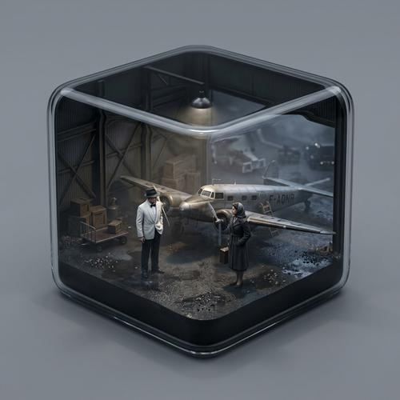

# Movie Diorama Cube

[← Back to Image Prompts](../README.md)

Hyper-realistic miniature dioramas of iconic movie or TV scenes encased in sleek, rounded cubic glass enclosures — part snow globe, part museum exhibit, part collectible art object. Two solid back walls form the environment while two transparent glass front walls provide a cutaway view. Inside, photorealistic miniature characters act out specific cinematic moments with meticulous set design, accurate costumes, and atmospheric lighting. Clean neutral backgrounds isolate the cube, and a slightly elevated isometric camera angle shows off the interior through the glass corner.

**Best for:** Social media posts · Desktop wallpapers · Fan art · Gift concepts · Movie tributes · Collectible mockups · Content creator assets



---

## Prompt

Replace the bracketed details with your subject and preferred format.

```text
A hyper-realistic isometric miniature diorama encased in a rounded cubic enclosure, 1:1 square format. Structure: The rounded cube features two solid back walls forming [SETTING — e.g., a rain-soaked 1982 Los Angeles rooftop at night], and two transparent glass front walls with smooth, curved edges, creating a perfect cutaway view. The entire scene is strictly contained within this soft-edged cube. Inside the cube is [SCENE DESCRIPTION — e.g., the final rooftop confrontation from Blade Runner — Roy Batty sitting in the rain holding a white dove]. Character: A photorealistic miniature person, representing [ACTOR] as [CHARACTER]. Materials and Textures: All elements feature hyper-realistic textures — [DETAILS — e.g., wet concrete, rain droplets on skin, worn leather coat]. Lighting: [ATMOSPHERE — e.g., neon-blue and amber rain-soaked noir]. Background: A clean, solid neutral grey background completely isolating the cube. Camera: A detailed macro photograph from a slightly elevated isometric three-quarter view, centering on the front glass rounded corner.
```

## With a Reference Image

Attach your image and use this prompt to preserve its defining features while applying the style.

```text
Using the attached movie still as reference, create a hyper-realistic isometric miniature diorama of this scene encased in a rounded cubic glass enclosure. Two solid back walls recreating the set, two transparent glass front walls with smooth curved edges for a cutaway view. Convert the characters to photorealistic miniature figurines preserving their costumes and poses. All textures hyper-realistic. Maintain the original scene's atmospheric lighting inside the cube. Clean neutral grey background isolating the cube. Macro photograph from a slightly elevated isometric three-quarter view.
```

---

## 💡 Tips & Best Practices

- **The structure prompt is critical**: "Two solid back walls forming [SETTING], two transparent glass front walls with smooth curved edges" is the architectural instruction that creates the glass-cube-cutaway look. Skip it and you get a generic diorama.
- **Name specific actors and characters**: "Humphrey Bogart as Rick Blaine" produces accurate costumes and features via search grounding. Just "a man in a white jacket" is too vague.
- **Materials and textures section sells realism**: Call out 3-4 specific texture details (wet tarmac, fabric weave, metallic rivets). This prevents the miniatures from looking like smooth, untextured toys.
- **Lighting names the mood**: "Noir fog," "neon-soaked rain," "warm candlelight" each produce drastically different atmospheres. Name the specific lighting style for the scene.
- **Neutral grey background isolation**: This is essential — it makes the cube feel like a premium collectible object rather than a scene in a room.
- **Common pitfalls**: Without "strictly contained within the cube," elements leak outside the glass enclosure. Without "photorealistic miniature," characters render as 2D or as full-size people.
- **Pairs well with:** [Landmark Dioramas](landmark-dioramas.md) (similar miniature-architecture aesthetic), [Collectible Figurines](collectible-figurines.md) (same resin-figurine quality for the characters)
