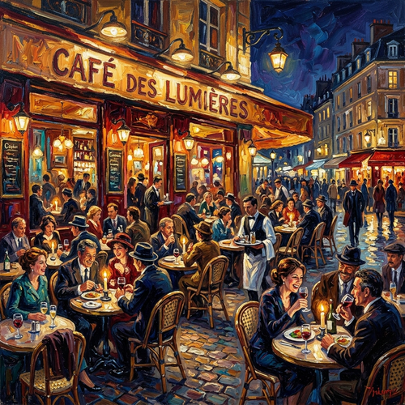

# Oil Painting Impasto

[← Back to Image Prompts](../README.md)

Rich, vibrant, and highly textured oil paintings characterized by thick impasto brushstrokes and expressive color blending. This style emulates the physical depth of wet oil paint applied generously to canvas, reminiscent of post-impressionist masters like Van Gogh. It brings intense energy, movement, and emotional weight to the artwork.

**Best for:** Expressive landscapes · Dynamic portraits · Still life · Gallery art · Vibrant scenes



> **Sample prompt used to generate the above image (Nano Banana 2):**
> ```text
> A vibrant oil painting of a bustling cafe scene at night, featuring thick impasto brushstrokes, rich textures, and expressive blending of colors.
> ```

---

## Prompt Variations

### 🔵 Nano Banana 2 _(Featured)_

**Variation 1 — Expressive Landscape** _(Fine Art)_ — Vibrant oil painting of [LANDSCAPE], thick impasto brushstrokes, heavy texture, swirling skies, expressive color palette, wet-on-wet technique, canvas texture.

**Variation 2 — Dynamic Portrait** _(Character Art)_ — Expressive oil portrait of [SUBJECT], bold visible brushwork, thick impasto textures, dramatic lighting, rich saturated colors.

**Variation 3 — Still Life** _(Gallery Art)_ — Post-impressionist oil painting of [OBJECTS/SCENE], heavy palette knife textures, thick layers of paint, vivid contrasting colors.

**Variation 4 — Abstract Impressionism** _(Backgrounds)_ — Abstract oil painting featuring [THEME/COLORS], thick chunky impasto strokes, dynamic movement, heavy physical texture.

### ChatGPT / Midjourney / Stable Diffusion — Standard templates with "oil painting, thick impasto brushstrokes, rich physical texture, visible brushwork, vibrant expressive colors" core keywords.

---

## 🔄 Image-to-Image Transformations

**Nano Banana 2** _(Featured)_
```text
Using the attached photo, transform it into a rich oil painting with thick impasto techniques. Replace all photographic details with bold, visible, chunky brushstrokes. Enhance the color saturation to make it vibrant and expressive. Add a strong sense of physical paint texture and a woven canvas background.
```
> 💡 **Follow-up refinements:**
> - "Make the brushstrokes thicker and more chaotic"
> - "Use a palette knife painting style"

---

## 💡 Tips & Best Practices
- **"Thick impasto brushstrokes"**: This is the magic phrase to get 3D, chunky paint rather than a flat digital painting.
- **"Palette knife"**: Add this if you want broader, flatter, and more architectural strokes of paint.
- **"Vibrant/expressive colors"**: Oil paintings in this style often use heightened, non-literal colors.
- **Pairs well with:** [Double Exposure](double-exposure.md) (for surreal oil art)
