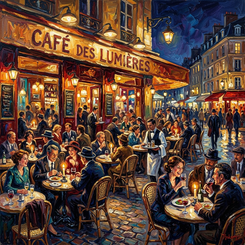

# Oil Painting Impasto

[← Back to Image Prompts](../README.md)

Rich, vibrant, and highly textured oil paintings characterized by thick impasto brushstrokes and expressive color blending. This style emulates the physical depth of wet oil paint applied generously to canvas, reminiscent of post-impressionist masters like Van Gogh. It brings intense energy, movement, and emotional weight to the artwork.

**Best for:** Expressive landscapes · Dynamic portraits · Still life · Gallery art · Vibrant scenes



> **Sample prompt used to generate the above image (Nano Banana 2):**
> ```text
> A vibrant oil painting of a bustling cafe scene at night, featuring thick impasto brushstrokes, rich textures, and expressive blending of colors.
> ```

---

## Prompt Variations

### 🔵 Nano Banana 2 _(Featured)_

**Variation 1 — Expressive Landscape** _(Fine Art)_
```text
Vibrant oil painting of [LANDSCAPE], thick impasto brushstrokes, heavy texture, swirling skies, expressive color palette, wet-on-wet technique, canvas texture.
```

**Variation 2 — Dynamic Portrait** _(Character Art)_
```text
Expressive oil portrait of [SUBJECT], bold visible brushwork, thick impasto textures, dramatic lighting, rich saturated colors.
```

**Variation 3 — Still Life** _(Gallery Art)_
```text
Post-impressionist oil painting of [OBJECTS/SCENE], heavy palette knife textures, thick layers of paint, vivid contrasting colors.
```

**Variation 4 — Abstract Impressionism** _(Backgrounds)_
```text
Abstract oil painting featuring [THEME/COLORS], thick chunky impasto strokes, dynamic movement, heavy physical texture.
```

### ChatGPT

**Variation 1 — Expressive Landscape** _(Fine Art)_
```text
Create a vibrant oil painting of [LANDSCAPE] with thick impasto brushstrokes — heavy physical paint texture, swirling expressive skies in the style of post-impressionist masters, wet-on-wet color blending, and visible woven canvas beneath. 3:2 landscape format.
```

**Variation 2 — Dynamic Portrait** _(Character Art)_
```text
Create an expressive oil portrait of [SUBJECT] with bold visible brushwork and thick impasto textures — dramatic directional lighting, rich saturated non-literal colors, emotional intensity in every stroke. 3:4 vertical format.
```

**Variation 3 — Still Life** _(Gallery Art)_
```text
Create a post-impressionist oil painting of [OBJECTS/SCENE] using heavy palette knife textures — thick sculptural layers of paint, vivid contrasting colors, energetic composition. 4:5 vertical format.
```

### Midjourney

**Variation 1 — Expressive Landscape** _(Fine Art)_
```text
vibrant oil painting of [LANDSCAPE], thick impasto brushstrokes, heavy paint texture, swirling sky, post-impressionist, wet-on-wet blending, canvas texture --ar 3:2 --s 400
```

**Variation 2 — Dynamic Portrait** _(Character Art)_
```text
expressive oil portrait of [SUBJECT], bold visible brushwork, thick impasto texture, dramatic lighting, rich saturated colors --ar 3:4 --s 350
```

**Variation 3 — Abstract Impressionism** _(Backgrounds)_
```text
abstract oil painting, [THEME/COLORS], thick chunky impasto strokes, palette knife texture, dynamic movement, heavy physical paint --ar 16:9 --s 500 --chaos 20
```

### Stable Diffusion

**Variation 1 — Expressive Landscape** _(Fine Art)_
- **Prompt:** `oil painting, [LANDSCAPE], thick impasto brushstrokes, heavy paint texture, swirling sky, post-impressionist style, wet-on-wet blending, vibrant expressive colors, canvas texture`
- **Negative Prompt:** `photograph, flat digital art, smooth airbrush, watercolor, low quality`

**Variation 2 — Dynamic Portrait** _(Character Art)_
- **Prompt:** `oil portrait, [SUBJECT], bold visible brushwork, thick impasto texture, dramatic lighting, rich saturated colors, expressive post-impressionist style`
- **Negative Prompt:** `photograph, smooth skin, digital render, flat colors, blur`

---

## 🔄 Image-to-Image Transformations

**Nano Banana 2** _(Featured)_
```text
Using the attached photo, transform it into a rich oil painting with thick impasto techniques. Replace all photographic details with bold, visible, chunky brushstrokes. Enhance the color saturation to make it vibrant and expressive. Add a strong sense of physical paint texture and a woven canvas background.
```
> 💡 **Follow-up refinements:**
> - "Make the brushstrokes thicker and more chaotic"
> - "Use a palette knife painting style"

**ChatGPT**
```text
[Upload Photo] "Transform this photo into a rich impasto oil painting — replace photographic detail with bold, chunky, visible brushstrokes, heighten the color saturation, and add strong physical paint texture over a woven canvas."
```

**Midjourney**
```text
[IMAGE_URL] oil painting, thick impasto brushstrokes, heavy paint texture, expressive vibrant colors, visible brushwork, canvas texture --iw 1.3 --ar 3:2
```

**Stable Diffusion**
- **Pipeline:** Img2Img · Denoising Strength: `0.55–0.7` (dissolves photo detail into brushwork)
- **Prompt:** `oil painting, thick impasto brushstrokes, heavy paint texture, vibrant expressive colors, visible brushwork, canvas texture`
- **Negative Prompt:** `photograph, smooth airbrush, flat digital art, blur`

---

## 💡 Tips & Best Practices
- **"Thick impasto brushstrokes"**: This is the magic phrase to get 3D, chunky paint rather than a flat digital painting.
- **"Palette knife"**: Add this if you want broader, flatter, and more architectural strokes of paint.
- **"Vibrant/expressive colors"**: Oil paintings in this style often use heightened, non-literal colors.
- **Pairs well with:** [Double Exposure](double-exposure.md) (for surreal oil art)
