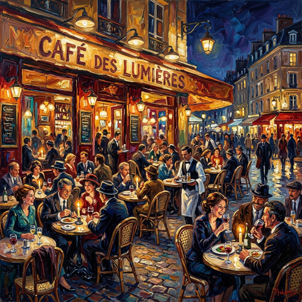

# Oil Painting Impasto

[← Back to Image Prompts](../README.md)

Rich, vibrant, and highly textured oil paintings characterized by thick impasto brushstrokes and expressive color blending. This style emulates the physical depth of wet oil paint applied generously to canvas, reminiscent of post-impressionist masters like Van Gogh. It brings intense energy, movement, and emotional weight to the artwork.

**Best for:** Expressive landscapes · Dynamic portraits · Still life · Gallery art · Vibrant scenes



---

## Prompt

Replace the bracketed details with your subject and preferred format.

```text
Oil painting of [SCENE — e.g., a lively café terrace at night], [FORMAT]. Build the foreground with thick palette-knife impasto: raised ridges of pigment catch raking light and cast tiny shadows on the canvas. Use [PALETTE — e.g., cobalt shadows, amber lamps, and vermilion accents] to separate the focal subject from a more loosely painted background. Blend wet color only where soft transitions help the light, leaving decisive visible strokes elsewhere. Show woven canvas at the thinnest passages; make the composition energetic and tactile.
```

## With a Reference Image

Attach your image and use this prompt to preserve its defining features while applying the style.

```text
Using the attached photo, transform it into a rich oil painting with thick impasto techniques. Replace all photographic details with bold, visible, chunky brushstrokes. Enhance the color saturation to make it vibrant and expressive. Add a strong sense of physical paint texture and a woven canvas background.
```

---

## 💡 Tips & Best Practices
- **"Thick impasto brushstrokes"**: This is the magic phrase to get 3D, chunky paint rather than a flat digital painting.
- **"Palette knife"**: Add this if you want broader, flatter, and more architectural strokes of paint.
- **"Vibrant/expressive colors"**: Oil paintings in this style often use heightened, non-literal colors.
- **Pairs well with:** [Double Exposure](double-exposure.md) (for surreal oil art)
