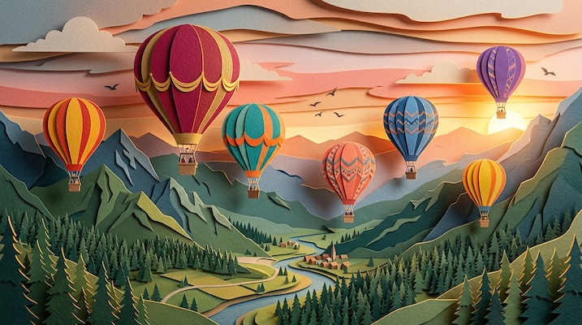

# Paper Cutout / Kirigami

[← Back to Image Prompts](../README.md)

Multi-layered paper craft scenes with visible paper textures, crisp cut edges, and dramatic drop shadows between layers that create a striking sense of depth. Each layer is a different sheet of thick, textured colored paper, stacked and separated by small spacers — the resulting parallax effect makes flat 2D paper feel deeply three-dimensional. The style draws from Japanese kirigami and pop-up book traditions, combining the precision of laser-cut edges with the tactile warmth of handmade craft.

**Best for:** Social media posts · Greeting cards · Book illustrations · Desktop wallpapers · Wedding invitations · Poster prints · Children's content



> **Sample prompt used to generate the above image (Nano Banana 2):**
> ```text
> 3D layered paper-cut illustration of a hot air balloon festival over a mountain valley at sunrise, 16:9 landscape format. Seven colorful balloons at different depths, each cut from a different colored paper — crimson, saffron, teal, coral. Multiple layers of thick textured paper forming mountain ridges, pine trees, and wispy clouds. Deep drop shadows separate each layer creating a pronounced sense of depth. Soft warm directional light from the right, making the paper edges glow.
> ```

---

## Prompt Variations

### 🔵 Nano Banana 2 _(Featured)_

> NB2 renders paper textures and layered shadows beautifully. The key phrase is "deep drop shadows separate each layer creating a pronounced sense of depth." Also specify "thick textured paper" and "crisp cut edges" — without these, the output looks like flat illustration rather than physical paper craft.

**Variation 1 — Landscape / Nature Scene** _(Desktop Wallpaper, Print)_
```text
3D layered paper-cut illustration of [SCENE — e.g., a coastal lighthouse on a rocky cliff with crashing waves below], 16:9 landscape format. Multiple layers of thick textured paper — each layer a different color: [COLORS — e.g., navy for the ocean, white for the waves, warm grey for the cliff, yellow for the lighthouse]. Crisp laser-cut edges on every form. Deep drop shadows between each paper layer creating pronounced depth. Soft warm directional light from the upper right making the paper edges glow. Visible paper fiber texture on each surface.
```

**Variation 2 — Character / Portrait** _(Social Media, Greeting Card)_
```text
3D layered paper-cut illustration of [SUBJECT — e.g., a girl with an umbrella walking through a paper rain shower], 3:4 vertical format. The figure is constructed from multiple precise paper layers — body, clothing, hair, and accessory are each separate cut sheets stacked for depth. Thick textured colored paper in [PALETTE]. The background is a multi-layered paper [ENVIRONMENT] with deep drop shadows between layers. Softly backlit — light passing through thinner paper sections creates a subtle translucent glow.
```

**Variation 3 — Pop-Up Book Style** _(Children's Content, Social Media)_
```text
3D layered paper-cut illustration styled as an open pop-up book — [SCENE — e.g., a fairy tale castle with towers, a moat bridge, and paper birds] rising from the book's center fold, 16:9 landscape format. The book pages are visible at the bottom with printed text. Multiple paper layers fold upward at 90-degree angles, creating a miniature stage. Deep drop shadows between each layer. Bright, cheerful color palette — [COLORS]. Soft studio lighting from above. Whimsical, storybook charm.
```

**Variation 4 — Seasonal / Holiday** _(Greeting Card, Social Media)_
```text
3D layered paper-cut illustration of a [HOLIDAY/SEASON — e.g., winter holiday] scene — [DETAILS — e.g., a snowy village with paper pine trees, a church with a glowing cut-out window, and paper snowflakes hanging from above], 3:4 vertical format. Multiple layers of thick textured paper in [PALETTE — e.g., white, icy blue, silver, and forest green with gold accents]. Deep drop shadows between layers. Soft warm backlighting creating a gentle glow through the thinner paper cuts. Festive, elegant.
```

**Variation 5 — Shadow Box / Framed Diorama** _(Art Print, Gift)_
```text
3D layered paper-cut shadow box mounted inside a deep wooden frame, depicting [SCENE — e.g., an underwater coral reef with fish, seahorses, and swaying kelp], 1:1 square format. Multiple paper layers recede into the frame — foreground closest to the viewer, background deepest. LED backlight illuminates the scene from behind, creating a warm glow through thinner paper sections. Thick textured paper in [COLORS]. Clean laser-cut details on each layer. The wooden frame edge is visible around the composition. Gallery-quality presentation.
```

### ChatGPT

**Variation 1 — Landscape**
```text
Create a 3D layered paper-cut illustration of [SCENE]. Multiple layers of thick textured colored paper with crisp cut edges. Deep drop shadows between each layer creating depth. Warm directional light making paper edges glow. Visible paper fiber texture. 3:2 landscape format.
```

**Variation 2 — Pop-Up Book**
```text
Create a 3D paper-cut illustration styled as an open pop-up book: [SCENE] rising from the center fold. Book pages visible at the bottom. Paper layers fold upward at 90-degree angles. Deep shadows. Bright cheerful palette. Studio lighting. 3:2 landscape format.
```

**Variation 3 — Shadow Box**
```text
Create a layered paper-cut shadow box inside a wooden frame depicting [SCENE]. LED backlight glowing through thinner paper sections. Multiple receding layers. Thick textured paper in [COLORS]. Clean laser-cut details. Gallery-quality. 1:1 square format.
```

### Midjourney

**Variation 1 — Landscape**
```text
3D layered paper-cut illustration, [SCENE], thick textured colored paper, crisp cut edges, deep drop shadows between layers, warm directional light, visible paper texture --ar 16:9
```

**Variation 2 — Character**
```text
3D layered paper-cut illustration, [SUBJECT] in [ENVIRONMENT], multi-layer paper figure, deep drop shadows, backlit translucent paper glow, textured colored paper --ar 4:5
```

**Variation 3 — Shadow Box**
```text
Paper-cut shadow box in wooden frame, [SCENE], multiple receding paper layers, LED backlight, warm glow through thin paper, laser-cut detail --ar 1:1
```

### Stable Diffusion

**Variation 1 — Landscape**
- **Prompt:** `3D layered paper-cut illustration, [SCENE], thick textured paper, crisp cut edges, deep drop shadows between layers, warm directional lighting, paper craft, kirigami, 8k`
- **Negative Prompt:** `drawing, painting, photograph, smooth, 2d flat, digital`

**Variation 2 — Holiday**
- **Prompt:** `3D layered paper-cut [HOLIDAY] scene, [DETAILS], textured paper, deep shadows, backlit glow, festive palette, paper craft, 8k`
- **Negative Prompt:** `drawing, painting, flat, smooth, digital, photograph`

**Variation 3 — Shadow Box**
- **Prompt:** `Paper-cut shadow box, wooden frame, [SCENE], receding layers, LED backlight, thick textured paper, laser-cut, gallery quality, 8k`
- **Negative Prompt:** `flat, painting, digital, smooth, no frame`

---

## 🔄 Image-to-Image Transformations

Transform photos into paper-cut art:

**Nano Banana 2** _(Featured)_
```text
Using the attached photo as reference, recreate the entire scene as a 3D layered paper-cut illustration. Convert every element — subject, objects, background — into layers of thick textured colored paper with crisp cut edges. Separate each layer with deep drop shadows to create depth. Simplify the color palette to [NUMBER] distinct paper colors. Add warm directional lighting making the paper edges glow. Preserve the original composition.
```
> 💡 **Follow-up refinements:**
> - "Add a backlit glow effect through the thinner paper sections"
> - "Frame it inside a shadow box with a wooden border"
> - "Make the layers more exaggerated — more separation and deeper shadows"
> - "Convert it into a pop-up book style rising from an open book"

**ChatGPT**
```text
[Upload Photo] "Recreate this scene as a 3D layered paper-cut illustration. Convert everything into thick textured paper layers with crisp edges. Deep drop shadows between layers. Warm directional lighting. Simplified color palette."
```

**Midjourney**
```text
[IMAGE_URL] 3D layered paper-cut illustration, thick textured paper, crisp edges, deep drop shadows, warm directional light, kirigami craft --iw 1.5 --ar 16:9
```

**Stable Diffusion**
- **Pipeline:** Img2Img · Denoising Strength: `0.65–0.80`
- **Prompt:** `3D layered paper-cut illustration, thick textured paper, crisp cut edges, deep drop shadows, warm lighting, kirigami, 8k`
- **Negative Prompt:** `photograph, smooth, painting, digital, flat`

---

## 💡 Tips & Best Practices

- **Shadows are the style**: "Deep drop shadows between each layer" is the single most important phrase. Without it, the output looks like a flat illustration rather than a physical paper sculpture.
- **Paper texture sells the craft**: "Thick textured paper with visible paper fiber" distinguishes this from digital vector art.
- **Backlighting adds magic**: When light passes through thinner paper sections, it creates a beautiful translucent glow — specify "backlit, light glowing through thinner paper sections" for this effect.
- **Limit your palette**: Real paper-cut art uses a limited number of paper colors. Specifying "6-8 paper colors" creates more cohesive, authentic results.
- **Common pitfalls**: Avoid "paper illustration" (too vague — sounds like drawing on paper). Don't skip the shadow language — no shadows = no depth = flat illustration.
- **Pairs well with:** [Stained Glass Windows](stained-glass-windows.md) (similar light-through-material effect), [Embroidered / Cross-Stitch](embroidered-cross-stitch.md) (same handcraft aesthetic, different medium)
