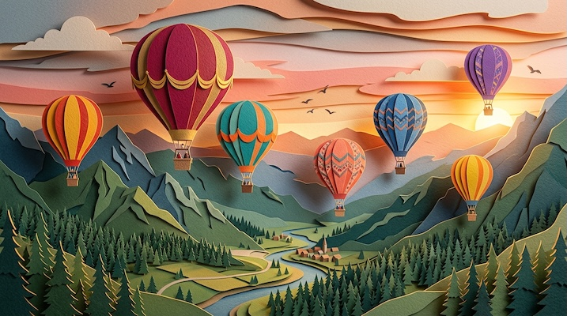

# Paper Cutout / Kirigami

[← Back to Image Prompts](../README.md)

Multi-layered paper craft scenes with visible paper textures, crisp cut edges, and dramatic drop shadows between layers that create a striking sense of depth. Each layer is a different sheet of thick, textured colored paper, stacked and separated by small spacers — the resulting parallax effect makes flat 2D paper feel deeply three-dimensional. The style draws from Japanese kirigami and pop-up book traditions, combining the precision of laser-cut edges with the tactile warmth of handmade craft.

**Best for:** Social media posts · Greeting cards · Book illustrations · Desktop wallpapers · Wedding invitations · Poster prints · Children's content



---

## Prompt

Replace the bracketed details with your subject and preferred format.

```text
3D layered paper-cut illustration of [SCENE — e.g., a coastal lighthouse on a rocky cliff with crashing waves below], 16:9 landscape format. Multiple layers of thick textured paper — each layer a different color: [COLORS — e.g., navy for the ocean, white for the waves, warm grey for the cliff, yellow for the lighthouse]. Crisp laser-cut edges on every form. Deep drop shadows between each paper layer creating pronounced depth. Soft warm directional light from the upper right making the paper edges glow. Visible paper fiber texture on each surface.
```

## With a Reference Image

Attach your image and use this prompt to preserve its defining features while applying the style.

```text
Using the attached photo as reference, recreate the entire scene as a 3D layered paper-cut illustration. Convert every element — subject, objects, background — into layers of thick textured colored paper with crisp cut edges. Separate each layer with deep drop shadows to create depth. Simplify the color palette to [NUMBER] distinct paper colors. Add warm directional lighting making the paper edges glow. Preserve the original composition.
```

---

## 💡 Tips & Best Practices

- **Shadows are the style**: "Deep drop shadows between each layer" is the single most important phrase. Without it, the output looks like a flat illustration rather than a physical paper sculpture.
- **Paper texture sells the craft**: "Thick textured paper with visible paper fiber" distinguishes this from digital vector art.
- **Backlighting adds magic**: When light passes through thinner paper sections, it creates a beautiful translucent glow — specify "backlit, light glowing through thinner paper sections" for this effect.
- **Limit your palette**: Real paper-cut art uses a limited number of paper colors. Specifying "6-8 paper colors" creates more cohesive, authentic results.
- **Common pitfalls**: Avoid "paper illustration" (too vague — sounds like drawing on paper). Don't skip the shadow language — no shadows = no depth = flat illustration.
- **Pairs well with:** [Stained Glass Windows](stained-glass-windows.md) (similar light-through-material effect), [Embroidered / Cross-Stitch](embroidered-cross-stitch.md) (same handcraft aesthetic, different medium)
