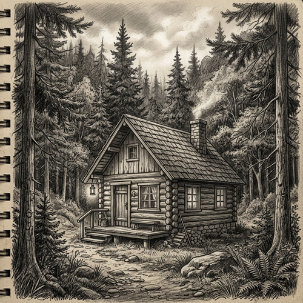

# Pencil Sketch

[← Back to Image Prompts](../README.md)

Detailed graphite pencil drawings characterized by precise linework, intricate cross-hatching, and subtle shading. This style captures the raw, monochromatic beauty of traditional sketching, ranging from loose, expressive studies to highly refined, photorealistic renderings. It emphasizes texture, light, and shadow on grainy sketch paper.

**Best for:** Portraits · Architectural concepts · Character design · Storyboarding · Nature studies · Fine art prints



> **Sample prompt used to generate the above image (Nano Banana 2):**
> ```text
> A highly detailed graphite pencil sketch of a rustic wooden cabin nestled in a pine forest, with intricate shading, cross-hatching, and realistic lighting, on textured sketch paper.
> ```

---

## Prompt Variations

### 🔵 Nano Banana 2 _(Featured)_

**Variation 1 — Detailed Portrait** _(Character Art)_ — Highly detailed graphite pencil sketch portrait of [SUBJECT], intricate cross-hatching, smooth shading, expressive eyes, rendered on textured sketch paper.

**Variation 2 — Architectural Concept** _(Design)_ — precise pencil sketch of [BUILDING/STRUCTURE], architectural rendering style, clean linework, perspective drawing, subtle shading for depth.

**Variation 3 — Loose Study** _(Concept Art)_ — Loose, expressive pencil sketch of [SUBJECT], quick energetic strokes, unfinished edges, artist's sketchbook style, dynamic lines.

**Variation 4 — Nature Botanical** _(Illustration)_ — Delicate pencil drawing of [PLANT/ANIMAL], scientific illustration style, fine details, soft gradients, high contrast graphite.

### ChatGPT / Midjourney / Stable Diffusion — Standard templates with "graphite pencil sketch, detailed linework, cross-hatching, monochrome, textured sketch paper" core keywords.

---

## 🔄 Image-to-Image Transformations

**Nano Banana 2** _(Featured)_
```text
Using the attached photo, transform it into a highly detailed graphite pencil sketch. Convert all colors to monochrome graphite tones. Emphasize light and shadow using intricate cross-hatching and smooth shading techniques. Add a visible grainy sketch paper texture to the background.
```
> 💡 **Follow-up refinements:**
> - "Make the lines looser and more sketchy"
> - "Increase the contrast with darker graphite"

---

## 💡 Tips & Best Practices
- **"Graphite pencil sketch"**: Specifies the medium clearly over general "drawing".
- **Mention techniques**: Words like "cross-hatching", "stippling", or "smudging" guide the AI on the style of shading.
- **Paper texture**: Always mention "textured sketch paper" or "grainy paper" to ground the image in reality.
- **Pairs well with:** [Charcoal Drawing](charcoal-drawing.md), [Blueprint Technical Drawing](blueprint-technical-drawing.md)
