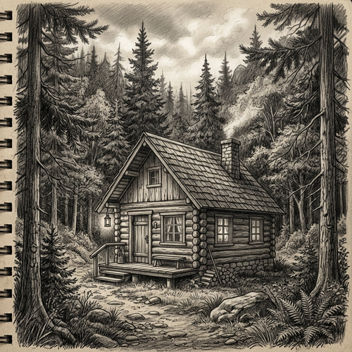

# Pencil Sketch

[← Back to Image Prompts](../README.md)

Detailed graphite pencil drawings characterized by precise linework, intricate cross-hatching, and subtle shading. This style captures the raw, monochromatic beauty of traditional sketching, ranging from loose, expressive studies to highly refined, photorealistic renderings. It emphasizes texture, light, and shadow on grainy sketch paper.

**Best for:** Portraits · Architectural concepts · Character design · Storyboarding · Nature studies · Fine art prints



> **Sample prompt used to generate the above image (Nano Banana 2):**
> ```text
> A highly detailed graphite pencil sketch of a rustic wooden cabin nestled in a pine forest, with intricate shading, cross-hatching, and realistic lighting, on textured sketch paper.
> ```

---

## Prompt Variations

### 🔵 Nano Banana 2 _(Featured)_

**Variation 1 — Detailed Portrait** _(Character Art)_
```text
Highly detailed graphite pencil sketch portrait of [SUBJECT], intricate cross-hatching, smooth shading, expressive eyes, rendered on textured sketch paper.
```

**Variation 2 — Architectural Concept** _(Design)_
```text
precise pencil sketch of [BUILDING/STRUCTURE], architectural rendering style, clean linework, perspective drawing, subtle shading for depth.
```

**Variation 3 — Loose Study** _(Concept Art)_
```text
Loose, expressive pencil sketch of [SUBJECT], quick energetic strokes, unfinished edges, artist's sketchbook style, dynamic lines.
```

**Variation 4 — Nature Botanical** _(Illustration)_
```text
Delicate pencil drawing of [PLANT/ANIMAL], scientific illustration style, fine details, soft gradients, high contrast graphite.
```

### ChatGPT

**Variation 1 — Detailed Portrait** _(Character Art)_
```text
Create a highly detailed graphite pencil sketch portrait of [SUBJECT] — intricate cross-hatching, smooth tonal shading, expressive eyes, monochrome graphite tones on visibly textured sketch paper. 3:4 vertical format.
```

**Variation 2 — Architectural Concept** _(Design)_
```text
Create a precise pencil sketch of [BUILDING/STRUCTURE] in an architectural rendering style — clean confident linework, accurate perspective, subtle graphite shading for depth, on textured sketch paper. 3:2 landscape format.
```

**Variation 3 — Loose Study** _(Concept Art)_
```text
Create a loose, expressive pencil sketch of [SUBJECT] — quick energetic strokes, unfinished edges, visible construction lines, artist's sketchbook aesthetic. 1:1 square format.
```

### Midjourney

**Variation 1 — Detailed Portrait** _(Character Art)_
```text
highly detailed graphite pencil sketch portrait of [SUBJECT], intricate cross-hatching, smooth shading, expressive eyes, textured sketch paper, monochrome --ar 3:4 --s 150
```

**Variation 2 — Architectural Concept** _(Design)_
```text
precise pencil sketch of [BUILDING/STRUCTURE], architectural rendering, clean linework, perspective drawing, subtle graphite shading, sketch paper --ar 3:2 --s 100
```

**Variation 3 — Nature Botanical** _(Illustration)_
```text
delicate graphite pencil drawing of [PLANT/ANIMAL], scientific illustration style, fine details, soft gradients, high contrast graphite, textured paper --ar 4:5 --s 150
```

### Stable Diffusion

**Variation 1 — Detailed Portrait** _(Character Art)_
- **Prompt:** `graphite pencil sketch portrait, [SUBJECT], intricate cross-hatching, smooth shading, expressive eyes, monochrome, textured sketch paper`
- **Negative Prompt:** `color, photograph, ink, digital painting, smooth airbrush, low quality`

**Variation 2 — Architectural Concept** _(Design)_
- **Prompt:** `pencil sketch, [BUILDING/STRUCTURE], architectural rendering, clean linework, perspective drawing, subtle graphite shading, textured sketch paper, monochrome`
- **Negative Prompt:** `color, photograph, messy scribbles, watercolor, blur`

---

## 🔄 Image-to-Image Transformations

**Nano Banana 2** _(Featured)_
```text
Using the attached photo, transform it into a highly detailed graphite pencil sketch. Convert all colors to monochrome graphite tones. Emphasize light and shadow using intricate cross-hatching and smooth shading techniques. Add a visible grainy sketch paper texture to the background.
```
> 💡 **Follow-up refinements:**
> - "Make the lines looser and more sketchy"
> - "Increase the contrast with darker graphite"

**ChatGPT**
```text
[Upload Photo] "Transform this photo into a detailed graphite pencil sketch — monochrome graphite tones, intricate cross-hatching and smooth shading for light and shadow, on grainy textured sketch paper."
```

**Midjourney**
```text
[IMAGE_URL] graphite pencil sketch, detailed cross-hatching, smooth shading, monochrome, textured sketch paper --iw 1.2 --ar 3:4
```

**Stable Diffusion**
- **Pipeline:** Img2Img · Denoising Strength: `0.5–0.65` (preserves composition, converts to graphite)
- **Prompt:** `graphite pencil sketch, detailed linework, cross-hatching, smooth shading, monochrome, textured sketch paper`
- **Negative Prompt:** `color, photograph, ink, digital painting, blur`

---

## 💡 Tips & Best Practices
- **"Graphite pencil sketch"**: Specifies the medium clearly over general "drawing".
- **Mention techniques**: Words like "cross-hatching", "stippling", or "smudging" guide the AI on the style of shading.
- **Paper texture**: Always mention "textured sketch paper" or "grainy paper" to ground the image in reality.
- **Pairs well with:** [Charcoal Drawing](charcoal-drawing.md), [Blueprint Technical Drawing](blueprint-technical-drawing.md)
