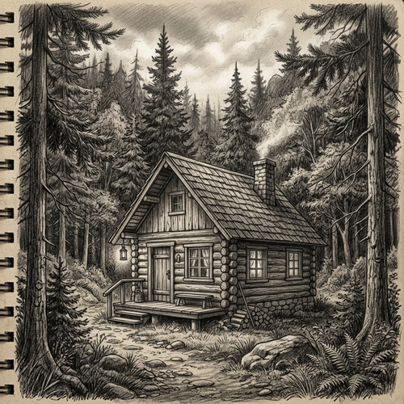

# Pencil Sketch

[← Back to Image Prompts](../README.md)

Detailed graphite pencil drawings characterized by precise linework, intricate cross-hatching, and subtle shading. This style captures the raw, monochromatic beauty of traditional sketching, ranging from loose, expressive studies to highly refined, photorealistic renderings. It emphasizes texture, light, and shadow on grainy sketch paper.

**Best for:** Portraits · Architectural concepts · Character design · Storyboarding · Nature studies · Fine art prints



---

## Prompt

Replace the bracketed details with your subject and preferred format.

```text
Graphite pencil sketch of [SUBJECT — e.g., a rustic cabin among pine trees], [FORMAT]. Establish the silhouette with confident fine lines, build dark areas with layered cross-hatching, and soften transitions with carefully blended graphite. Preserve unmarked paper for highlights and add the finest detail only at [FOCAL POINT — e.g., the lit cabin window]. Let the texture of cream sketch paper remain visible in the light tones. Observational drawing with convincing depth and natural variation in pencil pressure.
```

## With a Reference Image

Attach your image and use this prompt to preserve its defining features while applying the style.

```text
Using the attached photo, transform it into a highly detailed graphite pencil sketch. Convert all colors to monochrome graphite tones. Emphasize light and shadow using intricate cross-hatching and smooth shading techniques. Add a visible grainy sketch paper texture to the background.
```

---

## 💡 Tips & Best Practices
- **"Graphite pencil sketch"**: Specifies the medium clearly over general "drawing".
- **Mention techniques**: Words like "cross-hatching", "stippling", or "smudging" guide the AI on the style of shading.
- **Paper texture**: Always mention "textured sketch paper" or "grainy paper" to ground the image in reality.
- **Pairs well with:** [Charcoal Drawing](charcoal-drawing.md), [Blueprint Technical Drawing](blueprint-technical-drawing.md)
