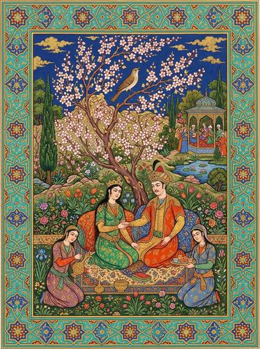

# Persian Miniature Painting

[← Back to Image Prompts](../README.md)

Highly detailed flat-perspective scenes with jewel-toned pigments, gold leaf accents, intricate geometric borders, and figures with almond-shaped eyes in lush garden settings. Inspired by the Shahnameh illustrations, Timurid and Safavid court painting, and the masterworks of Behzād.



> **Sample prompt used to generate the above image (Nano Banana 2):**
> ```text
> Persian miniature painting of a royal garden scene — a prince and princess seated on cushions beneath a flowering plum tree, attended by servants pouring tea, while a nightingale sings on a branch above them, 4:5 vertical format. Flat isometric perspective with no vanishing point — the garden is seen from a slightly elevated angle. Jewel-toned gouache pigments: lapis lazuli blue sky, vermillion robes, emerald foliage, and gold leaf accents on the clothing and tree. Intricate geometric border with interlocking star patterns in turquoise and gold. Figures have serene almond-shaped eyes and delicate features. Inspired by the Shahnameh and Safavid court painting tradition.
> ```

**ChatGPT**
```text
Create a Persian miniature painting depicting [SUBJECT] in a [ENVIRONMENT]. Use flat isometric perspective with no vanishing point — view the scene from a slightly elevated angle. Apply jewel-toned gouache pigments: lapis lazuli blue, vermillion, emerald green, and gold leaf accents. Frame the composition with an intricate geometric border using interlocking star patterns in turquoise and gold. Figures should have serene almond-shaped eyes and delicate features. Inspired by the Shahnameh and Safavid court painting tradition of Behzād.
```

**Midjourney**
```text
Persian miniature painting of [SUBJECT] in [ENVIRONMENT], flat isometric perspective, jewel-toned gouache pigments — lapis lazuli blue vermillion emerald, gold leaf accents, intricate geometric star-pattern border in turquoise and gold, serene almond-shaped eyes, Shahnameh Safavid style --ar 4:5 --s 250
```

**Stable Diffusion**
- **Prompt:** `Persian miniature painting, [SUBJECT] in [ENVIRONMENT], flat isometric perspective, jewel-toned gouache, lapis lazuli vermillion emerald, gold leaf accents, geometric star-pattern border, almond-shaped eyes, Shahnameh Safavid style, masterpiece`
- **Negative Prompt:** `photograph, 3d, realistic perspective, Western art, modern, dark`

**Nano Banana 2**
```text
Persian miniature painting depicting [SUBJECT] in a [ENVIRONMENT], 4:5 vertical format. Flat isometric perspective with no vanishing point — scene viewed from a slightly elevated angle. Jewel-toned gouache pigments: lapis lazuli blue, vermillion, emerald green, and gold leaf accents. Intricate geometric border with interlocking star patterns in turquoise and gold. Figures with serene almond-shaped eyes and delicate features. Inspired by the Shahnameh and Safavid court painting tradition.
```
