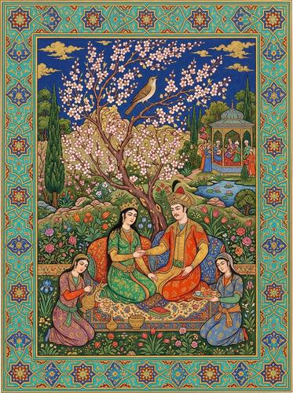

# Persian Miniature

[← Back to Image Prompts](../README.md)

Richly detailed paintings from the Persian manuscript tradition — flat perspective, jewel-toned mineral pigments, gold leaf accents, intricate floral borders, and narrative scenes depicting gardens, courts, hunts, and legends. Persian miniature painting combines microscopic detail (every tile pattern, textile weave, and flower petal individually rendered) with flat pictorial space where multiple scenes unfold simultaneously.

**Best for:** Art prints · Social media posts · Home décor · Greeting cards · Book illustrations · Desktop wallpapers



> **Sample prompt used to generate the above image (Nano Banana 2):**
> ```text
> Persian miniature painting depicting a royal garden party — courtiers seated on silk carpets under a flowering canopy, musicians playing, a central fountain, and a peacock on Nassā architecture in the background — on aged cream paper, 3:4 vertical format. Flat perspective with multiple scenes visible simultaneously. Rich mineral pigments — lapis lazuli blue, vermillion, malachite green, saffron gold. Gold leaf accents on architecture, clothing, and the ornate floral border frame. Every textile pattern, tile design, and flower petal individually rendered. Microscopic detail visible at every scale. Intricate floral border frame with arabesques.
> ```

---

## Prompt Variations

### 🔵 Nano Banana 2 _(Featured)_

**Variation 1 — Garden / Court Scene** _(Art Print)_
```text
Persian miniature of [SCENE], flat perspective, mineral pigments, gold leaf, floral border, microscopic detail, [FORMAT].
```

**Variation 2 — Battle / Hunt** _(Narrative Art)_
```text
Persian miniature depicting [BATTLE/HUNT], dynamic composition within flat space, rich pigments, gold accents, narrative detail, [FORMAT].
```

**Variation 3 — Portrait / Royal Figure** _(Profile Picture)_
```text
Persian miniature portrait of [FIGURE], formal pose, richly patterned clothing, gold leaf halo/background, floral border, [FORMAT].
```

**Variation 4 — Landscape / Architecture** _(Art Print)_
```text
Persian miniature of [LANDSCAPE/ARCHITECTURE], flat perspective, multiple vistas visible simultaneously, rich pigments, gold, intricate border, [FORMAT].
```

**Variation 5 — Modern Subject** _(Social Media)_
```text
Persian miniature-style painting of [MODERN SCENE], rendered in traditional flat perspective with mineral pigments and gold leaf, floral border, the contrast creates charm, [FORMAT].
```

### ChatGPT

**Variation 1 — Garden / Court Scene** _(Art Print)_
```text
Create a Persian miniature painting of [SCENE — e.g., a royal garden gathering] on aged cream paper — flat perspective with multiple scenes visible simultaneously, rich mineral pigments (lapis lazuli blue, vermillion, malachite green, saffron gold), gold leaf accents on architecture and clothing, and an intricate floral border frame with arabesques. Every textile pattern and flower petal individually rendered. 3:4 vertical format.
```

**Variation 2 — Royal Portrait** _(Book Illustration)_
```text
Create a Persian miniature portrait of [FIGURE] in a formal pose — richly patterned robes rendered in microscopic detail, a gold leaf background, jewel-toned mineral pigments, and an ornate floral border. Aged cream paper. 3:4 vertical format.
```

**Variation 3 — Modern Subject** _(Social Media)_
```text
Create a Persian miniature-style painting of [MODERN SCENE — e.g., a café full of laptops] rendered with complete traditional technique — flat perspective, mineral pigments, gold leaf, microscopic detail, intricate floral border. The anachronistic charm is the point. 3:4 vertical format.
```

### Midjourney

**Variation 1 — Garden / Court Scene** _(Art Print)_
```text
Persian miniature painting of [SCENE], flat perspective, lapis lazuli vermillion malachite saffron mineral pigments, gold leaf accents, intricate floral border, microscopic detail, aged cream paper --ar 3:4 --s 250
```

**Variation 2 — Battle / Hunt** _(Book Illustration)_
```text
Persian miniature depicting [BATTLE/HUNT], dynamic composition in flat pictorial space, rich mineral pigments, gold accents, narrative detail, ornate border --ar 3:4 --s 250
```

**Variation 3 — Royal Portrait** _(Art Print)_
```text
Persian miniature portrait of [FIGURE], formal pose, richly patterned clothing, gold leaf background, jewel-toned pigments, floral border, aged paper --ar 3:4 --s 200
```

### Stable Diffusion

**Variation 1 — Garden / Court Scene** _(Art Print)_
- **Prompt:** `Persian miniature painting, [SCENE], flat perspective, mineral pigments, lapis lazuli blue, vermillion, malachite green, gold leaf accents, intricate floral border, microscopic detail, aged cream paper`
- **Negative Prompt:** `photograph, 3d render, western perspective, realistic depth of field, low quality`

**Variation 2 — Royal Portrait** _(Book Illustration)_
- **Prompt:** `Persian miniature portrait, [FIGURE], formal pose, richly patterned robes, gold leaf background, jewel-toned mineral pigments, ornate floral border, manuscript painting`
- **Negative Prompt:** `photograph, realistic shading, 3d, modern illustration, blur`

---

## 🔄 Image-to-Image Transformations

**Nano Banana 2** _(Featured)_
```text
Using the attached photo, recreate it as a Persian miniature painting. Apply flat perspective — no Western vanishing-point perspective. Replace all colors with rich mineral pigments (lapis lazuli, vermillion, malachite, saffron). Add gold leaf accents. Render every textile, tile, and botanical element with microscopic detail. Add an intricate floral border frame. Aged cream paper surface.
```

**ChatGPT**
```text
[Upload Photo] "Recreate this photo as a Persian miniature painting — flat perspective, rich mineral pigments (lapis lazuli, vermillion, malachite, saffron), gold leaf accents, microscopic detail on every pattern, and an intricate floral border on aged cream paper."
```

**Midjourney**
```text
[IMAGE_URL] Persian miniature painting, flat perspective, mineral pigments, gold leaf accents, intricate floral border, microscopic detail, aged cream paper --iw 1 --ar 3:4
```

**Stable Diffusion**
- **Pipeline:** Img2Img · Denoising Strength: `0.6–0.75` (flattens perspective and repaints in pigments)
- **Prompt:** `Persian miniature painting, flat perspective, mineral pigments, gold leaf, intricate floral border, microscopic detail, aged paper`
- **Negative Prompt:** `photograph, 3d render, western perspective, realistic lighting`

---

## 💡 Tips & Best Practices
- **Flat perspective**: Persian miniatures do NOT use Western perspective. "Flat perspective with multiple scenes visible simultaneously."
- **Mineral pigment names**: "Lapis lazuli blue, vermillion, malachite green, saffron gold" — these specific pigments define the palette.
- **Microscopic detail**: "Every textile pattern, tile design, and flower petal individually rendered" — the density of detail is the hallmark.
- **Gold leaf accents**: Essential for the luminous, precious quality.
- **Pairs well with:** [Ukiyo-e Woodblock](ukiyo-e-woodblock.md) (similar flat perspective, different culture), [Illuminated Manuscript](illuminated-manuscript.md) (similar manuscript tradition)
