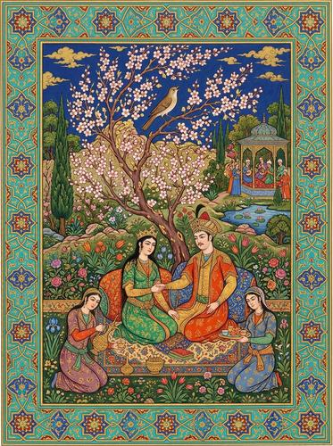

# Persian Miniature

[← Back to Image Prompts](../README.md)

Richly detailed paintings from the Persian manuscript tradition — flat perspective, jewel-toned mineral pigments, gold leaf accents, intricate floral borders, and narrative scenes depicting gardens, courts, hunts, and legends. Persian miniature painting combines microscopic detail (every tile pattern, textile weave, and flower petal individually rendered) with flat pictorial space where multiple scenes unfold simultaneously.

**Best for:** Art prints · Social media posts · Home décor · Greeting cards · Book illustrations · Desktop wallpapers



---

## Prompt

Replace the bracketed details with your subject and preferred format.

```text
Persian miniature painting of [SCENE — e.g., musicians and courtiers gathered beside a fountain in a garden], [FORMAT]. Use a flattened, layered perspective that shows the architecture, textiles, and garden at once. Render every tile, leaf, and patterned garment with fine brushwork and rich mineral pigments: lapis blue, vermilion, malachite green, and saffron. Add selective gold leaf to architectural details and clothing, with an intricate floral border of arabesques around the scene. Aged cream paper and dense detail balanced by a clear central narrative.
```

## With a Reference Image

Attach your image and use this prompt to preserve its defining features while applying the style.

```text
Using the attached photo, recreate it as a Persian miniature painting. Apply flat perspective — no Western vanishing-point perspective. Replace all colors with rich mineral pigments (lapis lazuli, vermillion, malachite, saffron). Add gold leaf accents. Render every textile, tile, and botanical element with microscopic detail. Add an intricate floral border frame. Aged cream paper surface.
```

---

## 💡 Tips & Best Practices
- **Flat perspective**: Persian miniatures do NOT use Western perspective. "Flat perspective with multiple scenes visible simultaneously."
- **Mineral pigment names**: "Lapis lazuli blue, vermillion, malachite green, saffron gold" — these specific pigments define the palette.
- **Microscopic detail**: "Every textile pattern, tile design, and flower petal individually rendered" — the density of detail is the hallmark.
- **Gold leaf accents**: Essential for the luminous, precious quality.
- **Pairs well with:** [Ukiyo-e Woodblock](ukiyo-e-woodblock.md) (similar flat perspective, different culture), [Illuminated Manuscript](illuminated-manuscript.md) (similar manuscript tradition)
