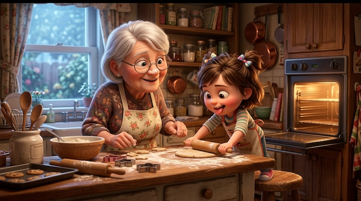

# Pixar / 3D Animation

[← Back to Image Prompts](../README.md)

Expressive 3D animated characters with large emotive eyes, soft subsurface-scattered skin, and whimsical, colorful environments. The quintessential family-film aesthetic — warm, inviting, and universally appealing. Characters have exaggerated but balanced proportions that convey personality instantly: a large head and eyes for expressiveness, simplified hands and feet, and clothing with chunky, stylized folds. This style works equally well for character portraits, full scenes, and transforming real people into their animated counterparts.

**Best for:** Profile pictures · Social media posts · Character designs · Group photo conversions · Phone wallpapers · Birthday/event invitations



> **Sample prompt used to generate the above image (Nano Banana 2):**
> ```text
> 3D animated feature film still of a grandmother and her granddaughter baking cookies together in a warm, cluttered kitchen, Pixar animation style, 16:9 landscape format. The grandmother has round spectacles and flour on her nose; the little girl stands on a stool, tongue poking out in concentration. Large expressive eyes with detailed iris reflections on both characters. Warm amber key light from the oven with cool blue window fill. Cookies, dough, and rolling pins scattered across the countertop.
> ```

---

## Prompt Variations

### 🔵 Nano Banana 2 _(Featured)_

> NB2 produces stunning Pixar-style characters. The most important phrase is "large expressive eyes with detailed iris reflections" — this is the hallmark of the Pixar look. Always specify both the key light color AND the fill light color for cinematic depth.

**Variation 1 — Single Character Portrait** _(Profile Picture, Social Media)_
```text
3D animated feature film character portrait of [SUBJECT — e.g., a young chef with messy hair, a flour-dusted apron, and a wooden spoon tucked behind one ear], Pixar animation style, 1:1 square format. Head and shoulders composition. Large expressive eyes with detailed iris reflections and catch lights. Soft rubbery skin with subsurface scattering. Exaggerated but appealing proportions — slightly oversized head, small nose, expressive eyebrows. Warm amber key light with cool blue fill. Vibrant [COLOR] gradient background. Friendly, determined expression.
```

**Variation 2 — Full Scene with Environment** _(Desktop Wallpaper, Social Post)_
```text
3D animated feature film still of [SUBJECT] in a whimsical [ENVIRONMENT — e.g., an enchanted library where books float through the air and spiral staircases twist into the clouds], Pixar animation style, 16:9 landscape format. Character positioned at a rule-of-thirds intersection with expressive pose showing [EMOTION — e.g., wide-eyed wonder with mouth agape]. Large eyes with iris reflections. Vibrant saturated color palette. Warm amber key light with cool blue fill. Rich environmental detail — every surface has texture and visual interest. Composition framed like a movie promotional poster.
```

**Variation 3 — Group / Family Scene** _(Family Content, Event Invitation)_
```text
3D animated feature film still of a group of [NUMBER] characters — [DESCRIBE EACH — e.g., a tall dad with a beard, a mom with braids and glasses, two kids, and a family dog] — posed together in [ENVIRONMENT], Pixar animation style, 16:9 landscape format. Each character has a distinct personality expressed through posture, expression, and proportions. All share the same art style — large expressive eyes with iris reflections, soft subsurface-scattered skin, exaggerated but appealing proportions. Warm key light with cool fill. Vibrant, joyful atmosphere.
```

**Variation 4 — Action / Dynamic Pose** _(YouTube Thumbnail, Phone Wallpaper)_
```text
3D animated feature film action still of [SUBJECT] in a dynamic mid-action pose — [ACTION — e.g., leaping across rooftops at sunset with a trail of sparkles behind them], Pixar animation style, 9:16 vertical format. Exaggerated action squash-and-stretch proportions. Large expressive eyes showing intensity and determination. Motion blur on trailing elements, sharp focus on the character. Dramatic low camera angle looking up at the character. Warm golden backlight with cool ambient fill. Vibrant saturated colors.
```

**Variation 5 — Pet / Animal Character** _(Social Media, Merchandise)_
```text
3D animated feature film portrait of an adorable [ANIMAL — e.g., golden retriever puppy] as a fully expressive Pixar character, 1:1 square format. The animal has a distinct personality — [PERSONALITY — e.g., goofy and enthusiastic with tongue hanging out and one ear flopped]. Large, soulful eyes with detailed iris reflections and catch lights. Soft fur rendered with individual strands catching the light. Exaggerated cute proportions — oversized head and paws for puppies, extra-fluffy for cats. Warm ambient lighting. Clean gradient background.
```

### ChatGPT

**Variation 1 — Character Portrait**
```text
Create a 3D animated character portrait of [SUBJECT] in the signature style of a Pixar feature film. Large expressive eyes with iris reflections, soft rubbery skin with subsurface scattering, and exaggerated but appealing proportions. Warm amber key light with cool blue fill. Vibrant gradient background. 1:1 square format. Friendly expression.
```

**Variation 2 — Full Scene**
```text
Create a 3D animated movie still of [SUBJECT] in a whimsical [ENVIRONMENT], Pixar animation style. Vibrant colors, expressive character poses, large eyes with iris reflections. Warm amber key light with cool blue fill. Rich environmental detail. Framed like a movie promotional poster. 3:2 landscape format.
```

**Variation 3 — Group Photo Conversion**
```text
Create a 3D animated Pixar-style group portrait of [NUMBER] characters: [DESCRIBE EACH]. Each has a distinct personality but shares the same art style — large expressive eyes, soft skin, exaggerated proportions. Warm lighting with cool fill. Joyful atmosphere. 3:2 landscape format.
```

### Midjourney

**Variation 1 — Character Portrait**
```text
3D animated Pixar-style character portrait of [SUBJECT], large expressive eyes with iris reflections, soft rubbery skin, exaggerated appealing proportions, warm amber key light, cool blue fill, gradient background --ar 1:1 --niji
```

**Variation 2 — Full Scene**
```text
3D animated feature film still of [SUBJECT] in a whimsical [ENVIRONMENT], Pixar animation style, large expressive eyes, vibrant saturated colors, warm amber key light with cool blue fill, movie poster composition --ar 16:9 --niji
```

**Variation 3 — Dynamic Action**
```text
3D animated Pixar-style action still, [SUBJECT] in dynamic mid-action pose, [ACTION], squash-and-stretch, dramatic low angle, warm golden backlight, vibrant saturated colors --ar 9:16 --niji
```

### Stable Diffusion

**Variation 1 — Character Portrait**
- **Prompt:** `3D animated Pixar-style character portrait, [SUBJECT], large expressive eyes, iris reflections, soft subsurface scattering skin, warm bounce lighting, vibrant colors, octane render`
- **Negative Prompt:** `realistic photograph, horror, dark, flat, sketch, monochrome`

**Variation 2 — Full Scene**
- **Prompt:** `3D animated movie still, [SUBJECT] in [ENVIRONMENT], Pixar animation style, expressive oversized eyes, soft subsurface scattering skin, warm bounce lighting, vibrant saturated colors, octane render`
- **Negative Prompt:** `realistic, dark, horror, flat, sketch, low quality`

**Variation 3 — Animal Character**
- **Prompt:** `3D animated Pixar-style [ANIMAL] character, large soulful eyes, soft detailed fur, exaggerated cute proportions, warm lighting, clean background, octane render`
- **Negative Prompt:** `realistic photograph, scary, dark, flat, rough, low quality`

---

## 🔄 Image-to-Image Transformations

Transform real photos into Pixar-style animated characters:

**Nano Banana 2** _(Featured)_
```text
Using the attached photograph as reference, transform every person into a 3D Pixar-style animated character. Preserve each person's hairstyle, clothing, accessories, and the overall scene composition. Stylize their features with large expressive eyes with iris reflections, soft rubbery skin, and exaggerated but appealing proportions. Rebuild the environment in a whimsical, colorful Pixar aesthetic. Warm amber key light with cool blue fill. 16:9 landscape format.
```
> 💡 **Follow-up refinements:**
> - "Make the eyes even larger and more expressive"
> - "Push the environment to be more whimsical — add floating elements, magical glow"
> - "Change [character]'s expression to [emotion]"
> - "Make it look more like a movie poster — add dramatic lighting and depth"
> - "Now create a 1:1 square version cropped to just the main character's face"

**ChatGPT**
```text
[Upload Photo] "Transform every person in this photo into a 3D Pixar-style animated character. Preserve their clothing, hairstyles, and the background layout, but stylize everything into a whimsical 3D animated movie aesthetic. Large expressive eyes, soft skin, vibrant colors."
```

**Midjourney**
```text
[IMAGE_URL] 3D Pixar animation style, expressive features, large eyes with iris reflections, soft rubbery skin, vibrant colors, warm magical lighting --iw 1.5 --ar 16:9 --niji
```

**Stable Diffusion**
- **Pipeline:** Img2Img · Denoising Strength: `0.60–0.75` (balanced — preserves identity while adding Pixar stylization)
- **Prompt:** `3D animated Pixar style, expressive features, large eyes, soft skin, subsurface scattering, vibrant colors, warm lighting, octane render`
- **Negative Prompt:** `realistic photograph, dark, horror, flat, distorted`

---

## 💡 Tips & Best Practices

- **Eyes are the Pixar signature**: "Large expressive eyes with detailed iris reflections and catch lights" — this single phrase does more for the Pixar look than any other descriptor.
- **Two-light setup**: Always specify both a warm key light (amber/golden) and a cool fill light (blue/teal). This two-tone lighting is instantly recognizable as Pixar.
- **Subsurface scattering on skin**: This is the technical term for the way light passes through the outer layers of skin, creating a soft glow. It's what separates Pixar from cheaper 3D.
- **Exaggerated proportions with purpose**: Big head = expressive. Small hands = non-threatening. Long limbs = elegant. Short and stocky = strong/stubborn. Use proportions to convey personality.
- **Common pitfalls**: Avoid "Disney style" (too generic). Avoid "realistic 3D" alongside "Pixar" — they pull in opposite directions. Don't over-describe facial features — let the AI work with "expressive" and "appealing."
- **Pairs well with:** [Studio Ghibli Anime](studio-ghibli-anime.md) (2D counterpart with similar emotional warmth), [The Simpsons](the-simpsons.md) (another iconic character conversion style)
