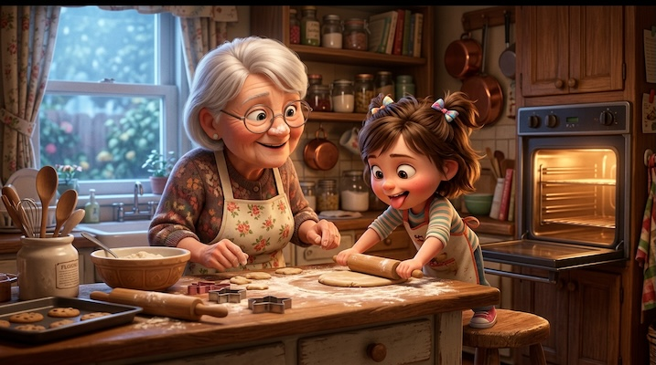

# Pixar / 3D Animation

[← Back to Image Prompts](../README.md)

Expressive 3D animated characters with large emotive eyes, soft subsurface-scattered skin, and whimsical, colorful environments. The quintessential family-film aesthetic — warm, inviting, and universally appealing. Characters have exaggerated but balanced proportions that convey personality instantly: a large head and eyes for expressiveness, simplified hands and feet, and clothing with chunky, stylized folds. This style works equally well for character portraits, full scenes, and transforming real people into their animated counterparts.

**Best for:** Profile pictures · Social media posts · Character designs · Group photo conversions · Phone wallpapers · Birthday/event invitations



---

## Prompt

Replace the bracketed details with your subject and preferred format.

```text
3D animated feature film character portrait of [SUBJECT — e.g., a young chef with messy hair, a flour-dusted apron, and a wooden spoon tucked behind one ear], Pixar animation style, 1:1 square format. Head and shoulders composition. Large expressive eyes with detailed iris reflections and catch lights. Soft rubbery skin with subsurface scattering. Exaggerated but appealing proportions — slightly oversized head, small nose, expressive eyebrows. Warm amber key light with cool blue fill. Vibrant [COLOR] gradient background. Friendly, determined expression.
```

## With a Reference Image

Attach your image and use this prompt to preserve its defining features while applying the style.

```text
Using the attached photograph as reference, transform every person into a 3D Pixar-style animated character. Preserve each person's hairstyle, clothing, accessories, and the overall scene composition. Stylize their features with large expressive eyes with iris reflections, soft rubbery skin, and exaggerated but appealing proportions. Rebuild the environment in a whimsical, colorful Pixar aesthetic. Warm amber key light with cool blue fill. 16:9 landscape format.
```

---

## 💡 Tips & Best Practices

- **Eyes are the Pixar signature**: "Large expressive eyes with detailed iris reflections and catch lights" — this single phrase does more for the Pixar look than any other descriptor.
- **Two-light setup**: Always specify both a warm key light (amber/golden) and a cool fill light (blue/teal). This two-tone lighting is instantly recognizable as Pixar.
- **Subsurface scattering on skin**: This is the technical term for the way light passes through the outer layers of skin, creating a soft glow. It's what separates Pixar from cheaper 3D.
- **Exaggerated proportions with purpose**: Big head = expressive. Small hands = non-threatening. Long limbs = elegant. Short and stocky = strong/stubborn. Use proportions to convey personality.
- **Common pitfalls**: Avoid "Disney style" (too generic). Avoid "realistic 3D" alongside "Pixar" — they pull in opposite directions. Don't over-describe facial features — let the AI work with "expressive" and "appealing."
- **Pairs well with:** [Studio Ghibli Anime](studio-ghibli-anime.md) (2D counterpart with similar emotional warmth), [The Simpsons](the-simpsons.md) (another iconic character conversion style)
