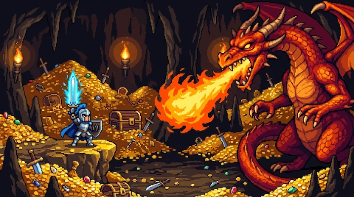

# Pixelated / 16-bit

[← Back to Image Prompts](../README.md)

Authentic retro video game pixel art evoking the SNES and Sega Genesis era — limited color palettes, visible pixel grids, and nostalgic charm.



> **Sample prompt used to generate the above image (Nano Banana 2):**
> ```text
> 16-bit pixel art scene of a tiny knight with a glowing blue sword facing an enormous
> fire-breathing dragon inside a treasure-filled cavern, 16:9 landscape format. Authentic
> SNES visual style. Limited curated color palette with warm golds for treasure, fiery oranges
> for the dragon's breath, and cool blues for the knight's enchanted blade. Each individual
> pixel clearly visible with crisp boundaries — no anti-aliasing. Side-scrolling perspective
> with the dragon taking up most of the right side of the frame.
> ```

**ChatGPT**
```text
Create a 16-bit pixel art scene of [SUBJECT] in a [ENVIRONMENT], in the authentic visual style of a Super Nintendo or Sega Genesis game from the early 1990s. Use a limited, curated color palette of no more than 64 colors. Each individual pixel should be clearly visible with crisp boundaries — no anti-aliasing, no sub-pixel blending. The composition should use an isometric or side-scrolling perspective.
```

**Midjourney**
```text
16-bit pixel art of [SUBJECT] in [ENVIRONMENT], authentic SNES/Genesis retro game style, limited 64-color palette, crisp visible pixel grid, no anti-aliasing, isometric perspective --ar 16:9 --niji
```

**Stable Diffusion**
- **Prompt:** `16-bit pixel art, [SUBJECT] in [ENVIRONMENT], retro SNES game graphics, limited color palette, crisp visible pixel grid, no anti-aliasing, pixel perfect, isometric perspective`
- **Negative Prompt:** `3d, smooth, gradients, high-resolution texture, blurry`

**Nano Banana 2**
```text
16-bit pixel art scene of [SUBJECT] in a [ENVIRONMENT] in the authentic visual style of a Super Nintendo or Sega Genesis game, 16:9 landscape format. Limited curated color palette of no more than 64 colors. Each individual pixel clearly visible with crisp boundaries — no anti-aliasing, no sub-pixel blending. Isometric or side-scrolling perspective.
```
