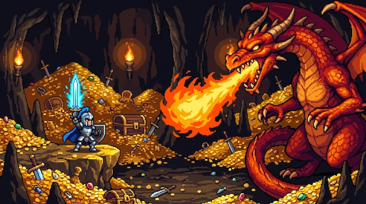

# Pixelated / 16-bit

[← Back to Image Prompts](../README.md)

Authentic SNES/Genesis-era pixel art with strictly limited color palettes, visible pixel grids, and the charming constraints of 16-bit hardware. Every pixel is intentionally placed, every color carefully selected from a restricted palette. The style encompasses everything from platformer sprites to detailed pixel-art scenes, capturing the nostalgic magic of gaming's golden age — vibrant, precise, and instantly recognizable.

**Best for:** Game assets · Profile pictures · Desktop wallpapers · Social media posts · Twitch/YouTube banners · Sticker designs · Merchandise



---

## Prompt

Replace the bracketed details with your subject and preferred format.

```text
16-bit pixel art character sprite of [CHARACTER — e.g., a wizard with a flowing purple robe, pointed hat, and a glowing staff], 1:1 square format. SNES-era aesthetic. Full-body sprite on a [COLOR] background. Every pixel individually visible on a strict pixel grid. Limited 16-color palette. Detailed pixel shading using dithering patterns. Clean pixel-perfect outlines. The character is in a [POSE — e.g., idle stance / casting spell / walking]. Inspired by Final Fantasy VI / Chrono Trigger sprite work.
```

## With a Reference Image

Attach your image and use this prompt to preserve its defining features while applying the style.

```text
Using the attached photo as reference, recreate the entire scene as 16-bit pixel art in the SNES era style. Reduce all elements to a visible pixel grid. Limit the color palette to 32 colors that approximate the original photo's tones. Use dithering patterns for shading instead of smooth gradients. Preserve the composition and key elements but simplify details to what pixels can express. Every pixel should be individually visible and intentional.
```

---

## 💡 Tips & Best Practices

- **"Visible pixel grid"**: Without this, AI models anti-alias the pixels into smooth edges. Always insist on visible, crisp pixel boundaries.
- **Limit the palette explicitly**: "16-color palette" or "32-color palette" forces the AI to work within authentic constraints. More colors dilute the retro feel.
- **Dithering is the shading**: "Dithering patterns rather than smooth gradients" defines how 16-bit art handles tonal transitions — alternating pixels of two colors to create the illusion of a third.
- **Name the hardware**: "SNES / Super Nintendo" or "Sega Genesis" or "Game Boy" — each has a distinct aesthetic and color set. The hardware reference calibrates the AI.
- **Common pitfalls**: "Pixel art" alone often produces modern, high-color pixel art that lacks retro charm. Always constrain the palette and name the hardware era.
- **Pairs well with:** [Isometric Pixel City](isometric-pixel-city.md) (same medium, different perspective), [Embroidered / Cross-Stitch](embroidered-cross-stitch.md) (same grid constraint, physical vs. digital)
