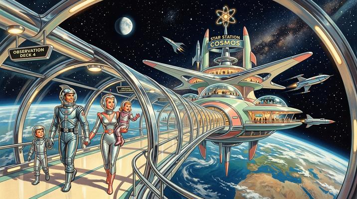

# Retrofuturism / Raygun Gothic

[← Back to Image Prompts](../README.md)

1950s–60s space-age optimism — chrome rockets, bubble helmets, atomic motifs, Jetsons-style architecture, and pastel-meets-metallic color palettes. The idealized retro vision of the future as imagined by the Atomic Age, pulp sci-fi illustrators, and Googie architecture.



> **Sample prompt used to generate the above image (Nano Banana 2):**
> ```text
> Retrofuturistic illustration of a 1950s-style family arriving at a gleaming chrome space
> station orbiting Earth, 16:9 landscape format. The mother wears a silver lamé jumpsuit and
> the father a finned chrome helmet; they lead two children through a curved transparent
> observation tube with Earth visible below. The space station has sweeping Googie
> architecture — boomerang-shaped wings, bubble-dome observation decks, and a central spire
> topped with a spinning atomic symbol. Polished chrome and pastel-colored surfaces — mint
> green, coral pink, cream, and metallic silver. Visible stars and a crescent moon through
> the transparent walls. The mood is optimistic and adventurous — the future as promised by
> 1950s Popular Mechanics magazine covers.
> ```

**ChatGPT**
```text
Create a retrofuturistic illustration of [SUBJECT] in a [ENVIRONMENT] inspired by 1950s–60s visions of the future. Include Googie architecture with sweeping curves, boomerang shapes, and bubble domes. Surfaces should be polished chrome and pastel-colored — mint green, coral pink, cream, and metallic silver. Incorporate atomic-age motifs: atom symbols, ray guns, finned rockets, and bubble helmets. The mood should be optimistic and adventurous — the future as promised by 1950s Popular Mechanics magazine covers and The Jetsons. Clean, idealized, and full of wonder.
```

**Midjourney**
```text
Retrofuturistic illustration, [SUBJECT] in [ENVIRONMENT], 1950s space-age aesthetic, Googie architecture, chrome rockets, bubble domes, atomic motifs, pastel and metallic palette — mint green coral pink cream silver, optimistic adventurous mood, Jetsons aesthetic --ar 16:9 --s 200
```

**Stable Diffusion**
- **Prompt:** `Retrofuturism raygun gothic illustration, [SUBJECT] in [ENVIRONMENT], 1950s space-age, Googie architecture, chrome rockets, bubble helmets, atomic motifs, pastel mint coral cream silver palette, optimistic, Jetsons aesthetic`
- **Negative Prompt:** `dystopian, dark, realistic, modern, gritty, cyberpunk, night`

**Nano Banana 2**
```text
Retrofuturistic illustration of [SUBJECT] in a [ENVIRONMENT] inspired by 1950s–60s visions of the future, 16:9 landscape format. Googie architecture with sweeping curves, boomerang shapes, and bubble domes. Polished chrome and pastel surfaces — mint green, coral pink, cream, and metallic silver. Atomic-age motifs: atom symbols, finned rockets, bubble helmets. The mood is optimistic and adventurous — the future as promised by 1950s Popular Mechanics and The Jetsons. Clean, idealized, and full of wonder.
```
