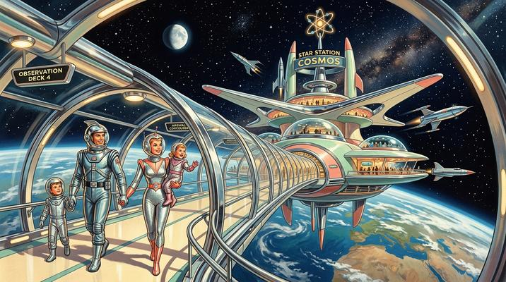

# Retrofuturism / Raygun Gothic

[← Back to Image Prompts](../README.md)

The retro-future that never happened — chrome rocketships, bubble-domed cities, finned automobiles, and the boundless technological optimism of 1950s/60s science fiction. The visual language of *The Jetsons*, *Forbidden Planet*, and *Googie architecture* — where every surface is streamlined, every vehicle has fins, and the future is bright, chrome, and atomic-powered.

**Best for:** Desktop wallpapers · Social media posts · Poster prints · Concept art · Brand imagery · Editorial illustrations · T-shirt designs



> **Sample prompt used to generate the above image (Nano Banana 2):**
> ```text
> Retrofuturist illustration of a 1960s family standing in front of their bubble-domed suburban home with a flying car parked in a hover-driveway, in the optimistic mid-century science fiction style, 16:9 landscape format. Chrome and pastel color palette — coral pink house, seafoam green trim, chrome accents. The flying car has exaggerated tail fins and a clear bubble canopy. A monorail zooms across a glass tube elevated track in the background. Atomic sunburst motifs on the garden fence. Clean streamlined shapes with no sharp edges — everything is rounded and aerodynamic. Bright, sunny, boundlessly optimistic.
> ```

---

## Prompt Variations

### 🔵 Nano Banana 2 _(Featured)_

**Variation 1 — Domestic / Suburban Scene** _(Social Media, Poster)_
```text
Retrofuturist illustration of [SCENE — e.g., a 1960s housewife using a robotic kitchen assistant that floats on anti-gravity discs while preparing a meal from pill capsules], optimistic mid-century sci-fi style, 16:9 landscape format. Chrome and [PASTEL PALETTE — e.g., mint green, coral pink, butter yellow]. Streamlined, rounded shapes — no sharp edges. Atomic sunburst and starburst motifs on surfaces. The kitchen has a bubble canopy window overlooking a city of geodesic domes. Every surface is chrome-trimmed. Bright, sunny, 1950s World's Fair optimism.
```

**Variation 2 — Spaceport / Transportation** _(Desktop Wallpaper, Concept Art)_
```text
Retrofuturist illustration of [SCENE — e.g., a busy spaceport with chrome rocketships being loaded on launch pads, passengers in streamlined space suits boarding via glass tube walkways], 16:9 landscape format. Mid-century sci-fi aesthetic. Chrome, glass, and [PASTEL PALETTE]. Every rocketship has exaggerated tail fins and porthole windows. Glass-tube monorails connect terminal buildings. Atomic energy symbols on the fuel tankers. Bright optimistic lighting. The Jetsons meets NASA concept art from the 1960s.
```

**Variation 3 — Vehicle Close-Up** _(Social Media, Poster Print)_
```text
Retrofuturist illustration of a [VEHICLE — e.g., two-seater flying car with a chrome body, exaggerated tail fins, a clear bubble canopy, and glowing atomic engine pods], parked on a futuristic landing pad, 16:9 landscape format. Mid-century sci-fi design language — everything streamlined and aerodynamic with rounded chrome surfaces. [PASTEL PALETTE] painted panels with chrome trim. A couple in stylish 1960s-futuristic clothing stands beside it. A retro-futuristic city skyline in the background. Bright sunny day.
```

**Variation 4 — City Panorama** _(Ultra-Wide Wallpaper, Print)_
```text
Retrofuturist panoramic illustration of a city of tomorrow, 16:9 ultra-wide format. Geodesic dome buildings, glass-tube elevated walkways, chrome spire towers, atomic-powered monorails on elevated tracks, and flying cars in color-coded traffic lanes. [PASTEL PALETTE] buildings with chrome accents. A massive chrome and glass World's Fair-style exposition building at the center. Citizens in streamlined futuristic clothing walk on moving sidewalks. Bright blue sky with one or two chrome rocketships ascending. 1960s boundless optimism.
```

**Variation 5 — Robot / Android** _(Social Media, Character Design)_
```text
Retrofuturist illustration of a friendly household robot — [DESIGN — e.g., chrome dome head with a single glowing blue eye, accordion-style segmented torso, pincer hands holding a serving tray of futuristic food pills], 3:4 vertical format. Mid-century sci-fi design language — rounded chrome body, atomic logo on the chest plate, antenna on the head. [PASTEL] domestic background. The robot has a cheerful, servile posture. Inspired by Robby the Robot and 1950s sci-fi illustration. Bright, clean, optimistic.
```

### ChatGPT

**Variation 1 — Retrofuturist Scene** _(Poster)_
```text
Create a retrofuturist illustration of [SCENE] — chrome and pastel palette, streamlined rounded shapes, atomic sunburst motifs, 1960s World's Fair optimism. Bright, sunny, and hopeful. 3:2 landscape format.
```

**Variation 2 — City Panorama** _(Desktop Wallpaper)_
```text
Create a retrofuturist city panorama with geodesic domes, elevated monorails, and flying cars with tail fins — chrome spires against a pastel sky, bright optimistic mid-century futurism. 3:2 landscape format.
```

**Variation 3 — Friendly Robot** _(Character Design)_
```text
Create a retrofuturist robot character — chrome dome head with a single glowing eye, [DESIGN], friendly servile posture, pastel domestic background. 1950s sci-fi illustration style, Robby the Robot inspired. 2:3 vertical format.
```

### Midjourney

**Variation 1 — Retrofuturist Scene** _(Poster)_
```text
retrofuturist illustration, [SCENE], chrome and pastel palette, streamlined shapes, atomic motifs, 1960s World's Fair optimism, The Jetsons aesthetic --ar 16:9 --s 300
```

**Variation 2 — City Panorama** _(Desktop Wallpaper)_
```text
retrofuturist city panorama, geodesic domes, monorails, flying cars, chrome spires, pastel sky, bright sunny optimism --ar 21:9 --s 300
```

**Variation 3 — Friendly Robot** _(Character Design)_
```text
retrofuturist robot character, chrome dome head, [DESIGN], friendly, pastel domestic background, 1950s sci-fi illustration --ar 4:5 --s 250
```

### Stable Diffusion

**Variation 1 — Retrofuturist Scene** _(Poster)_
- **Prompt:** `retrofuturist illustration, [SCENE], chrome, pastel palette, streamlined rounded shapes, atomic sunburst motifs, 1960s optimism, mid-century sci-fi`
- **Negative Prompt:** `dark, gritty, modern, realistic photo, cyberpunk, dystopian`

**Variation 2 — City Panorama** _(Desktop Wallpaper)_
- **Prompt:** `retrofuturist city panorama, geodesic domes, monorails, flying cars, chrome spires, pastel sky, bright sunny, mid-century futurism`
- **Negative Prompt:** `dark, dystopian, modern architecture, realistic, gritty, neon cyberpunk`

---

## 🔄 Image-to-Image Transformations

**Nano Banana 2** _(Featured)_
```text
Using the attached photo as reference, reimagine the scene in a retrofuturist 1960s science fiction style. Replace all technology with chrome, streamlined, fin-equipped equivalents. Change the architecture to geodesic domes and glass tubes. Remap the color palette to chrome + [PASTELS]. Add atomic sunburst motifs. The mood should be bright, sunny, and boundlessly optimistic. Mid-century World's Fair aesthetic.
```
> 💡 **Follow-up refinements:** "Add a flying car" · "Add a friendly chrome robot" · "Make it a poster with retro typography" · "Push the chrome harder"

**ChatGPT**
```text
[Upload Photo] "Reimagine this scene in retrofuturist 1960s sci-fi style — chrome streamlined technology with tail fins, geodesic dome architecture, a pastel-and-chrome palette, atomic sunburst motifs, and bright sunny optimism."
```

**Midjourney**
```text
[IMAGE_URL] retrofuturist 1960s sci-fi, chrome streamlined technology, geodesic domes, pastel and chrome palette, atomic motifs, bright optimistic --iw 1 --ar 16:9
```

**Stable Diffusion**
- **Pipeline:** Img2Img · Denoising Strength: `0.6–0.75` (rebuilds technology and architecture in period style)
- **Prompt:** `retrofuturist illustration, chrome, pastel palette, streamlined shapes, atomic motifs, 1960s optimism`
- **Negative Prompt:** `dark, gritty, cyberpunk, modern realistic photo`

---

## 💡 Tips & Best Practices

- **Chrome + pastels = retrofuturism**: Everything metallic is chrome. Everything else is mid-century pastel — coral, mint, butter yellow, powder blue.
- **No sharp edges**: "Streamlined, rounded shapes" — retrofuturism is aerodynamic even when something doesn't need to fly.
- **Atomic motifs**: Sunbursts, starbursts, and atom symbols are the decorative language of the era.
- **Optimism is the mood**: This is NOT dystopian sci-fi. Everything is bright, sunny, and hopeful. The future is wonderful.
- **Common pitfalls**: Don't mix with cyberpunk or brutalism — those are opposite aesthetics. Avoid gritty or dark tones.
- **Pairs well with:** [Steampunk Contraptions](steampunk-contraptions.md) (alt-history technology, different era), [Art Deco Illustration](art-deco-illustration.md) (similar geometric elegance)
