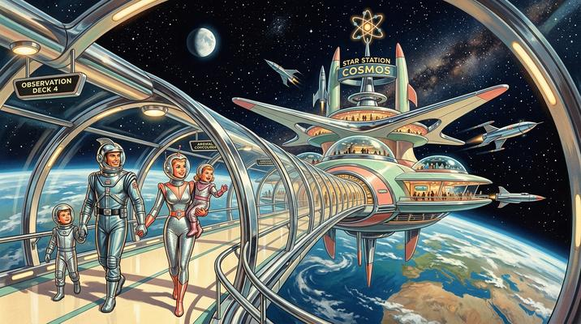

# Retrofuturism / Raygun Gothic

[← Back to Image Prompts](../README.md)

The retro-future that never happened — chrome rocketships, bubble-domed cities, finned automobiles, and the boundless technological optimism of 1950s/60s science fiction. The visual language of *The Jetsons*, *Forbidden Planet*, and *Googie architecture* — where every surface is streamlined, every vehicle has fins, and the future is bright, chrome, and atomic-powered.

**Best for:** Desktop wallpapers · Social media posts · Poster prints · Concept art · Brand imagery · Editorial illustrations · T-shirt designs



---

## Prompt

Replace the bracketed details with your subject and preferred format.

```text
Retrofuturist illustration of [SCENE — e.g., a 1960s housewife using a robotic kitchen assistant that floats on anti-gravity discs while preparing a meal from pill capsules], optimistic mid-century sci-fi style, 16:9 landscape format. Chrome and [PASTEL PALETTE — e.g., mint green, coral pink, butter yellow]. Streamlined, rounded shapes — no sharp edges. Atomic sunburst and starburst motifs on surfaces. The kitchen has a bubble canopy window overlooking a city of geodesic domes. Every surface is chrome-trimmed. Bright, sunny, 1950s World's Fair optimism.
```

## With a Reference Image

Attach your image and use this prompt to preserve its defining features while applying the style.

```text
Using the attached photo as reference, reimagine the scene in a retrofuturist 1960s science fiction style. Replace all technology with chrome, streamlined, fin-equipped equivalents. Change the architecture to geodesic domes and glass tubes. Remap the color palette to chrome + [PASTELS]. Add atomic sunburst motifs. The mood should be bright, sunny, and boundlessly optimistic. Mid-century World's Fair aesthetic.
```

---

## 💡 Tips & Best Practices

- **Chrome + pastels = retrofuturism**: Everything metallic is chrome. Everything else is mid-century pastel — coral, mint, butter yellow, powder blue.
- **No sharp edges**: "Streamlined, rounded shapes" — retrofuturism is aerodynamic even when something doesn't need to fly.
- **Atomic motifs**: Sunbursts, starbursts, and atom symbols are the decorative language of the era.
- **Optimism is the mood**: This is NOT dystopian sci-fi. Everything is bright, sunny, and hopeful. The future is wonderful.
- **Common pitfalls**: Don't mix with cyberpunk or brutalism — those are opposite aesthetics. Avoid gritty or dark tones.
- **Pairs well with:** [Steampunk Contraptions](steampunk-contraptions.md) (alt-history technology, different era), [Art Deco Illustration](art-deco-illustration.md) (similar geometric elegance)
