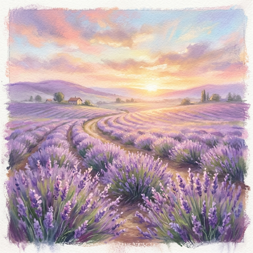

# Soft Pastel

[← Back to Image Prompts](../README.md)

Dreamy, softly blended artworks created with dry pastels. This style is characterized by its luminous, powdery colors, gentle smudged transitions, and the distinct grainy texture of pastel paper. It is perfect for capturing ethereal light, hazy atmospheres, and delicate subjects.

**Best for:** Dreamy landscapes · Soft portraits · Dawn/dusk scenes · Ethereal concepts · Impressionist scenes



> **Sample prompt used to generate the above image (Nano Banana 2):**
> ```text
> A dreamy, softly blended pastel drawing of a field of lavender at dawn, with gentle smudged edges, luminous colors, and visible pastel grain texture.
> ```

---

## Prompt Variations

### 🔵 Nano Banana 2 _(Featured)_

**Variation 1 — Dreamy Landscape** _(Fine Art)_ — Soft pastel drawing of [LANDSCAPE], dreamy and ethereal atmosphere, luminous powdery colors, softly blended edges, visible pastel grain texture.

**Variation 2 — Impressionist Portrait** _(Character Art)_ — Impressionist soft pastel portrait of [SUBJECT], gentle smudged shading, soft glowing light, delicate color transitions, textured paper.

**Variation 3 — Golden Hour** _(Environment Art)_ — Luminous soft pastel artwork of [SCENE] at sunset, hazy golden hour lighting, powdery textures, vibrant but soft color palette.

**Variation 4 — Still Life** _(Gallery Art)_ — Beautiful soft pastel drawing of [OBJECTS], soft focus, blended powdery strokes, chalky texture.

### ChatGPT / Midjourney / Stable Diffusion — Standard templates with "soft pastel drawing, softly blended, luminous powdery colors, smudged edges, pastel grain texture" core keywords.

---

## 🔄 Image-to-Image Transformations

**Nano Banana 2** _(Featured)_
```text
Using the attached photo, transform it into a dreamy soft pastel drawing. Soften all sharp edges with gentle smudged transitions. Map the colors to a luminous, powdery palette. Add the distinct dry, chalky texture of pastels on grainy textured paper. Give the overall image a hazy, ethereal atmosphere.
```
> 💡 **Follow-up refinements:**
> - "Make the blending softer and more hazy"
> - "Increase the visible paper grain texture"

---

## 💡 Tips & Best Practices
- **"Softly blended" and "smudged"**: Pastels are famously blended by hand, and these keywords capture that soft-focus look.
- **"Powdery colors"**: Helps achieve the distinct dry, chalky vibrancy of pastels compared to wet paints.
- **"Pastel grain texture"**: Pastel paper has a specific tooth that catches the pigment; mentioning this adds realism.
- **Pairs well with:** [Watercolor Painting](watercolor-painting.md), [Long Exposure Light Painting](long-exposure-light-painting.md) (for ethereal light)
