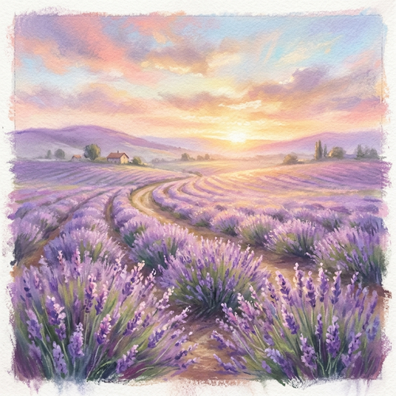

# Soft Pastel

[← Back to Image Prompts](../README.md)

Dreamy, softly blended artworks created with dry pastels. This style is characterized by its luminous, powdery colors, gentle smudged transitions, and the distinct grainy texture of pastel paper. It is perfect for capturing ethereal light, hazy atmospheres, and delicate subjects.

**Best for:** Dreamy landscapes · Soft portraits · Dawn/dusk scenes · Ethereal concepts · Impressionist scenes



> **Sample prompt used to generate the above image (Nano Banana 2):**
> ```text
> A dreamy, softly blended pastel drawing of a field of lavender at dawn, with gentle smudged edges, luminous colors, and visible pastel grain texture.
> ```

---

## Prompt Variations

### 🔵 Nano Banana 2 _(Featured)_

**Variation 1 — Dreamy Landscape** _(Fine Art)_
```text
Soft pastel drawing of [LANDSCAPE], dreamy and ethereal atmosphere, luminous powdery colors, softly blended edges, visible pastel grain texture.
```

**Variation 2 — Impressionist Portrait** _(Character Art)_
```text
Impressionist soft pastel portrait of [SUBJECT], gentle smudged shading, soft glowing light, delicate color transitions, textured paper.
```

**Variation 3 — Golden Hour** _(Environment Art)_
```text
Luminous soft pastel artwork of [SCENE] at sunset, hazy golden hour lighting, powdery textures, vibrant but soft color palette.
```

**Variation 4 — Still Life** _(Gallery Art)_
```text
Beautiful soft pastel drawing of [OBJECTS], soft focus, blended powdery strokes, chalky texture.
```

### ChatGPT

**Variation 1 — Dreamy Landscape** _(Fine Art)_
```text
Create a dreamy soft pastel drawing of [LANDSCAPE] — luminous powdery colors, gently smudged transitions between tones, an ethereal hazy atmosphere, and the visible grain of textured pastel paper. 3:2 landscape format.
```

**Variation 2 — Impressionist Portrait** _(Character Art)_
```text
Create an impressionist soft pastel portrait of [SUBJECT] with gentle smudged shading, soft glowing light on the face, delicate powdery color transitions, and chalky pastel texture on grainy paper. 3:4 vertical format.
```

**Variation 3 — Golden Hour Scene** _(Environment Art)_
```text
Create a luminous soft pastel artwork of [SCENE] at sunset — hazy golden-hour light, powdery blended textures, a vibrant but soft color palette, dreamlike warmth. 16:9 landscape format.
```

### Midjourney

**Variation 1 — Dreamy Landscape** _(Fine Art)_
```text
soft pastel drawing of [LANDSCAPE], dreamy ethereal atmosphere, luminous powdery colors, softly blended smudged edges, visible pastel grain texture --ar 3:2 --s 350
```

**Variation 2 — Impressionist Portrait** _(Character Art)_
```text
impressionist soft pastel portrait of [SUBJECT], gentle smudged shading, soft glowing light, delicate color transitions, chalky texture, grainy paper --ar 3:4 --s 300
```

**Variation 3 — Golden Hour** _(Environment Art)_
```text
luminous soft pastel artwork of [SCENE] at sunset, hazy golden hour light, powdery blended textures, vibrant soft palette --ar 16:9 --s 400
```

### Stable Diffusion

**Variation 1 — Dreamy Landscape** _(Fine Art)_
- **Prompt:** `soft pastel drawing, [LANDSCAPE], dreamy ethereal atmosphere, luminous powdery colors, softly blended smudged edges, pastel grain paper texture`
- **Negative Prompt:** `photograph, oil painting, sharp edges, digital art, oversaturated, low quality`

**Variation 2 — Impressionist Portrait** _(Character Art)_
- **Prompt:** `soft pastel portrait, [SUBJECT], impressionist style, gentle smudged shading, soft glowing light, delicate powdery color transitions, chalky texture, grainy paper`
- **Negative Prompt:** `photograph, sharp detail, digital render, harsh contrast, blur`

---

## 🔄 Image-to-Image Transformations

**Nano Banana 2** _(Featured)_
```text
Using the attached photo, transform it into a dreamy soft pastel drawing. Soften all sharp edges with gentle smudged transitions. Map the colors to a luminous, powdery palette. Add the distinct dry, chalky texture of pastels on grainy textured paper. Give the overall image a hazy, ethereal atmosphere.
```
> 💡 **Follow-up refinements:**
> - "Make the blending softer and more hazy"
> - "Increase the visible paper grain texture"

**ChatGPT**
```text
[Upload Photo] "Transform this photo into a dreamy soft pastel drawing — soften all edges with smudged transitions, map colors to a luminous powdery palette, add chalky pastel texture on grainy paper, and give it a hazy ethereal atmosphere."
```

**Midjourney**
```text
[IMAGE_URL] soft pastel drawing, luminous powdery colors, softly blended smudged edges, chalky texture, pastel grain paper, hazy ethereal --iw 1.2 --ar 3:2
```

**Stable Diffusion**
- **Pipeline:** Img2Img · Denoising Strength: `0.5–0.65` (softens detail into powdery blends)
- **Prompt:** `soft pastel drawing, luminous powdery colors, smudged blended edges, chalky texture, pastel paper grain, hazy atmosphere`
- **Negative Prompt:** `photograph, sharp edges, oil painting, digital art`

---

## 💡 Tips & Best Practices
- **"Softly blended" and "smudged"**: Pastels are famously blended by hand, and these keywords capture that soft-focus look.
- **"Powdery colors"**: Helps achieve the distinct dry, chalky vibrancy of pastels compared to wet paints.
- **"Pastel grain texture"**: Pastel paper has a specific tooth that catches the pigment; mentioning this adds realism.
- **Pairs well with:** [Watercolor Painting](watercolor-painting.md), [Long Exposure Light Painting](long-exposure-light-painting.md) (for ethereal light)
