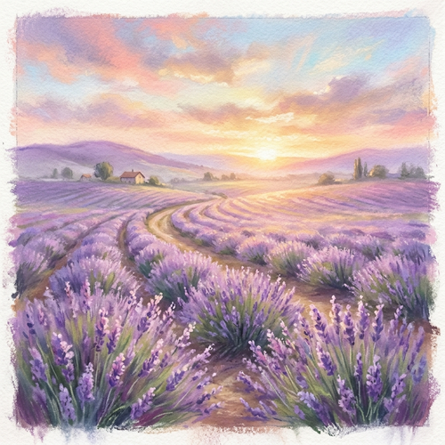

# Soft Pastel

[← Back to Image Prompts](../README.md)

Dreamy, softly blended artworks created with dry pastels. This style is characterized by its luminous, powdery colors, gentle smudged transitions, and the distinct grainy texture of pastel paper. It is perfect for capturing ethereal light, hazy atmospheres, and delicate subjects.

**Best for:** Dreamy landscapes · Soft portraits · Dawn/dusk scenes · Ethereal concepts · Impressionist scenes



---

## Prompt

Replace the bracketed details with your subject and preferred format.

```text
Soft pastel drawing of [SCENE — e.g., a lavender field at dawn], [FORMAT]. Layer luminous [COLORS — e.g., lavender, apricot, and cool blue] over textured pastel paper, allowing the grain to show between strokes. Blend the distant forms into a gentle haze while keeping dry, broken pastel marks on the nearest flowers or focal details. Use broad soft light and an open composition with plenty of air around the subject. Chalky pigment, feathered edges, and a quiet dreamlike mood.
```

## With a Reference Image

Attach your image and use this prompt to preserve its defining features while applying the style.

```text
Using the attached photo, transform it into a dreamy soft pastel drawing. Soften all sharp edges with gentle smudged transitions. Map the colors to a luminous, powdery palette. Add the distinct dry, chalky texture of pastels on grainy textured paper. Give the overall image a hazy, ethereal atmosphere.
```

---

## 💡 Tips & Best Practices
- **"Softly blended" and "smudged"**: Pastels are famously blended by hand, and these keywords capture that soft-focus look.
- **"Powdery colors"**: Helps achieve the distinct dry, chalky vibrancy of pastels compared to wet paints.
- **"Pastel grain texture"**: Pastel paper has a specific tooth that catches the pigment; mentioning this adds realism.
- **Pairs well with:** [Watercolor Painting](watercolor-painting.md), [Long Exposure Light Painting](long-exposure-light-painting.md) (for ethereal light)
