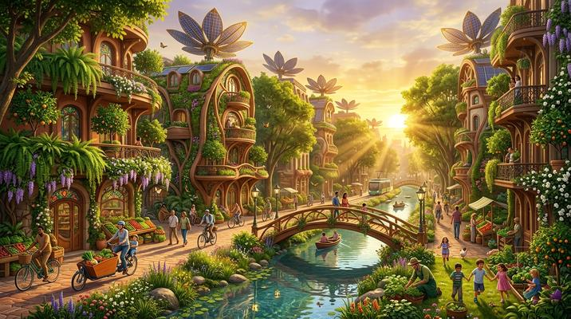

# Solarpunk

[← Back to Image Prompts](../README.md)

Optimistic eco-futurism — lush vertical gardens on Art Nouveau architecture, solar panels integrated into organic structures, diverse communities thriving in harmony with nature, and golden-hour warmth. The hopeful antithesis of cyberpunk, imagining a sustainable future we'd actually want to live in.



> **Sample prompt used to generate the above image (Nano Banana 2):**
> ```text
> Solarpunk cityscape at golden hour — a thriving urban neighborhood where nature and
> technology coexist in harmony, 16:9 landscape format. Art Nouveau-inspired buildings with
> curved organic facades covered in lush vertical gardens: cascading ferns, flowering vines,
> and fruit trees growing from integrated planters at every level. Solar panel arrays shaped
> like giant flower petals crown each rooftop. A crystal-clear canal runs through the center of
> the street, lined with wildflowers and crossed by a graceful wooden footbridge. Cyclists,
> gardeners, and children populate the scene. Warm golden-hour sunlight bathes everything in
> amber, with volumetric light filtering through the green canopy. Butterflies and birds are
> visible. The palette is dominated by lush greens, warm golds, and terracotta.
> ```

**ChatGPT**
```text
Create a solarpunk scene depicting [SUBJECT] in a [ENVIRONMENT] where nature and technology coexist in harmony. Art Nouveau-inspired architecture with curved organic facades covered in lush vertical gardens — cascading ferns, flowering vines, and fruit trees. Solar panel arrays shaped like flower petals on rooftops. Crystal-clear waterways lined with wildflowers. Include people gardening, cycling, or socializing to show a thriving community. Warm golden-hour sunlight with volumetric light filtering through the green canopy. Palette dominated by lush greens, warm golds, and terracotta. Optimistic and hopeful.
```

**Midjourney**
```text
Solarpunk cityscape, [SUBJECT] in [ENVIRONMENT], Art Nouveau organic architecture with vertical gardens, petal-shaped solar panels, crystal-clear canals, diverse community, golden-hour sunlight, volumetric light through green canopy, lush greens warm golds terracotta palette, optimistic eco-futurism --ar 16:9 --s 250
```

**Stable Diffusion**
- **Prompt:** `Solarpunk scene, [SUBJECT] in [ENVIRONMENT], Art Nouveau organic architecture, vertical gardens, flower-petal solar panels, canals, golden-hour lighting, volumetric green canopy light, lush greens golds terracotta, eco-futurism, optimistic, masterpiece`
- **Negative Prompt:** `dystopian, cyberpunk, dark, polluted, concrete, grey, rain, night`

**Nano Banana 2**
```text
Solarpunk scene depicting [SUBJECT] in a [ENVIRONMENT] where nature and technology coexist in harmony, 16:9 landscape format. Art Nouveau-inspired architecture with curved organic facades covered in lush vertical gardens — cascading ferns, flowering vines, and fruit trees. Solar panel arrays shaped like flower petals on rooftops. Crystal-clear waterways lined with wildflowers. People gardening, cycling, or socializing. Warm golden-hour sunlight with volumetric light filtering through the green canopy. Palette dominated by lush greens, warm golds, and terracotta. Optimistic eco-futurism — the hopeful antithesis of cyberpunk.
```
