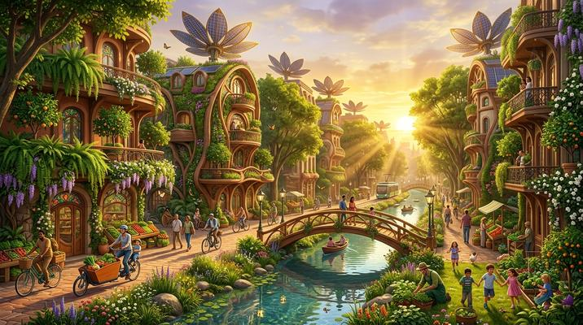

# Solarpunk

[← Back to Image Prompts](../README.md)

A utopian vision where advanced technology and lush nature coexist harmoniously — vertical gardens climbing solar-panel facades, organic architecture with living rooftops, algae bioreactors, and communities living in balance with their environment. Solarpunk is the hopeful counterpart to cyberpunk: instead of rain-soaked neon dystopia, it offers sunlit green harmony. The aesthetic is warm, bright, and dense with botanical detail interwoven with clean technology.

**Best for:** Desktop wallpapers · Social media posts · Concept art · Editorial illustrations · Architecture visualizations · Poster prints · Book covers



> **Sample prompt used to generate the above image (Nano Banana 2):**
> ```text
> Photograph of a solarpunk urban neighborhood — a residential street where every building is covered in vertical gardens, rooftop food forests, and integrated solar panel facades that double as trellises for flowering vines, 16:9 landscape format. A community bicycle-share station with organic curved forms sits at an intersection. An ancient oak tree grows through the center of a roundabout. Algae bioreactor tubes glow soft green along one building. Citizens ride bicycles and walk along tree-shaded paths. Warm golden-hour sunlight filters through the canopy. The architecture blends Art Nouveau organic curves with clean modern sustainability tech. Dense, lush, hopeful.
> ```

---

## Prompt Variations

### 🔵 Nano Banana 2 _(Featured)_

**Variation 1 — Urban Scene** _(Desktop Wallpaper)_
```text
Photograph of a solarpunk [SCENE — e.g., city intersection with buildings wrapped in vertical gardens, fruit trees growing from balconies, solar canopy walkways, and a crystal-clear urban stream flowing through a stone channel], 16:9 landscape format. Technology and nature interwoven — [TECH DETAILS — e.g., semi-transparent solar roof panels, wind micro-turbines shaped like leaves, a cargo drone delivering produce]. Warm golden-hour sunlight. Lush dense vegetation. Art Nouveau organic architecture meets clean sustainability tech. Hopeful, vibrant, alive.
```

**Variation 2 — Architecture Close-Up** _(Social Media, Concept Art)_
```text
Photograph of a solarpunk building facade — [BUILDING — e.g., a community library with a living wall of ferns and mosses, a rooftop greenhouse visible through glass, integrated photovoltaic glazing that shifts color in the sunlight, and a spiral external staircase wrapped in wisteria], 3:4 vertical format. Every surface supports life — even the stairs have moss between the treads. Warm sunlight. The building breathes — it feels more organism than structure. Dense botanical detail.
```

**Variation 3 — Interior** _(Social Media, Lifestyle)_
```text
Photograph of a solarpunk interior — [ROOM — e.g., a co-working space where wooden desks are arranged beneath a living canopy of trained indoor trees, sunlight streams through photovoltaic skylights that cast rainbow prismatic patterns, and a vertical hydroponic wall provides fresh herbs], 16:9 landscape format. The boundary between indoor and outdoor is blurred — open walls, cascading plants, birdsong implied by the setting. Warm natural light. Bamboo and reclaimed wood materials. Clean tech integrated invisibly.
```

**Variation 4 — Transport / Infrastructure** _(Concept Art, Wallpaper)_
```text
Photograph of solarpunk transportation infrastructure — [SCENE — e.g., a covered cycle-highway elevated above tree canopy level, with a living green roof of wildflowers and solar panels, glass windbreaks showing the forested city below], 16:9 landscape format. Cyclists and pedestrians use the elevated path. Below, a light-rail line runs on a grass-track bed. In the distance, organic-curved towers covered in vegetation rise against a blue sky with towering cumulus clouds. Everything is sunlit, green, and functional. Hopeful infrastructure.
```

**Variation 5 — Community Scene** _(Social Media, Editorial)_
```text
Photograph of a solarpunk community event — [SCENE — e.g., a neighborhood harvest festival in a rooftop food forest, with residents gathering produce, children running between the raised beds, and a communal kitchen preparing food under a solar canopy], 16:9 landscape format. The rooftop is dense with fruit trees, vegetable beds, and wildflower borders. Solar panels and rainwater collection tanks integrated aesthetically. The city skyline of green-covered towers visible in the background. Warm late-afternoon golden light. Communal, joyful, abundant.
```

### ChatGPT

**Variation 1 — Urban Scene** _(Editorial)_
```text
Create a solarpunk urban scene of [SCENE] — technology and nature interwoven, Art Nouveau organic architecture with vertical gardens and integrated solar panels, warm golden-hour sunlight. Lush, dense, and hopeful. 3:2 landscape format.
```

**Variation 2 — Building Facade** _(Concept Art)_
```text
Create a solarpunk building facade of [BUILDING] where every surface supports life — living walls, rooftop greenhouses, solar glazing integrated aesthetically, dense botanical detail in warm sunlight. 2:3 vertical format.
```

**Variation 3 — Community Event** _(Social Media)_
```text
Create a solarpunk community scene of [SCENE — e.g., a rooftop harvest festival] — communal activity in a rooftop garden, a skyline of green-covered towers behind, golden-hour light, joyful and abundant. 3:2 landscape format.
```

### Midjourney

**Variation 1 — Urban Scene** _(Editorial)_
```text
solarpunk urban scene, [SCENE], vertical gardens, integrated solar panels, Art Nouveau organic architecture, golden-hour light, lush green, hopeful --ar 16:9 --s 300
```

**Variation 2 — Building Facade** _(Concept Art)_
```text
solarpunk building facade, [BUILDING], living walls, solar glazing, rooftop greenhouse, dense botanical detail, warm sunlight --ar 4:5 --s 250
```

**Variation 3 — Green Transport** _(Desktop Wallpaper)_
```text
solarpunk transport scene, [SCENE], elevated cycle-highway with living green roof, solar panels, forested city skyline, bright blue sky --ar 16:9 --s 300
```

### Stable Diffusion

**Variation 1 — Urban Scene** _(Editorial)_
- **Prompt:** `solarpunk urban scene, [SCENE], vertical gardens, solar panels, Art Nouveau organic architecture, golden-hour sunlight, lush green, hopeful`
- **Negative Prompt:** `dark, dystopian, cyberpunk, gritty, industrial, neon, dead plants`

**Variation 2 — Building Facade** _(Concept Art)_
- **Prompt:** `solarpunk building facade, [BUILDING], living walls, solar glazing, dense botanical detail, warm sunlight, Art Nouveau curves`
- **Negative Prompt:** `dark, gritty, industrial, brutalist, dead plants, overcast`

---

## 🔄 Image-to-Image Transformations

**Nano Banana 2** _(Featured)_
```text
Using the attached photo as reference, transform the scene into a solarpunk vision. Cover all buildings in vertical gardens and living walls. Add rooftop greenhouses. Replace cars with bicycles and light-rail. Add solar panels integrated aesthetically into architecture. Make every surface support plant life. Warm golden-hour sunlight. The scene should feel lush, green, technologically advanced, and deeply hopeful.
```
> 💡 **Refinements:** "Add more botanical density" · "Integrate more visible clean tech — wind turbines, solar, algae tubes" · "Add community activities — people gardening, cycling" · "Make it an aerial view"

**ChatGPT**
```text
[Upload Photo] "Transform this scene into a solarpunk vision — cover the buildings in vertical gardens and living walls, add rooftop greenhouses and aesthetically integrated solar panels, replace cars with bicycles and light-rail, and light it all with warm golden-hour sun."
```

**Midjourney**
```text
[IMAGE_URL] solarpunk city, vertical gardens, living walls, integrated solar panels, organic architecture, golden-hour light, lush hopeful --iw 1 --ar 16:9
```

**Stable Diffusion**
- **Pipeline:** Img2Img · Denoising Strength: `0.55–0.7` (greens the scene while keeping its structure)
- **Prompt:** `solarpunk, vertical gardens, solar panels, organic architecture, golden-hour sunlight, lush, hopeful`
- **Negative Prompt:** `dark, dystopian, cyberpunk, industrial, dead plants`

---

## 💡 Tips & Best Practices

- **Nature AND technology**: Solarpunk is not just green — it's the fusion of advanced tech with lush nature. Both must be present.
- **Warm light = hope**: Golden-hour sunlight is the default. Dark or overcast solarpunk undermines the optimism.
- **Art Nouveau curves**: The architecture should use organic, curved forms rather than harsh geometric lines.
- **Dense botanical detail**: Every surface should support life — mosses, vines, trees, wildflowers. Sparse vegetation isn't solarpunk.
- **Common pitfalls**: "Green city" is too vague. Don't mix with cyberpunk aesthetics. The mood must be hopeful, never dystopian.
- **Pairs well with:** [Brutalist Architecture](brutalist-architecture.md) (opposite aesthetic — interesting contrast), [Botanical Illustration](botanical-illustration.md) (shares botanical focus)
