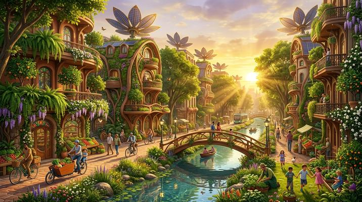

# Solarpunk

[← Back to Image Prompts](../README.md)

A utopian vision where advanced technology and lush nature coexist harmoniously — vertical gardens climbing solar-panel facades, organic architecture with living rooftops, algae bioreactors, and communities living in balance with their environment. Solarpunk is the hopeful counterpart to cyberpunk: instead of rain-soaked neon dystopia, it offers sunlit green harmony. The aesthetic is warm, bright, and dense with botanical detail interwoven with clean technology.

**Best for:** Desktop wallpapers · Social media posts · Concept art · Editorial illustrations · Architecture visualizations · Poster prints · Book covers



---

## Prompt

Replace the bracketed details with your subject and preferred format.

```text
Photograph of a solarpunk [SCENE — e.g., city intersection with buildings wrapped in vertical gardens, fruit trees growing from balconies, solar canopy walkways, and a crystal-clear urban stream flowing through a stone channel], 16:9 landscape format. Technology and nature interwoven — [TECH DETAILS — e.g., semi-transparent solar roof panels, wind micro-turbines shaped like leaves, a cargo drone delivering produce]. Warm golden-hour sunlight. Lush dense vegetation. Art Nouveau organic architecture meets clean sustainability tech. Hopeful, vibrant, alive.
```

## With a Reference Image

Attach your image and use this prompt to preserve its defining features while applying the style.

```text
Using the attached photo as reference, transform the scene into a solarpunk vision. Cover all buildings in vertical gardens and living walls. Add rooftop greenhouses. Replace cars with bicycles and light-rail. Add solar panels integrated aesthetically into architecture. Make every surface support plant life. Warm golden-hour sunlight. The scene should feel lush, green, technologically advanced, and deeply hopeful.
```

---

## 💡 Tips & Best Practices

- **Nature AND technology**: Solarpunk is not just green — it's the fusion of advanced tech with lush nature. Both must be present.
- **Warm light = hope**: Golden-hour sunlight is the default. Dark or overcast solarpunk undermines the optimism.
- **Art Nouveau curves**: The architecture should use organic, curved forms rather than harsh geometric lines.
- **Dense botanical detail**: Every surface should support life — mosses, vines, trees, wildflowers. Sparse vegetation isn't solarpunk.
- **Common pitfalls**: "Green city" is too vague. Don't mix with cyberpunk aesthetics. The mood must be hopeful, never dystopian.
- **Pairs well with:** [Brutalist Architecture](brutalist-architecture.md) (opposite aesthetic — interesting contrast), [Botanical Illustration](botanical-illustration.md) (shares botanical focus)
