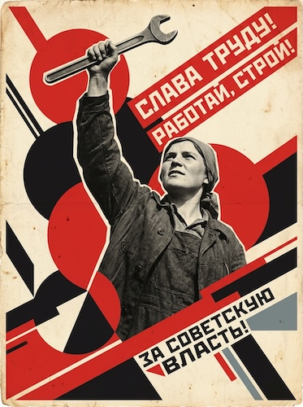

# Soviet Constructivist Propaganda

[← Back to Image Prompts](../README.md)

Bold geometric compositions with limited red/black/cream palettes, diagonal text banners, heroic upward-gazing figures, and photomontage elements. The revolutionary graphic design language of El Lissitzky, Alexander Rodchenko, and the Russian avant-garde (1920s–1930s).



> **Sample prompt used to generate the above image (Nano Banana 2):**
> ```text
> Soviet Constructivist propaganda poster of a woman factory worker raising a wrench
> triumphantly skyward, 4:5 vertical format. Bold geometric composition with strong dynamic
> diagonal lines radiating from the lower left to upper right. Strictly limited 4-color
> palette: Soviet red, pure black, cream, and a single accent of industrial steel grey.
> The figure is rendered as a high-contrast photomontage cutout layered over geometric
> shapes — circles, triangles, and bold red bars. A diagonal banner cuts across the upper
> right corner bearing bold Cyrillic-style block text reading "[СЛOGAN]". Aged paper texture
> with slight foxing and fold creases. Inspired by El Lissitzky and Alexander Rodchenko.
> ```

**ChatGPT**
```text
Create a Soviet Constructivist propaganda poster featuring [SUBJECT] in a heroic, triumphant pose. Use bold geometric composition with strong dynamic diagonal lines creating visual momentum. Strictly limit the palette to 4 colors: Soviet red, pure black, cream, and one accent of [COLOR]. Render the subject as a high-contrast photomontage cutout layered over geometric shapes — circles, triangles, and bold red bars. Include a diagonal banner with bold block text reading "[SLOGAN]." Aged paper texture with foxing. Inspired by El Lissitzky and Alexander Rodchenko.
```

**Midjourney**
```text
Soviet Constructivist propaganda poster, [SUBJECT] in heroic triumphant pose, bold geometric diagonal composition, limited palette — Soviet red black cream [COLOR], high-contrast photomontage, geometric shapes, diagonal text banner "[SLOGAN]", aged paper, El Lissitzky Rodchenko style --ar 4:5
```

**Stable Diffusion**
- **Prompt:** `Soviet Constructivist propaganda poster, [SUBJECT] in heroic pose, bold geometric diagonal composition, Soviet red black cream palette, photomontage cutout, geometric shapes, diagonal text banner, aged paper texture, El Lissitzky style`
- **Negative Prompt:** `photograph, 3d, realistic, full color, soft, modern`

**Nano Banana 2**
```text
Soviet Constructivist propaganda poster featuring [SUBJECT] in a heroic triumphant pose, 4:5 vertical format. Bold geometric composition with strong dynamic diagonal lines radiating outward. Strictly limited 4-color palette: Soviet red, pure black, cream, and a single accent of [COLOR]. Subject rendered as a high-contrast photomontage cutout layered over geometric shapes — circles, triangles, and bold red bars. Diagonal banner with bold block text reading "[SLOGAN]." Aged paper texture with slight foxing. Inspired by El Lissitzky and Alexander Rodchenko.
```
