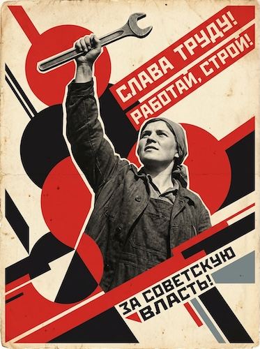

# Soviet Constructivist

[← Back to Image Prompts](../README.md)

Bold revolutionary propaganda posters with limited red-black-cream palettes, strong diagonal compositions, geometric sans-serif typography, photomontage elements, and radiating angular beams. The visual language of Rodchenko, El Lissitzky, and the Bauhaus-adjacent Soviet avant-garde of the 1920s-30s. Every element is designed to command attention, convey urgency, and direct the viewer's eye along dramatic diagonal axes.

**Best for:** Poster prints · Social media posts · Event promotions · Album covers · Political art · Brand campaigns · T-shirt designs



---

## Prompt

Replace the bracketed details with your subject and preferred format.

```text
Soviet Constructivist poster of [SUBJECT — e.g., a worker holding up a gear/tool/torch], [FORMAT]. Bold red, black, and cream palette. Strong diagonal composition. Angular radiating beams. The figure is high-contrast photomontage style. Bold geometric sans-serif typography: "[TEXT]." Rodchenko / El Lissitzky aesthetic. Aged paper texture.
```

## With a Reference Image

Attach your image and use this prompt to preserve its defining features while applying the style.

```text
Using the attached photo, transform it into a Soviet Constructivist poster. Convert the subject to high-contrast black and white photomontage. Replace the background with flat geometric shapes in red and cream. Add angular radiating beams. Rotate the composition to a strong diagonal. Add bold geometric sans-serif typography: "[TEXT]." Aged paper texture.
```

---

## 💡 Tips & Best Practices

- **Red + black + cream only**: The limited palette IS the style. Adding other colors breaks it.
- **Diagonal = dynamism**: "Strong 30-degree diagonal composition." Constructivism rejects horizontal/vertical stability — everything is angled.
- **Photomontage contrast**: Figurative elements should be high-contrast black and white, while backgrounds are flat geometric color.
- **Typography is design**: The text isn't decoration — it's a primary compositional element arranged at dramatic angles.
- **Common pitfalls**: "Russian style" is too vague. Always specify "Soviet Constructivist" + "Rodchenko" or "El Lissitzky."
- **Pairs well with:** [Art Deco Illustration](art-deco-illustration.md) (same era, opposite aesthetic), [Concert Poster](concert-poster.md) (similar bold graphic tradition)
