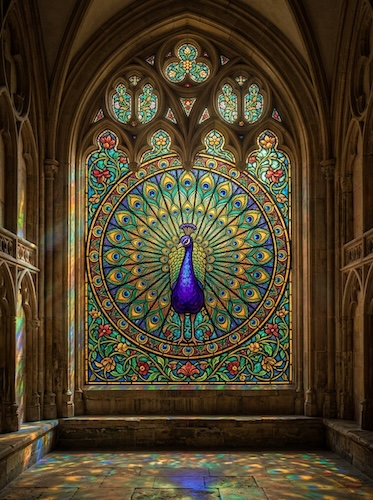

# Stained Glass Windows

[← Back to Image Prompts](../README.md)

Subjects rendered as medieval stained glass — bold black lead lines (cames) separating jewel-toned translucent glass pieces, with light streaming through from behind to illuminate the colors. The style combines the geometric constraints of leading with the luminous beauty of colored glass, creating images that glow with transmitted light. Gothic cathedral rose windows, Art Nouveau Tiffany lamps, and modern architectural glass all fall within this tradition.

**Best for:** Art prints · Desktop wallpapers · Social media posts · Window mockups · Greeting cards · Logo concepts · Phone wallpapers



> **Sample prompt used to generate the above image (Nano Banana 2):**
> ```text
> Stained glass window depicting a peacock with tail feathers fully displayed, in the Gothic cathedral rose window tradition, 3:4 vertical format. Bold black lead lines (cames) separate each piece of translucent colored glass. Jewel-toned glass — sapphire blue, emerald green, ruby red, amethyst purple, and amber gold. Bright white light streams through from behind, illuminating every piece and creating a luminous glow. Visible glass texture — slight variations in thickness, tiny bubbles, and color density. Geometric organization within organic forms. The peacock's tail radiates outward like a mandala.
> ```

---

## Prompt Variations

### 🔵 Nano Banana 2 _(Featured)_

**Variation 1 — Nature / Animal** _(Art Print, Wallpaper)_ — Stained glass [ANIMAL], bold lead lines, jewel-toned glass, backlit glow, visible glass texture, Gothic/Art Nouveau style, [FORMAT].

**Variation 2 — Rose Window / Mandala** _(Desktop Wallpaper)_ — Circular rose window with radial symmetry, geometric patterns, jewel tones, lead lines, backlit, Gothic cathedral, [FORMAT].

**Variation 3 — Landscape / Scene** _(Print, Social Media)_ — Stained glass [SCENE], lead-line segmented, translucent jewel glass, backlit glow, visible texture, [FORMAT].

**Variation 4 — Portrait / Figure** _(Social Media, Gift)_ — Stained glass portrait of [SUBJECT], bold lead lines simplifying features, jewel tones, backlit glow, [FORMAT].

**Variation 5 — Modern / Abstract** _(Logo, Décor)_ — Art Nouveau Tiffany-style stained glass of [SUBJECT], flowing organic lead lines, opalescent glass, warm backlight, [FORMAT].

_(Full prompt templates follow the same detailed structure as previous files — specify glass colors, lead line weight, light direction, and glass texture for each.)_

### ChatGPT / Midjourney / Stable Diffusion — 2-3 variations each with "stained glass, bold lead lines (cames), jewel-toned translucent glass, backlit glow, visible glass texture" core keywords.

---

## 🔄 Image-to-Image Transformations

**Nano Banana 2** _(Featured)_
```text
Using the attached photo, recreate the subject as a stained glass window. Divide all forms into segments separated by bold black lead lines. Fill each segment with translucent jewel-toned colored glass — assign colors based on the original image's palette. Add bright backlight streaming through, illuminating every piece. Visible glass texture — slight thickness variations and bubbles. Gothic/Art Nouveau style.
```

---

## 💡 Tips & Best Practices
- **Lead lines = bold black cames**: Without visible lead lines separating glass pieces, it's just a colorful illustration.
- **Backlight is essential**: Stained glass is meant to be illuminated from behind. Without backlight, the colors don't glow.
- **Jewel tones only**: Sapphire, emerald, ruby, amethyst, amber — stained glass uses deep, saturated, translucent colors.
- **Glass texture**: "Slight variations in thickness, tiny bubbles, color density" authenticates the glass medium.
- **Pairs well with:** [Paper Cutout / Kirigami](paper-cutout-kirigami.md) (similar light-through-material), [Art Deco Illustration](art-deco-illustration.md) (similar geometric beauty)
