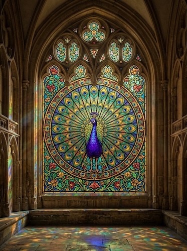

# Stained Glass Windows

[← Back to Image Prompts](../README.md)

Subjects rendered as medieval stained glass — bold black lead lines (cames) separating jewel-toned translucent glass pieces, with light streaming through from behind to illuminate the colors. The style combines the geometric constraints of leading with the luminous beauty of colored glass, creating images that glow with transmitted light. Gothic cathedral rose windows, Art Nouveau Tiffany lamps, and modern architectural glass all fall within this tradition.

**Best for:** Art prints · Desktop wallpapers · Social media posts · Window mockups · Greeting cards · Logo concepts · Phone wallpapers



> **Sample prompt used to generate the above image (Nano Banana 2):**
> ```text
> Stained glass window depicting a peacock with tail feathers fully displayed, in the Gothic cathedral rose window tradition, 3:4 vertical format. Bold black lead lines (cames) separate each piece of translucent colored glass. Jewel-toned glass — sapphire blue, emerald green, ruby red, amethyst purple, and amber gold. Bright white light streams through from behind, illuminating every piece and creating a luminous glow. Visible glass texture — slight variations in thickness, tiny bubbles, and color density. Geometric organization within organic forms. The peacock's tail radiates outward like a mandala.
> ```

---

## Prompt Variations

### 🔵 Nano Banana 2 _(Featured)_

**Variation 1 — Nature / Animal** _(Art Print, Wallpaper)_
```text
Stained glass [ANIMAL], bold lead lines, jewel-toned glass, backlit glow, visible glass texture, Gothic/Art Nouveau style, [FORMAT].
```

**Variation 2 — Rose Window / Mandala** _(Desktop Wallpaper)_
```text
Circular rose window with radial symmetry, geometric patterns, jewel tones, lead lines, backlit, Gothic cathedral, [FORMAT].
```

**Variation 3 — Landscape / Scene** _(Print, Social Media)_
```text
Stained glass [SCENE], lead-line segmented, translucent jewel glass, backlit glow, visible texture, [FORMAT].
```

**Variation 4 — Portrait / Figure** _(Social Media, Gift)_
```text
Stained glass portrait of [SUBJECT], bold lead lines simplifying features, jewel tones, backlit glow, [FORMAT].
```

**Variation 5 — Modern / Abstract** _(Logo, Décor)_
```text
Art Nouveau Tiffany-style stained glass of [SUBJECT], flowing organic lead lines, opalescent glass, warm backlight, [FORMAT].
```

_(Full prompt templates follow the same detailed structure as previous files — specify glass colors, lead line weight, light direction, and glass texture for each.)_

### ChatGPT

**Variation 1 — Nature / Animal** _(Art Print)_
```text
Create a stained glass window depicting [ANIMAL] in the Gothic cathedral tradition — bold black lead lines (cames) separating jewel-toned translucent glass pieces in sapphire, emerald, ruby, amethyst, and amber. Bright white light streams through from behind, illuminating every piece. Visible glass texture with thickness variations and tiny bubbles. 3:4 vertical format.
```

**Variation 2 — Rose Window / Mandala** _(Desktop Wallpaper)_
```text
Create a circular Gothic rose window with perfect radial symmetry — geometric patterns of jewel-toned glass separated by bold lead lines, backlit with bright light, [CENTRAL MOTIF] at the center. 1:1 square format.
```

**Variation 3 — Tiffany Style** _(Logo, Décor)_
```text
Create an Art Nouveau Tiffany-style stained glass panel of [SUBJECT] — flowing organic lead lines, opalescent and iridescent glass, warm backlight glow, botanical framing. 3:4 vertical format.
```

### Midjourney

**Variation 1 — Nature / Animal** _(Art Print)_
```text
stained glass window of [ANIMAL], bold black lead lines, jewel-toned translucent glass, sapphire emerald ruby amber, backlit glow, visible glass texture, Gothic cathedral --ar 3:4 --s 300
```

**Variation 2 — Rose Window / Mandala** _(Desktop Wallpaper)_
```text
circular Gothic rose window, radial symmetry, geometric jewel-toned glass, bold lead lines, backlit, [CENTRAL MOTIF] --ar 1:1 --s 250
```

**Variation 3 — Tiffany Style** _(Décor)_
```text
Art Nouveau Tiffany stained glass of [SUBJECT], flowing organic lead lines, opalescent glass, warm backlight, botanical framing --ar 3:4 --s 350
```

### Stable Diffusion

**Variation 1 — Nature / Animal** _(Art Print)_
- **Prompt:** `stained glass window, [ANIMAL], bold black lead lines, jewel-toned translucent glass, sapphire emerald ruby amethyst amber, backlit glow, visible glass texture, Gothic cathedral style`
- **Negative Prompt:** `flat illustration, no lead lines, opaque colors, photograph, low quality`

**Variation 2 — Rose Window / Mandala** _(Desktop Wallpaper)_
- **Prompt:** `circular Gothic rose window, radial symmetry, geometric stained glass patterns, jewel tones, bold lead lines, bright backlight, [CENTRAL MOTIF]`
- **Negative Prompt:** `asymmetric, flat colors, painting, photograph, blur`

---

## 🔄 Image-to-Image Transformations

**Nano Banana 2** _(Featured)_
```text
Using the attached photo, recreate the subject as a stained glass window. Divide all forms into segments separated by bold black lead lines. Fill each segment with translucent jewel-toned colored glass — assign colors based on the original image's palette. Add bright backlight streaming through, illuminating every piece. Visible glass texture — slight thickness variations and bubbles. Gothic/Art Nouveau style.
```

**ChatGPT**
```text
[Upload Photo] "Recreate this subject as a stained glass window — segment all forms with bold black lead lines, fill with translucent jewel-toned glass based on the original palette, add bright backlight glow and visible glass texture with bubbles and thickness variations."
```

**Midjourney**
```text
[IMAGE_URL] stained glass window, bold black lead lines, jewel-toned translucent glass, backlit glow, visible glass texture, Gothic style --iw 1 --ar 3:4
```

**Stable Diffusion**
- **Pipeline:** Img2Img · Denoising Strength: `0.6–0.75` (re-segments forms into glass pieces)
- **Prompt:** `stained glass window, bold black lead lines, jewel-toned translucent glass, backlit glow, glass texture, Gothic style`
- **Negative Prompt:** `flat illustration, photograph, opaque, no lead lines`

---

## 💡 Tips & Best Practices
- **Lead lines = bold black cames**: Without visible lead lines separating glass pieces, it's just a colorful illustration.
- **Backlight is essential**: Stained glass is meant to be illuminated from behind. Without backlight, the colors don't glow.
- **Jewel tones only**: Sapphire, emerald, ruby, amethyst, amber — stained glass uses deep, saturated, translucent colors.
- **Glass texture**: "Slight variations in thickness, tiny bubbles, color density" authenticates the glass medium.
- **Pairs well with:** [Paper Cutout / Kirigami](paper-cutout-kirigami.md) (similar light-through-material), [Art Deco Illustration](art-deco-illustration.md) (similar geometric beauty)
