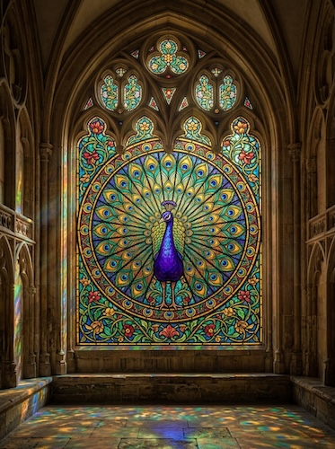

# Stained Glass Windows

[← Back to Image Prompts](../README.md)

Subjects rendered as medieval stained glass — bold black lead lines (cames) separating jewel-toned translucent glass pieces, with light streaming through from behind to illuminate the colors. The style combines the geometric constraints of leading with the luminous beauty of colored glass, creating images that glow with transmitted light. Gothic cathedral rose windows, Art Nouveau Tiffany lamps, and modern architectural glass all fall within this tradition.

**Best for:** Art prints · Desktop wallpapers · Social media posts · Window mockups · Greeting cards · Logo concepts · Phone wallpapers



---

## Prompt

Replace the bracketed details with your subject and preferred format.

```text
Stained-glass window depicting [SUBJECT — e.g., a peacock with its tail spread], [FORMAT]. Divide the subject into carefully fitted pieces of translucent glass joined by bold dark lead cames. Use jewel tones of [COLORS — e.g., sapphire, emerald, ruby, amethyst, and amber], with slight bubbles and thickness variations visible in each piece. Strong daylight passes through from behind, lighting the glass and casting a faint colored pattern nearby. Organize the panels in a balanced Gothic or Art Nouveau frame so the subject remains readable.
```

## With a Reference Image

Attach your image and use this prompt to preserve its defining features while applying the style.

```text
Using the attached photo, recreate the subject as a stained glass window. Divide all forms into segments separated by bold black lead lines. Fill each segment with translucent jewel-toned colored glass — assign colors based on the original image's palette. Add bright backlight streaming through, illuminating every piece. Visible glass texture — slight thickness variations and bubbles. Gothic/Art Nouveau style.
```

---

## 💡 Tips & Best Practices
- **Lead lines = bold black cames**: Without visible lead lines separating glass pieces, it's just a colorful illustration.
- **Backlight is essential**: Stained glass is meant to be illuminated from behind. Without backlight, the colors don't glow.
- **Jewel tones only**: Sapphire, emerald, ruby, amethyst, amber — stained glass uses deep, saturated, translucent colors.
- **Glass texture**: "Slight variations in thickness, tiny bubbles, color density" authenticates the glass medium.
- **Pairs well with:** [Paper Cutout / Kirigami](paper-cutout-kirigami.md) (similar light-through-material), [Art Deco Illustration](art-deco-illustration.md) (similar geometric beauty)
