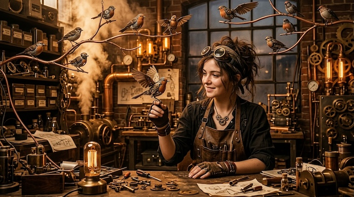

# Steampunk Contraptions

[← Back to Image Prompts](../README.md)

Victorian-era machinery reimagined with brass gears, copper pipes, leather straps, and steam-venting mechanisms. The aesthetic of H.G. Wells and Jules Verne — ornate mechanical complexity where every function is exposed and decorated. Steampunk celebrates the beauty of visible engineering: every gear meshes, every pipe connects, every valve has a purpose (or at least looks like it does).

**Best for:** Character designs · Desktop wallpapers · Product concepts · Social media posts · Art prints · Game concept art · Book covers



> **Sample prompt used to generate the above image (Nano Banana 2):**
> ```text
> Photograph of an elaborate steampunk mechanical owl perched on a brass stand, 16:9 landscape format. The owl is constructed from hundreds of interlocking brass gears, copper clock parts, leather wing membranes stretched over articulated bronze armatures, and glass marble eyes that glow with internal amber light. Steam vents from tiny exhaust pipes at the wing joints. Every gear meshes with its neighbor. The brass has a warm, aged patina — some surfaces polished to a mirror shine, others darkened with verdigris. Warm amber workshop lighting from a gas lamp. A cluttered Victorian workshop background.
> ```

---

## Prompt Variations

### 🔵 Nano Banana 2 _(Featured)_

**Variation 1 — Mechanical Creature / Animal** _(Art Print, Social Media)_
```text
Photograph of a steampunk [ANIMAL — e.g., mechanical dragonfly] constructed from [MATERIALS — e.g., brass gears, copper wire wings with thin mica membrane panels, a clock-spring thorax with visible mainspring], 16:9 landscape format. Every component interlocks and appears functional. [DETAILS — e.g., the four wings are articulated on bronze ball joints, tiny pistons drive the wing motion, glass compound eyes glow amber]. Warm aged brass patina with polished highlights. Steam venting from [LOCATION]. Warm amber workshop lighting. Victorian workshop background.
```

**Variation 2 — Wearable / Fashion** _(Character Design, Social Media)_
```text
Photograph of a person wearing steampunk [ITEM — e.g., a mechanical prosthetic arm with brass forearm plates, visible gear trains powering the articulated copper fingers, leather straps and buckles at the shoulder joint], 3:4 vertical portrait format. Warm aged brass and copper with polished highlights. Tiny steam valves at the elbow and wrist joints. Victorian-era clothing — [OUTFIT DETAILS]. Warm amber gas lamp lighting. The mechanical and organic blend seamlessly. H.G. Wells aesthetic.
```

**Variation 3 — Vehicle / Machine** _(Desktop Wallpaper, Concept Art)_
```text
Photograph of a steampunk [VEHICLE — e.g., airship — a massive brass and copper dirigible with an exposed gear-driven propulsion system, a wooden gondola cabin with porthole windows, and multiple steam exhausts trailing white vapor], 16:9 landscape format. Every mechanical system is visible and ornately decorated — brass boiler, gauge clusters, flywheel assembly. Riveted copper hull panels with verdigris patina. Warm sunset sky background. The vehicle feels simultaneously impractical and magnificent. Jules Verne adventure aesthetic.
```

**Variation 4 — Workshop / Interior** _(Desktop Wallpaper, Social Media)_
```text
Photograph of a cluttered steampunk inventor's workshop, 16:9 landscape format. [DETAILS — e.g., a massive half-assembled brass automaton on a workbench surrounded by gears, springs, and clock parts. Glass bell jars containing glowing specimens. Leather-bound journals with technical drawings. Brass telescopes and astrolabes hanging from the ceiling. A coal-fired furnace in the corner with copper pipes running to various devices]. Warm amber gas lamp lighting. Every surface covered with Victorian scientific instruments. Dense, detailed, lived-in.
```

**Variation 5 — Clockwork Mechanism Close-Up** _(Social Media, Art Print)_
```text
Macro photograph of an exposed steampunk clockwork mechanism, 1:1 square format. [DETAILS — e.g., dozens of interlocking brass gears of varying sizes, ruby jewel bearings, a coiled mainspring, tiny ratchet pawls, and a visible escapement wheel ticking]. The mechanism is mounted in an ornate brass case with engraved Victorian scrollwork. Warm amber lighting catching the polished gear teeth. Extreme detail — you can see the machining marks on individual gear teeth. The beauty of precision mechanical engineering.
```

### ChatGPT / Midjourney / Stable Diffusion — 3 variations each following standard template.

### ChatGPT
```text
Var 1: Create a steampunk [ANIMAL] from brass gears, copper, and leather. Every component interlocks. Warm patina. Steam venting. Workshop lighting. 3:2 format.
Var 2: Create a steampunk [VEHICLE]. Exposed mechanisms, ornate brass, riveted panels. Jules Verne aesthetic. 3:2 format.
Var 3: Create a steampunk workshop interior. Dense detail, gas lamps, workbenches, instruments. Warm amber. 3:2 format.
```

### Midjourney
```text
Var 1: Steampunk [ANIMAL], brass gears copper, interlocking mechanisms, steam venting, warm patina, workshop lighting --ar 16:9
Var 2: Steampunk [VEHICLE], exposed gears, ornate brass, riveted, Jules Verne, warm sunset --ar 16:9
Var 3: Steampunk clockwork mechanism close-up, interlocking gears, ruby bearings, brass case, macro, amber lighting --ar 1:1
```

### Stable Diffusion
- **Var 1:** `Steampunk [ANIMAL], brass gears copper leather, interlocking, steam, warm patina, workshop, 8k` / Neg: `modern, plastic, clean, minimalist, digital`
- **Var 2:** `Steampunk [VEHICLE], exposed mechanisms, brass copper, riveted panels, Jules Verne, 8k` / Neg: `modern, sleek, minimal, digital, clean`

---

## 🔄 Image-to-Image Transformations

**Nano Banana 2** _(Featured)_
```text
Using the attached photo, transform the subject into a steampunk version. Replace modern materials with brass, copper, and leather. Add visible gear mechanisms, steam pipes, and gauge clusters. Give metal surfaces a warm aged patina. Add steam venting from joints and valves. The overall aesthetic should be ornate, mechanical, and Victorian. Warm amber lighting.
```
> 💡 **Refinements:** "Add more gears and mechanical complexity" · "Make it more ornate — engravings and scrollwork" · "Add a Victorian workshop background" · "Steam must be visible"

**ChatGPT / Midjourney / Stable Diffusion** — Standard I2I with "steampunk, brass, copper, gears, steam, Victorian, warm patina" keywords.

---

## 💡 Tips & Best Practices

- **Brass + copper + leather + steam**: These four materials define steampunk. Every object should be built from them.
- **Everything is exposed**: Steampunk celebrates visible mechanics. Never hide gears behind panels — show every mechanism.
- **Patina adds age**: "Warm aged brass patina" with some "polished highlights" and "verdigris" creates authentic, lived-in metal.
- **Steam is mandatory**: If nothing is venting steam, it's just Victorian Victorian. Steam is what makes it steampunk.
- **Common pitfalls**: Don't mix with modern materials (plastic, LEDs). Avoid "steampunk-inspired" (too vague). Everything must be brass/copper/leather.
- **Pairs well with:** [Retrofuturism / Raygun Gothic](retrofuturism-raygun-gothic.md) (alt-history tech, different era), [Blueprint / Technical Drawing](blueprint-technical-drawing.md) (both celebrate mechanical engineering)
