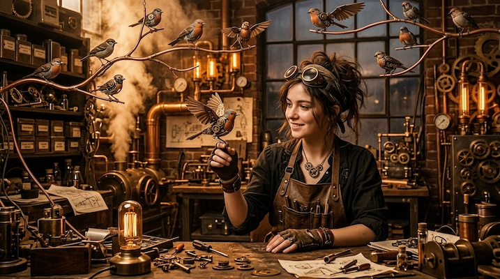

# Steampunk Contraptions

[← Back to Image Prompts](../README.md)

Victorian-era machinery reimagined with brass gears, copper pipes, leather straps, and steam-venting mechanisms. The aesthetic of H.G. Wells and Jules Verne — ornate mechanical complexity where every function is exposed and decorated. Steampunk celebrates the beauty of visible engineering: every gear meshes, every pipe connects, every valve has a purpose (or at least looks like it does).

**Best for:** Character designs · Desktop wallpapers · Product concepts · Social media posts · Art prints · Game concept art · Book covers



---

## Prompt

Replace the bracketed details with your subject and preferred format.

```text
Photograph of a steampunk [ANIMAL — e.g., mechanical dragonfly] constructed from [MATERIALS — e.g., brass gears, copper wire wings with thin mica membrane panels, a clock-spring thorax with visible mainspring], 16:9 landscape format. Every component interlocks and appears functional. [DETAILS — e.g., the four wings are articulated on bronze ball joints, tiny pistons drive the wing motion, glass compound eyes glow amber]. Warm aged brass patina with polished highlights. Steam venting from [LOCATION]. Warm amber workshop lighting. Victorian workshop background.
```

## With a Reference Image

Attach your image and use this prompt to preserve its defining features while applying the style.

```text
Using the attached photo, transform the subject into a steampunk version. Replace modern materials with brass, copper, and leather. Add visible gear mechanisms, steam pipes, and gauge clusters. Give metal surfaces a warm aged patina. Add steam venting from joints and valves. The overall aesthetic should be ornate, mechanical, and Victorian. Warm amber lighting.
```

---

## 💡 Tips & Best Practices

- **Brass + copper + leather + steam**: These four materials define steampunk. Every object should be built from them.
- **Everything is exposed**: Steampunk celebrates visible mechanics. Never hide gears behind panels — show every mechanism.
- **Patina adds age**: "Warm aged brass patina" with some "polished highlights" and "verdigris" creates authentic, lived-in metal.
- **Steam is mandatory**: If nothing is venting steam, it's just Victorian Victorian. Steam is what makes it steampunk.
- **Common pitfalls**: Don't mix with modern materials (plastic, LEDs). Avoid "steampunk-inspired" (too vague). Everything must be brass/copper/leather.
- **Pairs well with:** [Retrofuturism / Raygun Gothic](retrofuturism-raygun-gothic.md) (alt-history tech, different era), [Blueprint / Technical Drawing](blueprint-technical-drawing.md) (both celebrate mechanical engineering)
