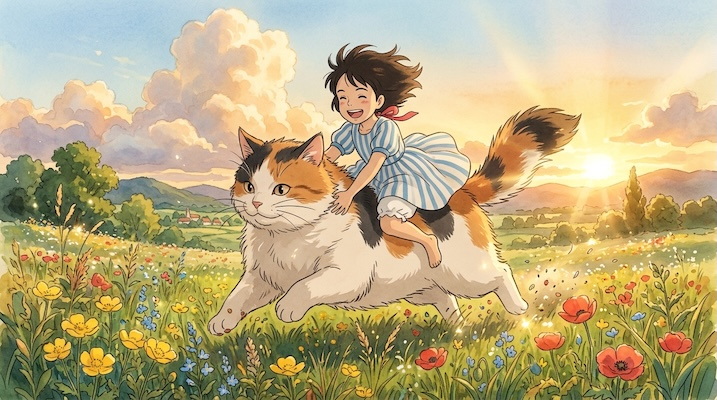

# Studio Ghibli Anime

[← Back to Image Prompts](../README.md)

Lush, hand-painted watercolor environments with emotionally expressive character designs, evoking the films of Hayao Miyazaki — *Spirited Away*, *My Neighbor Totoro*, *Princess Mononoke*, and *Howl's Moving Castle*. The Ghibli aesthetic is defined by meticulous attention to nature (swaying grass, drifting clouds, dappled light through leaves), characters with genuine emotional depth rather than over-the-top expressions, and a pervasive sense of atmospheric wonder. The color palette favors warm earth tones with vivid accents of sky blue and forest green.

**Best for:** Profile pictures · Desktop/phone wallpapers · Social media posts · Character portraits · Scene compositions · Fan art · Greeting cards



> **Sample prompt used to generate the above image (Nano Banana 2):**
> ```text
> Anime movie still of a young girl joyfully riding on the back of a giant fluffy calico cat bounding through a meadow of wildflowers at golden hour, Studio Ghibli style by Hayao Miyazaki, 16:9 landscape format. Windswept hair and skirt flowing behind her. The meadow is a lush hand-painted watercolor landscape with towering cumulus clouds, buttercups, poppies, and dappled light. The cat has soft, expressive eyes and fur ruffled by the breeze. Warm golden atmospheric lighting with lens flare from the setting sun.
> ```

---

## Prompt Variations

### 🔵 Nano Banana 2 _(Featured)_

> NB2 renders Ghibli-style environments beautifully. The key phrases are "Studio Ghibli style by Hayao Miyazaki," "lush hand-painted watercolor," and "warm golden atmospheric lighting." Always describe the environmental details — clouds, light, plants, wind — Ghibli worlds are defined more by their environments than their characters.

**Variation 1 — Character Portrait** _(Profile Picture, Social Media)_
```text
Anime character portrait in the art style of a Studio Ghibli film by Hayao Miyazaki, 1:1 square format. [SUBJECT — e.g., a young woman with short brown hair and a straw sun hat, wearing a linen apron]. Large detailed eyes with subtle iris color variation and warm catch lights. Gentle, genuine expression — [EMOTION — e.g., a quiet, contented smile]. Soft wind ruffling their hair and clothing. Background is a softly blurred hand-painted watercolor [ENVIRONMENT — e.g., sunlit flower field]. Warm golden-hour atmospheric lighting. Visible watercolor brushstroke texture.
```

**Variation 2 — Landscape / Environment** _(Desktop Wallpaper, Print)_
```text
Anime landscape in the art style of a Studio Ghibli film by Hayao Miyazaki, 16:9 landscape format. [ENVIRONMENT — e.g., a hilltop meadow overlooking a vast valley with a meandering river, patchwork farmlands, and a distant coastal town]. No human figures — pure environment. Lush hand-painted watercolor rendering with visible brushstroke texture. Towering cumulus clouds with pink-tinged edges filling the upper third. Warm golden-hour atmospheric lighting with volumetric god rays filtering through distant rain. Rich color palette — emerald greens, cerulean blues, warm ochres.
```

**Variation 3 — Character with Spirit / Creature** _(Fan Art, Social Media)_
```text
Anime movie still of [SUBJECT] encountering a [CREATURE — e.g., gentle forest spirit made of moss and glowing amber mushrooms, standing three meters tall in a dense forest clearing], Studio Ghibli style by Hayao Miyazaki, 16:9 landscape format. The character shows [EMOTION — e.g., wide-eyed wonder mixed with cautious awe]. The creature has soft, expressive eyes that convey benevolence. Hand-painted watercolor forest background with dappled light filtering through dense canopy. Floating pollen and dust motes catching the light. Magical but grounded — treated as reality, not fantasy.
```

**Variation 4 — Flying / Travel Scene** _(Phone Wallpaper, Poster)_
```text
Anime movie still of [SUBJECT] flying above [LANDSCAPE — e.g., a patchwork of emerald rice paddies and winding rivers below towering cumulus clouds], Studio Ghibli style by Hayao Miyazaki, 9:16 vertical phone wallpaper format. [FLYING METHOD — e.g., riding a giant white heron / sitting on a broomstick / gliding with mechanical wings]. Windswept hair and clothing streaming behind them. Vast panoramic sky filling most of the frame. Hand-painted watercolor clouds with pink, gold, and violet edges. Sense of freedom and exhilaration. Atmospheric perspective — distant landscape fading to haze.
```

**Variation 5 — Cozy Interior Scene** _(Social Media, Greeting Card)_
```text
Anime movie still of [SUBJECT] in a cozy [INTERIOR — e.g., a cluttered witch's cottage kitchen with herbs hanging from the rafters, a bubbling pot on a wood stove, and a cat sleeping on a stack of spell books], Studio Ghibli style by Hayao Miyazaki, 16:9 landscape format. Warm amber interior lighting from the stove and candles. Every surface has lovingly detailed objects — jars, bottles, tools, books. Visible watercolor brushstroke texture on all surfaces. The character is engaged in a quiet, everyday task — [ACTION — e.g., stirring the pot while reading from an open book]. Gentle, lived-in warmth.
```

### ChatGPT

**Variation 1 — Character Portrait**
```text
Create an anime character portrait of [SUBJECT] in the art style of a Studio Ghibli film by Hayao Miyazaki. Large detailed eyes with warm expression. Soft wind in hair. Blurred watercolor [ENVIRONMENT] background. Golden-hour atmospheric lighting. 1:1 square format.
```

**Variation 2 — Landscape**
```text
Create an anime landscape in Studio Ghibli style by Hayao Miyazaki — [ENVIRONMENT]. No human figures. Lush hand-painted watercolor with visible brushstrokes. Towering cumulus clouds. Warm golden-hour lighting. Rich emerald, cerulean, and ochre palette. 16:9 landscape format.
```

**Variation 3 — Character with Creature**
```text
Create an anime movie still of [SUBJECT] encountering [CREATURE] in a [ENVIRONMENT], Studio Ghibli style by Miyazaki. Hand-painted watercolor background, dappled light, floating pollen. Wide-eyed wonder expression. Magical but grounded. 16:9 landscape format.
```

### Midjourney

**Variation 1 — Character Portrait**
```text
Anime character portrait, [SUBJECT], Studio Ghibli style by Hayao Miyazaki, large detailed eyes, gentle expression, windswept hair, watercolor [ENVIRONMENT] background, golden-hour lighting --ar 1:1 --niji
```

**Variation 2 — Landscape**
```text
Anime landscape, [ENVIRONMENT], Studio Ghibli, Hayao Miyazaki, hand-painted watercolor, towering cumulus clouds, golden-hour atmospheric lighting, no people, emerald green cerulean --ar 16:9 --niji
```

**Variation 3 — Flying Scene**
```text
Anime movie still, [SUBJECT] flying above [LANDSCAPE], Studio Ghibli, Miyazaki, vast panoramic sky, windswept, hand-painted clouds, atmospheric perspective, freedom --ar 9:16 --niji
```

### Stable Diffusion

**Variation 1 — Character Portrait**
- **Prompt:** `Studio Ghibli anime style, [SUBJECT], large detailed eyes, gentle expression, watercolor background, golden-hour lighting, windswept hair, Hayao Miyazaki, masterpiece`
- **Negative Prompt:** `3d, photograph, dark, horror, poorly drawn, blurry`

**Variation 2 — Landscape**
- **Prompt:** `Studio Ghibli landscape, [ENVIRONMENT], hand-painted watercolor, cumulus clouds, golden-hour atmospheric lighting, no people, rich colors, masterpiece`
- **Negative Prompt:** `photograph, 3d, dark, urban, modern, people, blurry`

**Variation 3 — Cozy Interior**
- **Prompt:** `Studio Ghibli anime, [SUBJECT] in [INTERIOR], warm amber lighting, cluttered lovingly detailed room, watercolor texture, cozy atmosphere, Miyazaki, masterpiece`
- **Negative Prompt:** `cold, dark, horror, modern, minimalist, 3d, photograph`

---

## 🔄 Image-to-Image Transformations

Transform photos into Studio Ghibli anime style:

**Nano Banana 2** _(Featured)_
```text
Using the attached photograph as reference, transform it into an anime movie still in the art style of a Studio Ghibli film by Hayao Miyazaki. Convert the background into a lush hand-painted watercolor landscape while preserving the subject's pose, expression, and overall composition. Give the character large detailed eyes with subtle emotion and windswept hair. Apply warm golden-hour atmospheric lighting. Visible watercolor brushstroke texture throughout. 16:9 landscape format.
```
> 💡 **Follow-up refinements:**
> - "Make the environment more lush — add more plants, flowers, and cumulus clouds"
> - "Add a small spirit creature in the background peeking around a tree"
> - "Change the lighting to a dramatic sunset with pink and violet clouds"
> - "Create a 9:16 phone wallpaper version focused on the character"
> - "Make it a rainy scene — add gentle rain and puddle reflections"

**ChatGPT**
```text
[Upload Photo] "Transform this photograph into an anime movie still in the style of Studio Ghibli by Miyazaki. Convert the background into a hand-painted watercolor landscape. Preserve the subject's pose and expression. Golden-hour atmospheric lighting. Windswept hair."
```

**Midjourney**
```text
[IMAGE_URL] Studio Ghibli anime style, Hayao Miyazaki, lush painted watercolor background, golden-hour atmospheric lighting, windswept, expressive --iw 1.5 --ar 16:9 --niji
```

**Stable Diffusion**
- **Pipeline:** Img2Img · Denoising Strength: `0.55–0.70` (balanced — preserves composition while applying Ghibli style)
- **Prompt:** `Studio Ghibli anime style, hand-painted watercolor, golden-hour lighting, atmospheric, lush landscape, Hayao Miyazaki, masterpiece`
- **Negative Prompt:** `3d, photograph, dark, horror, blurry, low quality`

---

## 💡 Tips & Best Practices

- **Environments define Ghibli**: More than any other anime style, Ghibli is about the *world*. Always describe clouds, wind, light, and plants in detail — the environment should feel alive.
- **Emotion over expression**: Ghibli characters don't scream or exaggerate — they show genuine, subtle humanity. Use "gentle smile," "quiet determination," "wide-eyed wonder" rather than "laughing" or "angry."
- **Golden-hour is default**: Most iconic Ghibli scenes use warm golden-hour lighting. Specify it unless you want a specific alternative (rainy, nighttime, snowy).
- **Watercolor texture**: Including "visible watercolor brushstroke texture" ensures the painterly quality. Without it, outputs can look too digitally clean.
- **Nature is a character**: Wind, clouds, rain, grass, and light are as important as the human characters. Always describe how nature interacts with the scene.
- **Common pitfalls**: "Anime style" alone won't produce Ghibli — always specify "Studio Ghibli by Hayao Miyazaki." Don't use action-anime tropes (speed lines, energy blasts) — Ghibli is contemplative, not kinetic.
- **Pairs well with:** [Pixar / 3D Animation](pixar-3d-animation.md) (3D counterpart with similar emotional tone), [Botanical Illustration](botanical-illustration.md) (shares nature focus, different medium)
