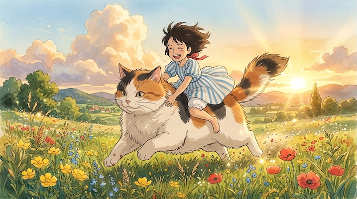

# Studio Ghibli Anime

[← Back to Image Prompts](../README.md)

Lush, hand-painted watercolor environments with emotionally expressive character designs, evoking the films of Hayao Miyazaki — *Spirited Away*, *My Neighbor Totoro*, *Princess Mononoke*, and *Howl's Moving Castle*. The Ghibli aesthetic is defined by meticulous attention to nature (swaying grass, drifting clouds, dappled light through leaves), characters with genuine emotional depth rather than over-the-top expressions, and a pervasive sense of atmospheric wonder. The color palette favors warm earth tones with vivid accents of sky blue and forest green.

**Best for:** Profile pictures · Desktop/phone wallpapers · Social media posts · Character portraits · Scene compositions · Fan art · Greeting cards



---

## Prompt

Replace the bracketed details with your subject and preferred format.

```text
Anime character portrait in the art style of a Studio Ghibli film by Hayao Miyazaki, 1:1 square format. [SUBJECT — e.g., a young woman with short brown hair and a straw sun hat, wearing a linen apron]. Large detailed eyes with subtle iris color variation and warm catch lights. Gentle, genuine expression — [EMOTION — e.g., a quiet, contented smile]. Soft wind ruffling their hair and clothing. Background is a softly blurred hand-painted watercolor [ENVIRONMENT — e.g., sunlit flower field]. Warm golden-hour atmospheric lighting. Visible watercolor brushstroke texture.
```

## With a Reference Image

Attach your image and use this prompt to preserve its defining features while applying the style.

```text
Using the attached photograph as reference, transform it into an anime movie still in the art style of a Studio Ghibli film by Hayao Miyazaki. Convert the background into a lush hand-painted watercolor landscape while preserving the subject's pose, expression, and overall composition. Give the character large detailed eyes with subtle emotion and windswept hair. Apply warm golden-hour atmospheric lighting. Visible watercolor brushstroke texture throughout. 16:9 landscape format.
```

---

## 💡 Tips & Best Practices

- **Environments define Ghibli**: More than any other anime style, Ghibli is about the *world*. Always describe clouds, wind, light, and plants in detail — the environment should feel alive.
- **Emotion over expression**: Ghibli characters don't scream or exaggerate — they show genuine, subtle humanity. Use "gentle smile," "quiet determination," "wide-eyed wonder" rather than "laughing" or "angry."
- **Golden-hour is default**: Most iconic Ghibli scenes use warm golden-hour lighting. Specify it unless you want a specific alternative (rainy, nighttime, snowy).
- **Watercolor texture**: Including "visible watercolor brushstroke texture" ensures the painterly quality. Without it, outputs can look too digitally clean.
- **Nature is a character**: Wind, clouds, rain, grass, and light are as important as the human characters. Always describe how nature interacts with the scene.
- **Common pitfalls**: "Anime style" alone won't produce Ghibli — always specify "Studio Ghibli by Hayao Miyazaki." Don't use action-anime tropes (speed lines, energy blasts) — Ghibli is contemplative, not kinetic.
- **Pairs well with:** [Pixar / 3D Animation](pixar-3d-animation.md) (3D counterpart with similar emotional tone), [Botanical Illustration](botanical-illustration.md) (shares nature focus, different medium)
