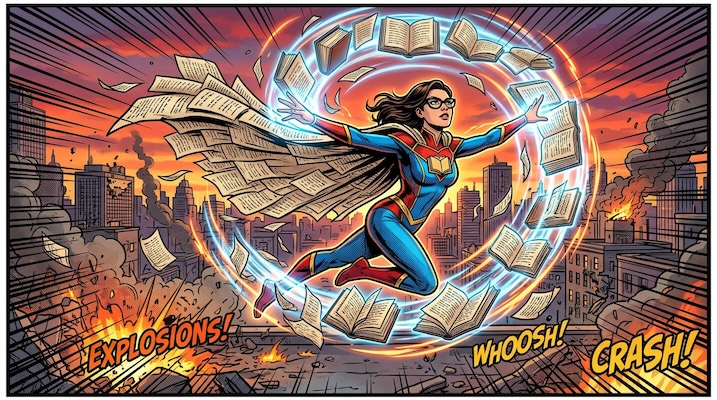

# Superhero Comic Book

[← Back to Image Prompts](../README.md)

Dynamic, action-packed comic book panels with heavy ink outlines, halftone dot shading, and explosive compositions inspired by classic Marvel/DC art.



> **Sample prompt used to generate the above image (Nano Banana 2):**
> ```text
> Dynamic comic book panel featuring a librarian superhero mid-air, levitating dozens of glowing books around her in a telekinetic spiral, 16:9 landscape format. She wears a cape made of flowing book pages and horn-rimmed glasses. Classic Marvel Comics visual language: heavy black ink outlines, bold flat colors with halftone dot shading in the shadows, dramatic foreshortening from below, and speed lines radiating outward. Explosive city rooftop background at sunset with debris and energy effects.
> ```

**ChatGPT**
```text
Create a dynamic comic book panel featuring [SUBJECT] in a powerful superhero action pose — mid-leap or delivering a punch. Use the visual language of classic Marvel Comics: heavy black ink outlines, bold flat colors with subtle halftone dot shading in the shadows, dramatic foreshortening, and speed lines radiating from the point of action. The background is an explosive [ENVIRONMENT] with debris and energy effects.
```

**Midjourney**
```text
Comic book panel of [SUBJECT] in a dynamic superhero action pose, explosive [ENVIRONMENT] background, heavy black ink outlines, halftone dot shading, bold flat colors, dramatic foreshortening, speed lines, classic Marvel Comics style --ar 16:9
```

**Stable Diffusion**
- **Prompt:** `Comic book illustration, [SUBJECT] in dynamic superhero action pose, heavy black ink outlines, halftone dot shading, bold flat colors, speed lines, [ENVIRONMENT] background, dramatic foreshortening, masterpiece`
- **Negative Prompt:** `photograph, 3d render, blurry, soft shading, watercolor`

**Nano Banana 2**
```text
Dynamic comic book panel featuring [SUBJECT] in a powerful superhero action pose — mid-leap or delivering a punch, 16:9 landscape format. Classic Marvel Comics visual language: heavy black ink outlines, bold flat colors with halftone dot shading in the shadows, dramatic foreshortening, and speed lines radiating from the point of action. Explosive [ENVIRONMENT] background with debris and energy effects.
```
