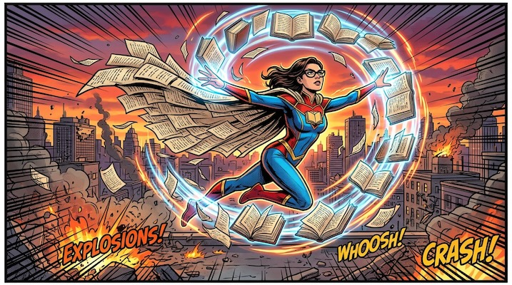

# Superhero Comic Book

[← Back to Image Prompts](../README.md)

Dynamic action panels with heavy ink outlines, halftone dot shading, speed lines, and dramatic foreshortening. This is the visual language of Marvel and DC's Silver and Bronze Age — bold, kinetic, and unapologetically dramatic. Characters burst from the frame with exaggerated musculature and flowing capes, while onomatopoeic sound effects ("BOOM!", "CRACK!") float in stylized lettering. The style applies equally well to original characters, real-person conversions, and scene compositions.

**Best for:** Social media posts · Profile pictures · Character designs · Poster prints · Birthday invitations · Fan art



---

## Prompt

Replace the bracketed details with your subject and preferred format.

```text
Comic book cover illustration of [SUBJECT — e.g., an armored warrior queen standing atop a cliff with her sword raised against a stormy sky], 3:4 vertical cover format. Heavy black ink outlines on every form. Classic halftone dot shading in the shadows and mid-tones. Bold primary color palette — [COLORS]. Dramatic low camera angle looking up at the figure. Wind-swept cape/hair adding dynamic motion. Title banner area at the top. Classic Marvel/DC Silver Age comic book aesthetic.
```

## With a Reference Image

Attach your image and use this prompt to preserve its defining features while applying the style.

```text
Using the attached photo as reference, transform the subject into a comic book superhero illustration. Preserve their face shape, hairstyle, and build, but render everything with heavy black ink outlines, halftone dot shading, and bold primary colors. Give them a heroic costume: [COSTUME DESCRIPTION — e.g., a red and gold suit with a star emblem]. Add dramatic comic book lighting — strong key light with deep ink shadows. Place against an action-oriented [ENVIRONMENT] background with crosshatching.
```

---

## 💡 Tips & Best Practices

- **Halftone dots are the signature**: "Classic halftone dot shading" is what separates comic book art from generic illustration. Always include it.
- **Name the era**: "Silver Age Marvel/DC" produces classic bold heroics. "Modern Image Comics" produces darker, grittier results. "Golden Age" produces simpler, more wholesome compositions.
- **Foreshortening adds power**: "Dramatic foreshortening on the leading fist" or "low camera angle looking up" immediately adds dynamism.
- **Onomatopoeia sells it**: Adding "BOOM!", "CRACK!", or "WHOOSH!" in the prompt creates authentic comic book sound effects that cement the style.
- **Common pitfalls**: Avoid mixing "realistic" with comic book — it produces an awkward painted look. Don't skip "heavy black ink outlines" — without them it looks like generic illustration.
- **Pairs well with:** [Cell Shaded Art](cell-shaded-art.md) (similar bold outlines, different medium), [Glitch Art](glitch-art.md) (for cyberpunk-meets-comic mashups)
