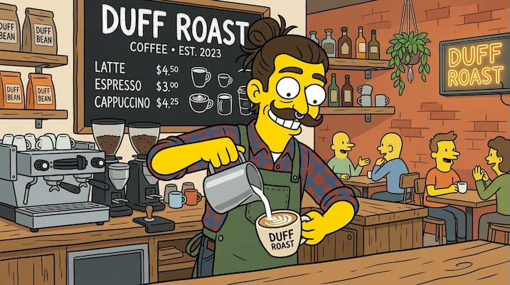

# The Simpsons

[← Back to Image Prompts](../README.md)

Matt Groening's iconic art style — yellow skin, bulging eyes, distinct overbites, and the flat, hand-drawn aesthetic of Springfield.



> **Sample prompt used to generate the above image (Nano Banana 2):**
> ```text
> 2D cartoon illustration of a hipster barista with a man-bun and handlebar mustache, drawn exactly in The Simpsons art style by Matt Groening, 16:9 landscape format. Bright yellow skin, large round bulging eyes, prominent overbite, four-fingered hands pouring latte art. Flat unshaded colors with clean black outlines — no gradients or shading. Set inside a Springfield coffee shop with a chalkboard menu reading "Duff Roast" in the background.
> ```

**ChatGPT**
```text
Create a 2D cartoon illustration of [SUBJECT] drawn exactly in the art style of The Simpsons TV show. The character must have bright yellow skin, large round bulging eyes, a prominent overbite, and four-fingered hands. Use flat, unshaded colors with clean black outlines. Place the character in a recognizable Springfield [ENVIRONMENT] (e.g., Moe's Tavern, the nuclear plant, the Kwik-E-Mart) that matches the show's background painting style.
```

**Midjourney**
```text
2D cartoon illustration of [SUBJECT] in The Simpsons art style by Matt Groening, bright yellow skin, round bulging eyes, overbite, four-fingered hands, flat unshaded colors, clean black outlines, Springfield [ENVIRONMENT] background --ar 16:9 --niji
```

**Stable Diffusion**
- **Prompt:** `The Simpsons cartoon style by Matt Groening, [SUBJECT] with yellow skin, round bulging eyes, overbite, flat unshaded colors, clean black outlines, Springfield [ENVIRONMENT] background, 2D animation cel`
- **Negative Prompt:** `3d, realistic, anime, shading, gradients`

**Nano Banana 2**
```text
2D cartoon illustration of [SUBJECT] drawn exactly in The Simpsons art style by Matt Groening, 16:9 landscape format. Bright yellow skin, large round bulging eyes, prominent overbite, four-fingered hands. Flat unshaded colors with clean black outlines — no gradients or shading. Place the character in a recognizable Springfield [ENVIRONMENT] rendered in the show's background painting style.
```

> 🔄 **Image-to-Image Variations:**
> * **ChatGPT:** *[Upload Photo]* "Draw the person in this photo as a character from The Simpsons. Give them yellow skin, round bulging eyes, an overbite, and four-fingered hands. Use flat colors with clean black outlines."
> * **Midjourney:** `[IMAGE_URL] The Simpsons cartoon style, Matt Groening, yellow skin, bulging eyes, overbite, flat unshaded colors, Springfield background --iw 1.5 --ar 1:1 --niji`
