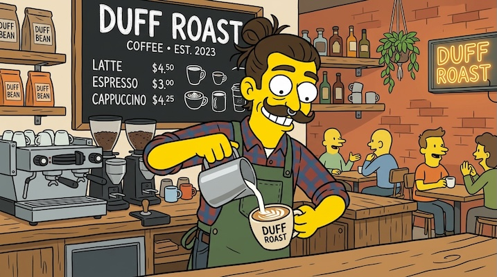

# The Simpsons

[← Back to Image Prompts](../README.md)

Matt Groening's iconic art style — bright yellow skin, large round bulging eyes, prominent overbites, four-fingered hands, and flat, unshaded colors with clean black outlines. The Springfield universe has such a distinctive visual language that it's one of the most immediately recognizable character conversion styles. Perfect for turning real people into Simpsons characters or creating original scenes in the Springfield aesthetic.

**Best for:** Profile pictures · Social media posts · Group photo conversions · Birthday cards · Fan art · Humorous character portraits



---

## Prompt

Replace the bracketed details with your subject and preferred format.

```text
2D cartoon illustration of [SUBJECT — e.g., a bearded software engineer wearing a hoodie and noise-canceling headphones around the neck] drawn exactly in The Simpsons art style by Matt Groening, 1:1 square profile picture format. Bright yellow skin, large round bulging eyes, prominent overbite, four-fingered hands. Flat unshaded colors with clean black outlines — no gradients or shading. Head and shoulders composition. Springfield-style [COLOR] background. Characteristic Simpsons expression matching their personality.
```

## With a Reference Image

Attach your image and use this prompt to preserve its defining features while applying the style.

```text
Using the attached photo as reference, draw every person as a character from The Simpsons. Give them bright yellow skin, large round bulging eyes, a prominent overbite, and four-fingered hands. Preserve each person's hairstyle, clothing, and accessories — translate them into the Simpsons flat-color, clean-outline art style. Replace the background with a Springfield location — [LOCATION]. Flat unshaded colors, no gradients.
```

---

## 💡 Tips & Best Practices

- **All five traits are mandatory**: Yellow skin, bulging eyes, overbite, four-fingered hands, flat unshaded colors. Dropping any one of these makes the output look like generic cartoon rather than The Simpsons.
- **"No gradients or shading"**: This is critical. The Simpsons uses perfectly flat color fills. If you don't explicitly exclude gradients, AI models add smooth shading that breaks the style.
- **Springfield locations add authenticity**: Placing characters in Moe's Tavern, the Kwik-E-Mart, or the nuclear plant control room immediately grounds the image in the Simpsons universe.
- **Translate, don't simplify**: When converting a real person, translate their specific features (glasses, beard, hairstyle) into Simpsons equivalents rather than making a generic yellow character.
- **Common pitfalls**: "Cartoon style" is too vague. "Simpsons-like" drifts. Always use "The Simpsons art style by Matt Groening" for precision. Avoid asking for realistic shading or 3D — it fights the style.
- **Pairs well with:** [Pixar / 3D Animation](pixar-3d-animation.md) (3D counterpart for character conversion), [Studio Ghibli Anime](studio-ghibli-anime.md) (another iconic animated style transformation)
