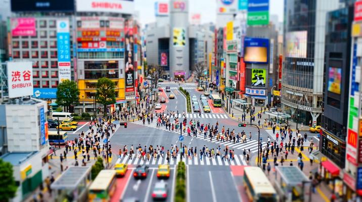

# Tilt-Shift Miniature Effect

[← Back to Image Prompts](../README.md)

Real-world scenes — cities, landscapes, events — photographed to look like tiny toy models through selective focus blur and oversaturated colors. The dramatic scale illusion makes full-size environments appear as if they're miniature tabletop dioramas.



> **Sample prompt used to generate the above image (Nano Banana 2):**
> ```text
> Tilt-shift miniature photograph of a bustling Tokyo intersection at midday seen from a
> high rooftop, 16:9 landscape format. The extreme tilt-shift lens effect makes everything
> appear toy-sized — tiny cars queue at miniature traffic lights, toy-like pedestrians cross
> in neat streams, and buildings look like plastic model kits. Only a narrow horizontal band
> across the center is in sharp focus; everything above and below dissolves into smooth
> creamy blur. Colors are slightly oversaturated — the red brake lights, yellow taxis, and
> green trees pop with toy-like vibrancy. Bright, even overhead daylight eliminating most
> shadows to reinforce the model-like illusion.
> ```

**ChatGPT**
```text
Create a tilt-shift miniature photograph of [SUBJECT/SCENE] viewed from a high vantage point above. Apply an extreme tilt-shift lens effect that makes everything appear toy-sized — people become tiny figurines, vehicles look like die-cast models, buildings resemble plastic kits. Only a narrow horizontal band across the center is in sharp focus; everything above and below dissolves into smooth creamy blur. Oversaturate the colors slightly to reinforce the model-like illusion — reds, yellows, and greens should pop with toy-like vibrancy. Bright, even overhead daylight.
```

**Midjourney**
```text
Tilt-shift miniature photograph of [SUBJECT/SCENE] from a high vantage point, extreme tilt-shift lens effect, everything appears toy-sized, narrow band of sharp focus, smooth blur above and below, slightly oversaturated toy-like colors, bright even daylight, miniature illusion --ar 16:9
```

**Stable Diffusion**
- **Prompt:** `Tilt-shift miniature photograph, [SUBJECT/SCENE], high vantage point, extreme tilt-shift effect, toy-like scale, narrow focus band, smooth bokeh blur, oversaturated colors, bright daylight, miniature model illusion, 8k`
- **Negative Prompt:** `normal scale, eye-level, dark, night, illustration, cartoon`

**Nano Banana 2**
```text
Tilt-shift miniature photograph of [SUBJECT/SCENE] viewed from a high vantage point, 16:9 landscape format. Extreme tilt-shift lens effect making everything appear toy-sized — people as tiny figurines, vehicles as die-cast models, buildings as plastic kits. Only a narrow horizontal band across the center in sharp focus; everything above and below dissolves into smooth creamy blur. Colors slightly oversaturated for toy-like vibrancy. Bright even overhead daylight reinforcing the miniature model illusion.
```
