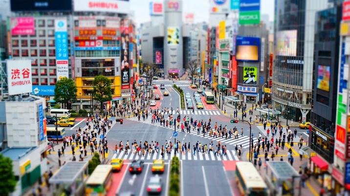

# Tilt-Shift Miniature Effect

[← Back to Image Prompts](../README.md)

Real-world scenes photographed (or processed to appear as if) with a tilt-shift lens that creates a narrow band of sharp focus, making full-size scenes look like tiny scale models. Cities become model train layouts, highways become slot-car tracks, and people become tiny figurines. The effect is amplified by slightly oversaturated colors and careful composition — shooting from above at a steep angle.

**Best for:** Desktop wallpapers · Social media posts · Travel photography · Urban photography · Art prints · Aerial views



> **Sample prompt used to generate the above image (Nano Banana 2):**
> ```text
> Tilt-shift photograph of a busy European city square from a high elevated angle, 16:9 landscape format. The miniature effect is aggressive — only a narrow horizontal band in the center is in sharp focus, everything above and below is dramatically blurred. Slightly oversaturated colors make the red buses, yellow taxis, and green park trees look like model-paint colors. The tiny pedestrians look like painted figurines. Bright midday sunlight with crisp shadows. The scene genuinely appears to be a photograph of a meticulously detailed scale model rather than a real city.
> ```

---

## Prompt Variations

### 🔵 Nano Banana 2 _(Featured)_

**Variation 1 — City Street** _(Desktop Wallpaper, Social Media)_
```text
Tilt-shift photograph of [SCENE — e.g., a busy Tokyo intersection from a high elevated angle], 16:9 landscape format. Aggressive miniature effect — narrow horizontal band of sharp focus in the center, dramatic blur above and below. Slightly oversaturated colors — [DETAILS — e.g., yellow taxis, red lanterns, green trees look model-painted]. Tiny pedestrians as figurines. Bright [LIGHTING — e.g., midday sunlight with crisp shadows]. Must genuinely appear to be a photograph of a scale model.
```

**Variation 2 — Aerial / Coastal** _(Desktop Wallpaper, Print)_
```text
Tilt-shift aerial photograph of [SCENE — e.g., a Mediterranean harbor with colorful fishing boats, a stone breakwater, and a waterfront village], 16:9 landscape format. Shot from above at a steep angle. Narrow focus band across the boats — everything else dramatically blurred. Oversaturated paint-like colors — the boats look like hand-painted model watercraft. The water has an impossibly perfect turquoise-model quality. Bright sunlight. A postcard become a diorama.
```

**Variation 3 — Construction / Industrial** _(Social Media)_
```text
Tilt-shift photograph of [SCENE — e.g., a construction site with cranes, excavators, and workers], from a high angle, 16:9 landscape format. Narrow focus band on the main machinery. Oversaturated colors — the yellow excavator and orange crane look like toy construction equipment. Workers appear as tiny figurines. Crisp shadows from midday sun. The building under construction looks like an unfinished model kit.
```

**Variation 4 — Stadium / Event** _(Social Media, Sports)_
```text
Tilt-shift photograph of [SCENE — e.g., a football stadium during a match, shot from the highest seats looking down at the pitch], 16:9 landscape format. Narrow focus band on the center of the pitch — players look like miniature figurines on a tabletop game. The crowd in the stands blurs into painted texture. Oversaturated green pitch, bright kit colors. Floodlight glow. The stadium genuinely appears to be a model.
```

**Variation 5 — Seasonal / Holiday Scene** _(Greeting Card, Social Media)_
```text
Tilt-shift photograph of [SCENE — e.g., a Christmas market village square from above], 3:4 vertical format. Narrow focus on the market stalls — stall canopies, tiny shoppers, and miniature string lights. Oversaturated Christmas colors — red, green, gold. Snow on rooftops looks like model snow flock. The scene appears to be a miniature Christmas village display. Warm tungsten from the market lights contrasting with cool blue twilight sky.
```

### ChatGPT

**Variation 1 — City from Above** _(Social Media)_
```text
Create a tilt-shift photograph of [SCENE] from a high angle looking down — a narrow horizontal band of sharp focus, dramatic blur above and below, slightly oversaturated model-like colors, crisp midday shadows. The scene must look like a detailed scale model. 3:2 landscape format.
```

**Variation 2 — Aerial Miniature** _(Desktop Wallpaper)_
```text
Create a tilt-shift aerial photograph of [SCENE] with a strong miniature effect — saturated paint-like colors, narrow focus band, everything appearing to be a hand-built model diorama. 16:9 landscape format.
```

### Midjourney

**Variation 1 — City from Above** _(Social Media)_
```text
tilt-shift miniature effect, [SCENE], high angle looking down, narrow focus band, oversaturated model-like colors, crisp shadows --ar 16:9 --s 200
```

**Variation 2 — Aerial Miniature** _(Desktop Wallpaper)_
```text
tilt-shift aerial photograph, [SCENE], miniature effect, paint-like saturated colors, dramatic blur, scale model look --ar 16:9 --s 200
```

### Stable Diffusion

**Variation 1 — City from Above** _(Social Media)_
- **Prompt:** `tilt-shift miniature photograph, [SCENE], high angle, narrow focus band, oversaturated colors, model-like, crisp shadows, miniature effect`
- **Negative Prompt:** `normal perspective, eye-level, natural muted colors, wide focus, low quality`

**Variation 2 — Aerial Miniature** _(Desktop Wallpaper)_
- **Prompt:** `tilt-shift aerial photograph, [SCENE], miniature diorama effect, paint-like saturated colors, narrow focus band, scale model`
- **Negative Prompt:** `eye-level view, natural colors, deep focus, blurry subject`

---

## 🔄 Image-to-Image Transformations

**Nano Banana 2** _(Featured)_
```text
Using the attached photo, apply an aggressive tilt-shift miniature effect. Create a narrow horizontal band of sharp focus through the center and dramatically blur everything above and below. Slightly oversaturate the colors to look model-painted. The scene must appear to be a photograph of a detailed scale model rather than a real place. Maintain the original composition.
```
> 💡 **Refinements:** "Make the miniature effect more aggressive — narrower focus band" · "Oversaturate the colors more" · "Shift the focus band up/down" · "Add model elements — a visible model base edge"

**ChatGPT**
```text
[Upload Photo] "Apply an aggressive tilt-shift miniature effect to this photo — a narrow horizontal band of sharp focus through the center, dramatic blur above and below, and slightly oversaturated model-painted colors so it looks like a scale model."
```

**Midjourney**
```text
[IMAGE_URL] tilt-shift miniature effect, narrow focus band, oversaturated model-like colors, scale model look --iw 1.5 --ar 16:9
```

**Stable Diffusion**
- **Pipeline:** Img2Img · Denoising Strength: `0.35–0.5` (light touch — the effect is mostly focus and color)
- **Prompt:** `tilt-shift miniature photograph, narrow focus band, oversaturated colors, scale model effect, high angle`
- **Negative Prompt:** `eye-level, natural colors, wide focus`

---

## 💡 Tips & Best Practices

- **Shoot from above**: Tilt-shift miniature effect ONLY works from an elevated angle looking down. Eye-level breaks the illusion.
- **Narrow focus band**: The narrower the focus, the stronger the miniature effect. "Only a narrow horizontal band in sharp focus."
- **Oversaturate slightly**: "Slightly oversaturated colors" makes objects look model-painted — this is critical for the miniature illusion.
- **Bright lighting**: Crisp midday sunlight with clear shadows reinforces the model-photography look. Overcast or dim lighting weakens it.
- **Common pitfalls**: Eye-level tilt-shift doesn't look miniature. Dark/moody lighting fights the model aesthetic.
- **Pairs well with:** [Miniature People](miniature-people.md) (actual miniatures vs. miniature illusion), [Landmark Dioramas](landmark-dioramas.md) (real miniatures in the same spirit)
