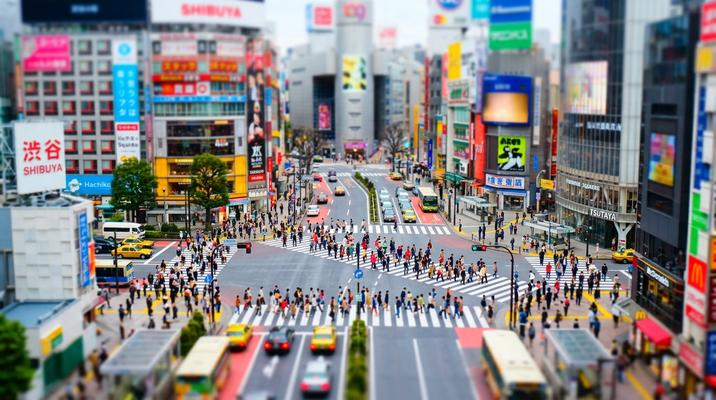

# Tilt-Shift Miniature Effect

[← Back to Image Prompts](../README.md)

Real-world scenes photographed (or processed to appear as if) with a tilt-shift lens that creates a narrow band of sharp focus, making full-size scenes look like tiny scale models. Cities become model train layouts, highways become slot-car tracks, and people become tiny figurines. The effect is amplified by slightly oversaturated colors and careful composition — shooting from above at a steep angle.

**Best for:** Desktop wallpapers · Social media posts · Travel photography · Urban photography · Art prints · Aerial views



---

## Prompt

Replace the bracketed details with your subject and preferred format.

```text
Tilt-shift photograph of [SCENE — e.g., a busy Tokyo intersection from a high elevated angle], 16:9 landscape format. Aggressive miniature effect — narrow horizontal band of sharp focus in the center, dramatic blur above and below. Slightly oversaturated colors — [DETAILS — e.g., yellow taxis, red lanterns, green trees look model-painted]. Tiny pedestrians as figurines. Bright [LIGHTING — e.g., midday sunlight with crisp shadows]. Must genuinely appear to be a photograph of a scale model.
```

## With a Reference Image

Attach your image and use this prompt to preserve its defining features while applying the style.

```text
Using the attached photo, apply an aggressive tilt-shift miniature effect. Create a narrow horizontal band of sharp focus through the center and dramatically blur everything above and below. Slightly oversaturate the colors to look model-painted. The scene must appear to be a photograph of a detailed scale model rather than a real place. Maintain the original composition.
```

---

## 💡 Tips & Best Practices

- **Shoot from above**: Tilt-shift miniature effect ONLY works from an elevated angle looking down. Eye-level breaks the illusion.
- **Narrow focus band**: The narrower the focus, the stronger the miniature effect. "Only a narrow horizontal band in sharp focus."
- **Oversaturate slightly**: "Slightly oversaturated colors" makes objects look model-painted — this is critical for the miniature illusion.
- **Bright lighting**: Crisp midday sunlight with clear shadows reinforces the model-photography look. Overcast or dim lighting weakens it.
- **Common pitfalls**: Eye-level tilt-shift doesn't look miniature. Dark/moody lighting fights the model aesthetic.
- **Pairs well with:** [Miniature People](miniature-people.md) (actual miniatures vs. miniature illusion), [Landmark Dioramas](landmark-dioramas.md) (real miniatures in the same spirit)
