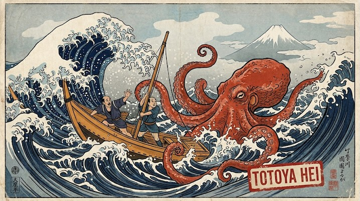

# Ukiyo-e Woodblock

[← Back to Image Prompts](../README.md)

Japanese woodblock print aesthetic — flat areas of color with visible wood grain texture, bold black outlines, and the compositional elegance of Hokusai and Hiroshige. Ukiyo-e ("pictures of the floating world") uses a limited palette of hand-mixed pigments printed from carved cherry-wood blocks, creating layered color areas with subtle registration misalignment. The style celebrates nature, urban life, and dramatic moments with equal reverence.

**Best for:** Art prints · Desktop wallpapers · Social media posts · Poster prints · Book covers · Home décor · Greeting cards



> **Sample prompt used to generate the above image (Nano Banana 2):**
> ```text
> Ukiyo-e Japanese woodblock print of a great wave crashing against rocky cliffs with Mount Fuji visible in the distance, in the style of Katsushika Hokusai, 16:9 landscape format. Flat areas of Prussian blue, indigo, and white with visible woodgrain texture in the color areas. Bold black outlines define every form. The wave curls with dramatic energy — white foam rendered as intricate claw-like patterns. Subtle registration misalignment between color layers. Printed on cream washi paper with visible fiber texture. Limited palette — indigo, Prussian blue, warm ochre, white, and black. Compositional drama — the wave dominates while Fuji is small and distant.
> ```

---

## Prompt Variations

### 🔵 Nano Banana 2 _(Featured)_

**Variation 1 — Landscape / Nature** _(Desktop Wallpaper, Print)_
```text
Ukiyo-e Japanese woodblock print of [SCENE — e.g., cherry blossoms over a temple garden with a stone bridge and koi pond], in the style of [ARTIST — e.g., Hiroshige], [FORMAT]. Flat color areas with visible woodgrain texture. Bold black outlines. Limited palette — [COLORS — e.g., soft pink, celadon green, warm grey, indigo]. Subtle registration misalignment. Cream washi paper texture. [COMPOSITION — e.g., blossoming branch frames the top, temple recedes in the distance]. Seasonal, contemplative.
```

**Variation 2 — Dramatic Scene / Action** _(Poster, Social Media)_
```text
Ukiyo-e woodblock print of [SCENE — e.g., samurai warriors in battle during a thunderstorm], style of Kuniyoshi, [FORMAT]. Dynamic composition with dramatic foreshortening. Flat color areas with visible woodgrain. Bold black outlines. [PALETTE]. Rain rendered as fine parallel diagonal lines across the entire print. Lightning as angular white zigzags. The figures are frozen in dramatic poses. Registration misalignment. Cream washi paper.
```

**Variation 3 — Portrait / Figure** _(Profile Picture, Art Print)_
```text
Ukiyo-e bijin-ga (beauty portrait) of [SUBJECT — e.g., a woman in an elaborate silk kimono with chrysanthemum pattern, arranging her hair], in the style of Utamaro, [FORMAT]. Flat skin tones with minimal shading. Elaborate kimono pattern rendered in flat color blocks. Bold black outlines define hair, face, and fabric folds. [PALETTE — e.g., indigo, vermillion, white, gold]. Woodgrain visible in larger color areas. Cream washi paper. Elegant, refined.
```

**Variation 4 — Modern Subject in Ukiyo-e Style** _(Social Media, Gift)_
```text
Ukiyo-e woodblock print depicting [MODERN SUBJECT — e.g., a Tokyo street scene with convenience stores, vending machines, and salarymen with umbrellas in the rain], [FORMAT]. Rendered in the traditional flat-color, bold-outline ukiyo-e technique. Rain as parallel diagonal lines (Hiroshige's signature). Neon signs rendered as flat color blocks with Japanese text. [PALETTE — e.g., indigo, neon pink, warm yellow, grey]. Woodgrain texture. The contrast between modern content and traditional technique creates visual interest.
```

**Variation 5 — Animal / Wildlife** _(Art Print, Greeting Card)_
```text
Ukiyo-e woodblock print of [ANIMAL — e.g., a red-crowned crane standing in a snowy landscape with bare winter branches], [FORMAT]. Flat color areas — the crane's white body is the paper itself, red crown in vermillion. Bold black outlines define feathers and branches. Snow rendered as unpainted paper with grey shadow shapes. [PALETTE — e.g., white, black, vermillion, pale grey, indigo sky]. Woodgrain visible. Cream washi paper. Minimalist, elegant, Japanese.
```

### ChatGPT
```text
Var 1: Create a ukiyo-e woodblock print of [SCENE]. Flat colors, visible woodgrain, bold outlines. [PALETTE]. Registration misalignment. Washi paper. [FORMAT].
Var 2: Create a ukiyo-e portrait of [SUBJECT] in elaborate kimono. Flat colors, bold outlines. [STYLE] by [ARTIST]. [FORMAT].
```

### Midjourney
```text
Var 1: Ukiyo-e woodblock print, [SCENE], flat colors, visible woodgrain, bold outlines, [PALETTE], washi paper, [ARTIST] style --ar 16:9
Var 2: Ukiyo-e bijin-ga portrait, [SUBJECT], flat color kimono, bold outlines, Utamaro style --ar 4:5
```

### Stable Diffusion
- **Var 1:** `Ukiyo-e woodblock print, [SCENE], flat colors, visible woodgrain texture, bold black outlines, limited palette, washi paper, Japanese` / Neg: `photograph, 3d, gradient shading, modern, digital`

---

## 🔄 Image-to-Image Transformations

**Nano Banana 2** _(Featured)_
```text
Using the attached photo, recreate the scene as a Japanese ukiyo-e woodblock print. Convert all shading to flat color areas with visible woodgrain texture. Apply bold black outlines to every form. Limit the palette to [NUMBER] colors — [COLORS]. Add subtle registration misalignment between color layers. Render on cream washi paper. Compose in the style of [ARTIST — Hokusai / Hiroshige / Kuniyoshi / Utamaro].
```

---

## 💡 Tips & Best Practices

- **Name the artist**: Hokusai (landscapes, waves), Hiroshige (rain, travel), Kuniyoshi (warriors, action), Utamaro (portraits) — each has a distinct subject and composition style.
- **Flat color + woodgrain**: "Flat areas of color with visible woodgrain texture" is the defining visual characteristic. Without woodgrain, it's just flat illustration.
- **Registration misalignment**: "Subtle registration misalignment between color layers" authenticates the multi-block printing process.
- **Washi paper**: The cream, fibrous paper is the correct substrate. White paper looks wrong.
- **Common pitfalls**: "Japanese art" is too broad. "Anime" is completely different. Always specify "ukiyo-e woodblock print."
- **Pairs well with:** [Persian Miniature](persian-miniature.md) (similar flat perspective, different cultural tradition), [Botanical Illustration](botanical-illustration.md) (similar nature subjects)
