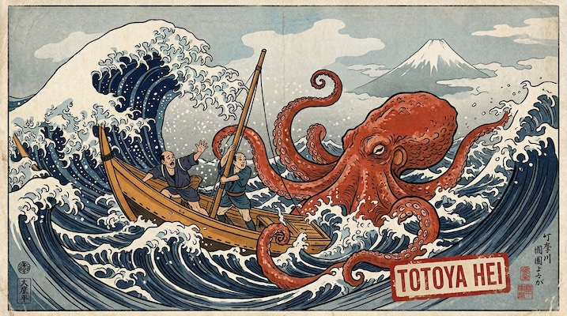

# Ukiyo-e Woodblock

[← Back to Image Prompts](../README.md)

Japanese woodblock print aesthetic — flat areas of color with visible wood grain texture, bold black outlines, and the compositional elegance of Hokusai and Hiroshige. Ukiyo-e ("pictures of the floating world") uses a limited palette of hand-mixed pigments printed from carved cherry-wood blocks, creating layered color areas with subtle registration misalignment. The style celebrates nature, urban life, and dramatic moments with equal reverence.

**Best for:** Art prints · Desktop wallpapers · Social media posts · Poster prints · Book covers · Home décor · Greeting cards



---

## Prompt

Replace the bracketed details with your subject and preferred format.

```text
Ukiyo-e Japanese woodblock print of [SCENE — e.g., cherry blossoms over a temple garden with a stone bridge and koi pond], in the style of [ARTIST — e.g., Hiroshige], [FORMAT]. Flat color areas with visible woodgrain texture. Bold black outlines. Limited palette — [COLORS — e.g., soft pink, celadon green, warm grey, indigo]. Subtle registration misalignment. Cream washi paper texture. [COMPOSITION — e.g., blossoming branch frames the top, temple recedes in the distance]. Seasonal, contemplative.
```

## With a Reference Image

Attach your image and use this prompt to preserve its defining features while applying the style.

```text
Using the attached photo, recreate the scene as a Japanese ukiyo-e woodblock print. Convert all shading to flat color areas with visible woodgrain texture. Apply bold black outlines to every form. Limit the palette to [NUMBER] colors — [COLORS]. Add subtle registration misalignment between color layers. Render on cream washi paper. Compose in the style of [ARTIST — Hokusai / Hiroshige / Kuniyoshi / Utamaro].
```

---

## 💡 Tips & Best Practices

- **Name the artist**: Hokusai (landscapes, waves), Hiroshige (rain, travel), Kuniyoshi (warriors, action), Utamaro (portraits) — each has a distinct subject and composition style.
- **Flat color + woodgrain**: "Flat areas of color with visible woodgrain texture" is the defining visual characteristic. Without woodgrain, it's just flat illustration.
- **Registration misalignment**: "Subtle registration misalignment between color layers" authenticates the multi-block printing process.
- **Washi paper**: The cream, fibrous paper is the correct substrate. White paper looks wrong.
- **Common pitfalls**: "Japanese art" is too broad. "Anime" is completely different. Always specify "ukiyo-e woodblock print."
- **Pairs well with:** [Persian Miniature](persian-miniature.md) (similar flat perspective, different cultural tradition), [Botanical Illustration](botanical-illustration.md) (similar nature subjects)
