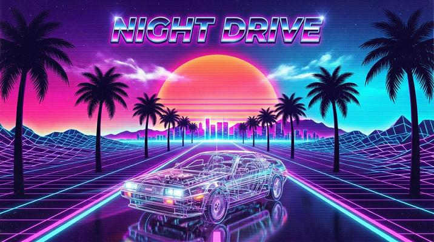

# Vaporwave / Synthwave Retrowave

[← Back to Image Prompts](../README.md)

The neon-drenched nostalgia of the 1980s filtered through internet culture — chrome grids stretching to vanishing points, gradient sunsets in hot pink and electric cyan, retro computer interfaces, palm tree silhouettes, and classical sculptures rendered in fluorescent wireframes. Vaporwave is equal parts sincere nostalgia and ironic commentary on consumer culture.

**Best for:** Phone/desktop wallpapers · Social media posts · Album covers · Poster prints · YouTube banners · Twitch overlays · T-shirt designs



> **Sample prompt used to generate the above image (Nano Banana 2):**
> ```text
> Vaporwave aesthetic illustration of a chrome wireframe sports car driving on a neon grid plane stretching to a vanishing point on the horizon, 16:9 landscape format. A massive sunset gradient in hot pink to electric cyan to deep purple fills the sky. Twin palm tree silhouettes frame the road. The car is rendered in reflective chrome with neon-purple edge reflections. Scanline overlay effect. Retro 80s typography reading "NIGHT DRIVE" in chrome outlined letters at the top. The horizon glows with a synthetic sun — a huge circle of gradient light. Neon grid lines pulse with light as they recede into the distance.
> ```

---

## Prompt Variations

### 🔵 Nano Banana 2 _(Featured)_

**Variation 1 — Classic Retrowave Landscape** _(Desktop Wallpaper)_
```text
Vaporwave/synthwave landscape — a chrome grid plane stretching to a vanishing point horizion beneath a massive gradient sunset in [COLORS — e.g., hot pink to electric cyan to deep purple], 16:9 landscape format. [ELEMENTS — e.g., twin palm tree silhouettes, a lone wireframe pyramid on the grid, a bright synthetic sun circle on the horizon]. Neon grid lines pulsing with light as they recede. Scanline overlay effect. Chrome reflective surfaces. Retro 80s aesthetic. The grid, the sun, the gradients — pure synthwave.
```

**Variation 2 — Statue / Classical Object** _(Social Media, Art Print)_
```text
Vaporwave aesthetic render of [OBJECT — e.g., a Greek marble bust of Apollo] surrounded by [ELEMENTS — e.g., floating holographic Windows 95 dialog boxes, palm leaves, glitch artifacts, and Japanese text "美学"], 1:1 square format. The bust is rendered in [TREATMENT — e.g., half classic white marble, half neon wireframe with hot pink edges]. Background is a gradient from deep purple to teal. Scanline overlay. VHS tracking distortion at the top and bottom edges. Surreal, internet-era, aesthetically ironic.
```

**Variation 3 — Retro Tech / Computer** _(Social Media, Poster)_
```text
Vaporwave illustration of a retro computer setup — [DETAILS — e.g., a bulky CRT monitor displaying a sunset gradient screensaver, a chunky mechanical keyboard, a floppy disk stack, and a desk lamp casting neon purple light], 16:9 landscape format. The scene is bathed in gradient neon lighting — pink from the left, cyan from the right. Chrome and plastic textures on the tech. Grid floor stretching to a horizon. Scanline overlay. Floating error dialog boxes and pixelated dolphin icons. Windows 98 aesthetic meets neon dreamscape.
```

**Variation 4 — Character / Silhouette** _(Phone Wallpaper)_
```text
Synthwave character silhouette — [FIGURE — e.g., a motorcycle rider on a futuristic bike] in black silhouette against a massive synthwave sunset, 9:16 vertical phone wallpaper format. The sunset is a gradient from deep purple at the top through hot pink to electric orange at the horizon. Horizontal stripe lines across the sun like a venetian blind effect. Chrome neon grid floor. The silhouette has neon edge-glow in [COLOR]. Stars above, grid below. Outrun / retrowave aesthetic.
```

**Variation 5 — Album Cover / Typography** _(Album Art, Poster)_
```text
Synthwave album cover — bold chrome 3D typography reading "[TEXT]" floating over a neon grid landscape with a gradient sunset, 1:1 square format. The text is rendered in reflective chrome with [COLOR] neon edge-glow and lens flare reflections. The background features the classic synthwave elements: grid floor, horizon sun, palm silhouettes. Scanline overlay. The overall composition reads as a premium album cover or movie title card. 1980s retro-futuristic.
```

### ChatGPT

**Variation 1 — Landscape**
```text
Create a synthwave landscape: chrome grid to vanishing point, massive gradient sunset in [COLORS], palm silhouettes, neon-pulsing grid lines, scanline overlay. 3:2 landscape format.
```

**Variation 2 — Statue / Vaporwave**
```text
Create a vaporwave aesthetic render of [OBJECT]. Half marble, half neon wireframe. Gradient background, floating Windows dialogs, Japanese text, VHS distortion. 1:1 square format.
```

**Variation 3 — Character Silhouette**
```text
Create a synthwave silhouette of [FIGURE] against a massive gradient sunset. Chrome grid floor. Neon edge-glow. Horizontal sun stripes. Outrun aesthetic. 2:3 vertical format.
```

### Midjourney

**Variation 1 — Landscape**
```text
Synthwave retrowave landscape, chrome grid, gradient sunset pink cyan purple, palm silhouettes, neon pulsing grid, synthetic sun, scanlines --ar 16:9 --s 200
```

**Variation 2 — Vaporwave Statue**
```text
Vaporwave aesthetic, [OBJECT], neon wireframe, gradient purple teal, floating Windows dialogs, Japanese text, VHS distortion, scanlines --ar 1:1
```

**Variation 3 — Character Silhouette**
```text
Synthwave silhouette, [FIGURE], massive gradient sunset, chrome grid floor, neon edge-glow, horizontal sun stripes, Outrun --ar 9:16
```

### Stable Diffusion

**Variation 1 — Landscape**
- **Prompt:** `Synthwave retrowave landscape, chrome grid, gradient sunset hot pink cyan purple, palm trees, neon grid, synthetic sun, scanlines, 80s retro`
- **Negative Prompt:** `realistic, photograph, daytime, natural colors, dull`

**Variation 2 — Vaporwave**
- **Prompt:** `Vaporwave aesthetic, [OBJECT], neon wireframe, gradient background, Windows dialogs, Japanese text, VHS distortion, surreal`
- **Negative Prompt:** `realistic, natural, photograph, modern, clean`

---

## 🔄 Image-to-Image Transformations

Transform photos into vaporwave/synthwave:

**Nano Banana 2** _(Featured)_
```text
Using the attached photo as reference, transform it into a vaporwave/synthwave aesthetic. Replace the background with a neon grid plane and gradient sunset in hot pink to cyan to purple. Apply scanline overlay and VHS tracking distortion. Remap all colors to neon-saturated tones. Add chrome reflections to metallic surfaces. Float Windows 95 dialog boxes and Japanese text around the subject. The subject should glow with neon edge-light.
```
> 💡 **Follow-up refinements:**
> - "Push more vaporwave — add Greek statues, dolphins, palm leaves"
> - "Make it more synthwave — less ironic, more earnest neon"
> - "Add chrome 3D text floating above: '[TEXT]'"
> - "Convert to a silhouette against the sunset instead"

**ChatGPT**
```text
[Upload Photo] "Transform into vaporwave aesthetic. Neon gradient background, scanline overlay, VHS distortion, neon-saturated colors, floating Windows dialogs, Japanese text, chrome reflections."
```

**Midjourney**
```text
[IMAGE_URL] Vaporwave synthwave aesthetic, neon gradient background, scanlines, VHS distortion, chrome, neon edge-glow --iw 1.5 --ar 16:9
```

**Stable Diffusion**
- **Pipeline:** Img2Img · Denoising Strength: `0.55–0.70`
- **Prompt:** `Vaporwave synthwave, neon gradient, scanlines, VHS distortion, chrome, neon, 80s retro`
- **Negative Prompt:** `realistic, natural, photograph, modern, dull`

---

## 💡 Tips & Best Practices

- **Vaporwave ≠ synthwave**: Vaporwave is ironic, glitchy, and references 90s computer culture (Windows 95, internet art). Synthwave is earnest, sleek, and references 80s action films. Specify which you want.
- **The holy trinity**: Grid floor + gradient sunset + chrome = retrowave. You need all three for the canonical look.
- **Scanline overlay**: "Scanline overlay effect" adds the CRT monitor / VHS feel that grounds the digital nostalgia.
- **Chrome is essential**: Metallic chrome reflections on text, cars, and objects are the signature material of retrowave.
- **Common pitfalls**: "80s style" is too vague. "Neon" alone doesn't capture it. You need the specific elements: grid, gradient, chrome, scanlines.
- **Pairs well with:** [Glitch Art](glitch-art.md) (shares digital corruption elements), [Cyberpunk Noir](cyberpunk-noir.md) (similar neon palette, different mood)
