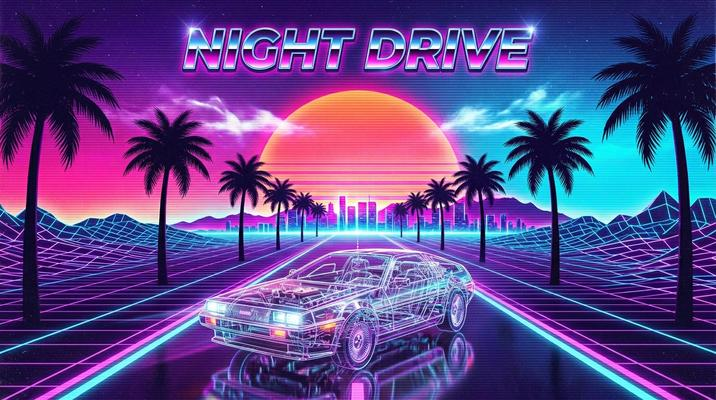

# Vaporwave / Synthwave Retrowave

[← Back to Image Prompts](../README.md)

The neon-drenched nostalgia of the 1980s filtered through internet culture — chrome grids stretching to vanishing points, gradient sunsets in hot pink and electric cyan, retro computer interfaces, palm tree silhouettes, and classical sculptures rendered in fluorescent wireframes. Vaporwave is equal parts sincere nostalgia and ironic commentary on consumer culture.

**Best for:** Phone/desktop wallpapers · Social media posts · Album covers · Poster prints · YouTube banners · Twitch overlays · T-shirt designs



---

## Prompt

Replace the bracketed details with your subject and preferred format.

```text
Vaporwave/synthwave landscape — a chrome grid plane stretching to a vanishing point on the horizon beneath a massive gradient sunset in [COLORS — e.g., hot pink to electric cyan to deep purple], 16:9 landscape format. [ELEMENTS — e.g., twin palm tree silhouettes, a lone wireframe pyramid on the grid, a bright synthetic sun circle on the horizon]. Neon grid lines pulsing with light as they recede. Scanline overlay effect. Chrome reflective surfaces. Retro 80s aesthetic. The grid, the sun, the gradients — pure synthwave.
```

## With a Reference Image

Attach your image and use this prompt to preserve its defining features while applying the style.

```text
Using the attached photo as reference, transform it into a vaporwave/synthwave aesthetic. Replace the background with a neon grid plane and gradient sunset in hot pink to cyan to purple. Apply scanline overlay and VHS tracking distortion. Remap all colors to neon-saturated tones. Add chrome reflections to metallic surfaces. Float Windows 95 dialog boxes and Japanese text around the subject. The subject should glow with neon edge-light.
```

---

## 💡 Tips & Best Practices

- **Vaporwave ≠ synthwave**: Vaporwave is ironic, glitchy, and references 90s computer culture (Windows 95, internet art). Synthwave is earnest, sleek, and references 80s action films. Specify which you want.
- **The holy trinity**: Grid floor + gradient sunset + chrome = retrowave. You need all three for the canonical look.
- **Scanline overlay**: "Scanline overlay effect" adds the CRT monitor / VHS feel that grounds the digital nostalgia.
- **Chrome is essential**: Metallic chrome reflections on text, cars, and objects are the signature material of retrowave.
- **Common pitfalls**: "80s style" is too vague. "Neon" alone doesn't capture it. You need the specific elements: grid, gradient, chrome, scanlines.
- **Pairs well with:** [Glitch Art](glitch-art.md) (shares digital corruption elements), [Cyberpunk Noir](cyberpunk-noir.md) (similar neon palette, different mood)
